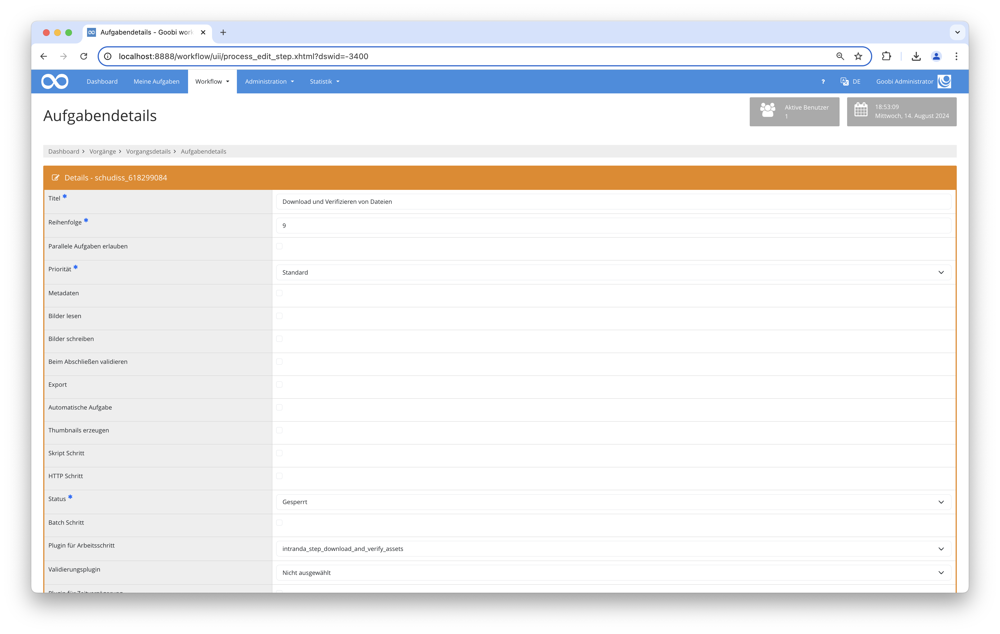

# Download und Verifizieren von Dateien

## Übersicht

Name                     | Wert
-------------------------|-----------
Identifier               | intranda_step_download_and_verify_assets
Repository               | [https://github.com/intranda/goobi-plugin-step-download-and-verify-assets](https://github.com/intranda/goobi-plugin-step-download-and-verify-assets)
Lizenz              | GPL 2.0 oder neuer 
Letzte Änderung    | 07.09.2024 14:11:55


## Einführung
Dieses Plugin liest URLs bzw. Hash-Werte aus mehreren konfigurierten Vorgangseigenschaften ein, lädt die Dateien von der definierten URL herunter und verglicht sie anschließend mit dem zugehörigen Hash-Wert. Abschließend können mehrere Rückmeldungen gegeben werden, je nachdem ob der Status `success` oder `error` lautet. Diese Rückmeldungen können per REST zu einem anderen System geschickt oder einfach innerhalb des Journals geloggt werden.


## Installation
Zur Installation des Plugins muss die folgende Datei installiert werden:

```bash
/opt/digiverso/goobi/plugins/step/plugin_intranda_step_download_and_verify_assets-base.jar
```

Die Konfigurationsdatei befindet sich üblicherweise hier:

```bash
/opt/digiverso/goobi/config/plugin_intranda_step_download_and_verify_assets.xml
```



## Konfiguration
Der Inhalt dieser Konfigurationsdatei sieht beispielhaft wie folgt aus:

```xml
<config_plugin>
    <!--
        order of configuration is:
          1.) project name and step name matches
          2.) step name matches and project is *
          3.) project name matches and step name is *
          4.) project name and step name are *
    -->

    <config>
        <!-- which projects to use for (can be more then one, otherwise use *) -->
        <project>*</project>
        <step>*</step>

        <!-- Configure here how many times shall be maximally tried before reporting final results. OPTIONAL. DEFAULT 1. -->
        <maxTryTimes>3</maxTryTimes>

        <!-- This tag accepts the following three attributes:
            - @urlProperty: name of the property that holds the URL of the file
            - @hashProperty: name of the property that holds the checksum of the file
            - @folder: configured name of the target folder that shall be used to download the file. OPTIONAL. DEFAULT master.
        -->
        <fileNameProperty urlProperty="DraftUri" hashProperty="DraftHash" folder="master" />
        <fileNameProperty urlProperty="AssetUriSplitted" hashProperty="AssetHashSplitted" folder="master" />

        <!-- A response tag accepts four attributes:
            - @type: success | error. Determines by which cases this configured response shall be activated.
            - @method: OPTIONAL. If not configured or configured blankly, then the response will be performed via journal logs. Non-blank configuration options are: put | post | patch.
            - @url: URL to the target system expecting this response. MANDATORY if @method is not blank..
            - @message: Message that shall be logged into journal. ONLY needed when @method is blank.
            - - - - - - - - - - - - - - - - - - - - - - - - - - - - - - - - - - - - - - - - - - - - - - - - - - - - - - - - - - - - - - - - - - - - - - - - - - - - -
            One can also define a JSON string inside a pair of these tags, which will be used as JSON body to shoot a REST request.
        -->
        <!-- Usage of Goobi variables in @url as well as @message is allowed. -->
        <response type="success" method="put" url="URL_ZU_BACH/upload_successful/{meta.ThesisId}" />

        <!-- For error cases there is no need for a response back to BACH, but an error message should be logged into journal. -->
        <!-- Log ERROR_MESSAGE into journal as a signal of errors -->
        <response type="error" message="ERROR_MESSAGE" />

        <!-- Example for REST calls with json body -->
        <!--
        <response type="success" method="put" url="CHANGE_ME">
        {
           "id": 0,
           "name": "string",
           "value": "string"
        }
        </response>
        -->

    </config>

</config_plugin>
```

Der Block `<config>` kann für verschiedene Projekte oder Arbeitsschritte wiederholt vorkommen, um innerhalb verschiedener Workflows unterschiedliche Aktionen durchführen zu können.

| Wert | Beschreibung |
| :--- | :--- |
| `project` | Dieser Parameter legt fest, für welches Projekt der aktuelle Block `<config>` gelten soll. Verwendet wird hierbei der Name des Projektes. Dieser Parameter kann mehrfach pro `<config>` Block vorkommen. |
| `step` | Dieser Parameter steuert, für welche Arbeitsschritte der Block `<config>` gelten soll. Verwendet wird hier der Name des Arbeitsschritts. Dieser Parameter kann mehrfach pro `<config>` Block vorkommen. |
| `maxTryTimes` | Dieser Wert legt fest, wie viele Versuche maximal erfolgen sollen, bevor Rückmeldungen gegeben werden müssen. Dieser Parameter ist optional und hat den Standardwert `1`. |
| `fileNameProperty` | Dieser Parameter steuert den Teil für das Herunterladen und Verifizieren der Dateien. Er akzeptiert drei Attribute. `@urlProperty` definiert den Namen der Vorgangseigenschaft, die die URL der Datei enthält. `@hashProperty` definiert den Namen der Vorgangseigenschaft, die die Checksumme der Datei enthält. Das Attribut `@folder` ist optional und hat den Standardwert `master`. Es steuert, wo die heruntergeladenen Dateien abgespeichert werden sollen.  |
| `response` | Dieser optionale Parameter kann verwendet werden, um mehrere Rückmeldungen nach dem Downloaden und Verifizieren der Dateien zu geben. Er akzeptiert vier Attribute und einen JSON-Text für REST-Requests mit JSON-Body. Mehr Details und Beispiele sind innerhalb der Kommentare der beispielhaften Konfigurationsdatei ersichtlich. |