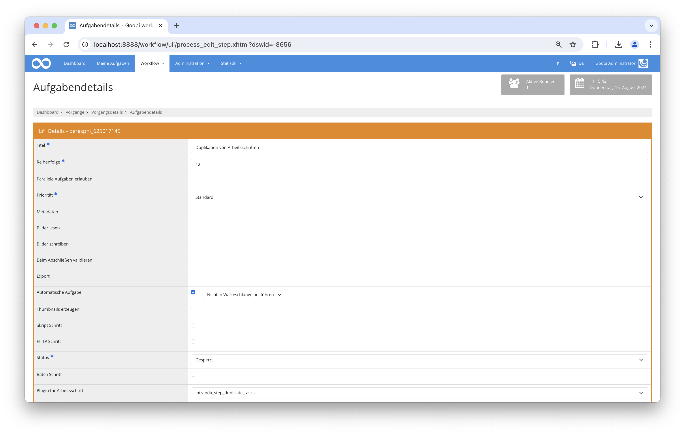

# Duplikation von Arbeitsschritten

## Übersicht

Name                     | Wert
-------------------------|-----------
Identifier               | intranda_step_duplicate_tasks
Repository               | [https://github.com/intranda/goobi-plugin-step-duplicate-tasks](https://github.com/intranda/goobi-plugin-step-duplicate-tasks)
Lizenz              | GPL 2.0 oder neuer 
Letzte Änderung    | 15.08.2024 11:20:05


## Einführung
Dieses Plugin liest den Wert einer Vorgangseigenschaft ein und kann abhängig von den Inhalten der Eigenschaft eine definierten Arbeitsschritt des Workflows automatisch mehrfach duplizieren. Außerdem kann dabei die ursprünglich ausgewertete Eigenschaft aufgesplittet und als jeweils eigene neue Eigenschaften gespeichert werden, die auf diese Duplizierung verweisen.


## Installation
Zur Installation des Plugins muss die folgende Datei installiert werden:

```bash
/opt/digiverso/goobi/plugins/step/plugin_intranda_step_duplicate_tasks-base.jar
```

Die Konfigurationsdatei befindet sich üblicherweise hier:

```bash
/opt/digiverso/goobi/config/plugin_intranda_step_duplicate_tasks.xml
```


## Überblick und Funktionsweise
Nach der erfolgreichen Installation, wird das Plugin wie im folgenden Screenshot innerhalb des Workflows integriert.



### Mit Duplikation eines Arbeitsschritts
1. Das Plugin holt sich den Wert der konfigurierten Vorgangseigenschaft und teilt ihn unter Verwendung des eventuell konfigurierten Trennzeichens *(oder `\n`, falls nicht)* in Teile auf.
2. Für jeden Teil der ursprünglichen Eigenschaft wird der möglicherweise konfigurierte Arbeitsschritt *(oder der nächste Arbeitsschritt des aktuellen Arbeitsschritts, wenn er nicht konfiguriert ist)* noch einmal dupliziert. Die Namen dieser duplizierten neuen Arbeitsschritte erhalten den Namen des ursprünglichen Arbeitsschritts plus einen hochgezählten Wert.
3. Für jeden duplizierten neuen Arbeitsschritt wird eine neue Vorgangseigenschaft oder ein Metadatum erstellt, je nachdem wie das Attribut `@target` konfiguriert ist. Der Wert dieser neuen Vorgangseigenschaft bzw. dieses neuen Metadatums entspricht dabei dem Teil der ursprünglichen Eigenschaft, auf dessen Grundlage dieser Arbeitsschritt dupliziert wurde.
4. Wenn Duplikate für jeden Teil der ursprünglichen Eigenschaft erzeugt werden, wird der ursprüngliche Arbeitsschritt deaktiviert.

### Ohne Duplikation eines Arbeitsschritts
1. Das Plugin holt sich den Wert der konfigurierten Vorgangseigenschaft und teilt ihn unter Verwendung des eventuell konfigurierten Trennzeichens *(oder `\n`, falls nicht)* in Teile auf.
2. Für jeden Teil der ursprünglichen Eigenschaft wird eine neue Vorgangseigenschaft oder ein Metadatum erstellt, je nachdem wie das Attribut `@target` konfiguriert ist. Der Wert dieser neuen Vorgangseigenschaft bzw. dieses neuen Metadatums entspricht dabei dem Teil der ursprünglichen Eigenschaft.


## Konfiguration
Der Inhalt dieser Konfigurationsdatei sieht beispielhaft wie folgt aus:

```xml
<config_plugin>
    <!--
        order of configuration is:
          1.) project name and step name matches
          2.) step name matches and project is *
          3.) project name matches and step name is *
          4.) project name and step name are *
	-->
    
    <config>
        <!-- which projects to use for (can be more then one, otherwise use *) -->
        <project>*</project>
        <step>*</step>
        
         <!-- Process property whose value shall be separated into parts, and it accepts four attributes:
              - @name: name of the process property that shall be splitted
              - @separator: separator that shall be used to split the value of the process property into smaller parts. OPTIONAL. DEFAULT "\n".
              - @target: configure with this attribute where and how to save the splitted parts. OPTIONAL.
                              - IF NOT configured, then all splitted parts will be saved as process properties, and the default property names depend on the configuration of @enabled of the tag <stepToDuplicate>:
                                If @enabled is true, then the default property name will be the step's name that is to be duplicated.
                                If @enabled is false, then the default property name will be the property's @name.
                              - IF configured without using a colon, then all splitted parts will be saved as process properties, and the configured @target will be the new properties' names.
                              - IF configured with a colon, then the part before that colon will control where the changes land, while the part after that colon will define the names of the splitted new parts:
                                Before the colon there are three options: property | metadata | person. For "metadata" and "person", changes will be saved into the METS file. For "property" changes will be saved as properties.
              - @useIndex: determines whether to use an index as suffix to each new process property / metadata entry to distinguish them between each other. OPTIONAL. DEFAULT true.
         -->
        <!-- ATTENTION: there can only be one such tag configured for each step, to split several properties, one has to do that in several steps. -->
        <property name="AssetUri" separator="," target="property:AssetUriSplitted" useIndex="true" />
        
        <!-- Name of the step that shall be duplicated. OPTIONAL. If not configured, then the next step following the current one will be used as default. It accepts an attribute:
              - @enabled: true if some step's duplication is needed, false otherwise. OPTIONAL. DEFAULT true.
         -->
        <stepToDuplicate enabled="true">Metadata enrichment</stepToDuplicate>
    </config>

</config_plugin>
```

Der Block `<config>` kann für verschiedene Projekte oder Arbeitsschritte wiederholt vorkommen, um innerhalb verschiedener Workflows unterschiedliche Aktionen durchführen zu können.

| Wert | Beschreibung |
| :--- | :--- |
| `project` | Dieser Parameter legt fest, für welches Projekt der aktuelle Block `<config>` gelten soll. Verwendet wird hierbei der Name des Projektes. Dieser Parameter kann mehrfach pro `<config>` Block vorkommen. |
| `step` | Dieser Parameter steuert, für welche Arbeitsschritte der Block `<config>` gelten soll. Verwendet wird hier der Name des Arbeitsschritts. Dieser Parameter kann mehrfach pro `<config>` Block vorkommen. |
| `property` | Dieser Wert legt fest, welche Vorgangseigenschaft zur Prüfung der gewünschten Duplizierung verwendet werden soll. Er akzeptiert vier Attribute, wobei nur `@name` obligatorisch ist. Details der möglichen Konfiguration sind in der Beispielkonfiguration aufgeführt. |
| `stepToDuplicate` | Dieser optionale Parameter kann verwendet werden, um den Namen der Arbeitsschritte festzulegen, die dupliziert werden soll. Wenn dieser Wert nicht konfiguriert wird, wird derjenige Arbeitsschritt für die Duplizierung verwendet, der im Workflow als nächster Arbeitsschritt folgt. Der Parameter akzeptiert außerdem ein optionales Attribut `@enabled` mit einem Standardwert `true`, das steuert ob es einen Arbeitsschritt zu duplizieren gibt. |