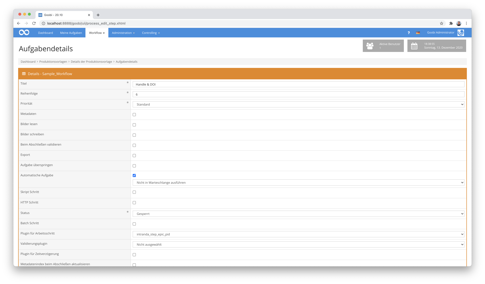

# ePIC PID Registrierung (Handle & DOI)

## Übersicht

Name                     | Wert
-------------------------|-----------
Identifier               | intranda_step_epic_pid
Repository               | [https://github.com/intranda/goobi-plugin-step-epic-pid](https://github.com/intranda/goobi-plugin-step-epic-pid)
Lizenz              | GPL 2.0 oder neuer 
Letzte Änderung    | 25.07.2024 11:59:30


## Einführung
Das Plugin erlaubt eine Registrierung von Digitalisaten beim [ePIC Service der GWDG](https://www.gwdg.de/de/application-services/persistent-identifier-pid). Hierbei ist sowohl die Erzeugung von Handle-IDs als auch die Registrierung von DOI möglich. Die Handles können dabei für jedes logische und physische Element eines METS-Datei erzeugt und jeweils darin als Metadatum gespeichert werden.


## Installation
Zur Installation des Plugins muss die folgende Datei installiert werden:

```bash
/opt/digiverso/goobi/plugins/step/plugin_intranda_step_epic_pid-base.jar
```

Um zu konfigurieren, wie sich das Plugin verhalten soll, müssen ausserdem die folgenden beiden Konfigurationsdateien installiert werden:

```bash
/opt/digiverso/goobi/config/plugin_intranda_step_epic_pid.xml
/opt/digiverso/goobi/config/plugin_intranda_step_epic_pid_mapping.xml
```


## Überblick und Funktionsweise
Zur Inbetriebnahme des Plugins muss dieses für einen oder mehrere gewünschte Aufgaben im Workflow aktiviert werden. Dies erfolgt wie im folgenden Screenshot aufgezeigt durch Auswahl des Plugins `intranda_step_epic_pid` aus der Liste der installierten Plugins.



Da dieses Plugin üblicherweise automatisch ausgeführt werden soll, sollte der Arbeitsschritt im Workflow als automatisch konfiguriert werden.

Nachdem das Plugin vollständig installiert und eingerichtet wurde, wird es üblicherweise automatisch innerhalb des Workflows ausgeführt, so dass keine manuelle Interaktion mit dem Nutzer erfolgt. Stattdessen erfolgt der Aufruf des Plugins durch den Workflow im Hintergrund und startet die Generierung eines Identifiers abhängig von der gewählten Konfiguration. Das Plugin geht dabei folgendermaßen vor:

Die Arbeitsweise des Plugins innerhalb des korrekt konfigurierten Workflows sieht folgendermaßen aus:

* Zunächst öffnet das Plugin die METS-Datei des Vorgangs.
* Für jede logische und physische Element dieser METS-Datei wird ein Handle in der Form `PREFIX-CLIENT-OBJECTID` erzeugt. Ist die geplante `OBJECTID` bereits als Handle vergeben, so wird ein hochzählender Suffix (z.B: `-1`, `-2`, etc.) hinten angefügt.
* Der generierte Handle wird abschließend innerhalb der METS-Datei bei dem jeweiligen logischen bzw. physischen Strukturelement als Metadatum gespeichert. Hierfür wird üblicherweise der Metadatentyp `_urn` verwendet.
* Wurde die Registrierung von DOIs aktiviert, wird zusätzlich zur Handle-Generierung für jedes logische top-level Element ein neuer DOI-Identifier erzeugt und innerhalb der METS-Datei gespeichert.


## Konfiguration 

### Hauptkonfiguration

Die Konfiguration der Datei `plugin_intranda_step_epic_pid.xml` ist folgendermaßen aufgebaut:

```xml
<config_plugin>

    <config>
        <!-- which projects to use for (can be more then one, otherwise use *) -->
        <project>*</project>
        <step>*</step>

        <!-- authentication and main information -->
        <certificate>/opt/digiverso/goobi/config/certificate.pem</certificate>
        <user>USER</user>
        <base>BASE</base>
        <url>https://viewer.example.org/resolver?field=MD_PI_HANLDE&identifier=</url>

        <!-- configuration for Handles -->
        <prefix>go</prefix>
        <name>goobi</name>
        <separator>-</separator>

        <!-- configuration for DOIs -->
        <doiGenerate>true</doiGenerate>
        <doiMapping>/opt/digiverso/goobi/config/plugin_intranda_step_epic_pid_mapping.xml</doiMapping>
    </config>

</config_plugin>
```

Der Block `<config>` kann für verschiedene Projekte oder Arbeitsschritte wiederholt vorkommen, um innerhalb verschiedener Workflows unterschiedliche Aktionen durchführen zu können. Die weiteren Parameter innerhalb dieser Konfigurationsdatei haben folgende Bedeutungen:

| Wert | Beschreibung |
| :--- | :--- |
| `project` | Dieser Parameter legt fest, für welches Projekt der aktuelle Block `<config>` gelten soll. Verwendet wird hierbei der Name des Projektes. Dieser Parameter kann mehrfach pro `<config>` Block vorkommen. |
| `step` | Dieser Parameter steuert, für welche Arbeitsschritte der Block `<config>` gelten soll. Verwendet wird hier der Name des Arbeitsschritts. Dieser Parameter kann mehrfach pro `<config>` Block vorkommen. |
| `certificate` | Im Element `certificate` wird der Pfad zum privaten Key definiert, der für die Authentifizierung verwendet wird. |
| `user` | Mit diesem Parameter wird der Nutzername für die Authentifizierung festgelegt. |
| `base` | Hiermit wird der Base-Name für die Generierung der Handles festgelegt. |
| `url` | Mit diesem Parameter wird definiert, wie die finale URL für den Handle-Resolver lauten soll. Dabei wird an dieser Stelle definiert, wie die URL beginnt. Die anschließend gebildete Handle-ID wird hinten angestellt, so dass die letztliche URL folgendermaßen aufgebaut sein wird: `url` + Handle-ID |
| `prefix` | Der eigentliche Handle wird aus mehreren Teilen zusammengesetzt und hat üblicherweise diesen Aufbau: `prefix` + `separator` + `name` + `separator` + `objectId`. Mit dem Parameter `prefix` wird der Präfix definiert, mit dem der Handle beginnen soll. Dieser Parameter ist optional. |
| `name` | Mit dem Parameter `name` wird der Inhalt des Handles definiert, an den anschließend die Objekt-IDs angehängt werden. Dieser Parameter ist optional. |
| `separator` | Mit diesem Parameter wird das Trennzeichen definiert, das zwischen den einzelnen Elementen des generierten Handles verwendet werden soll. |
| `doiGenerate` | Mit diesem Parameter wird festgelegt, ob zusätzlich zu dem Handle auch ein DOI-Identifier erzeugt werden soll. |
| `doiMapping` | An dieser Stelle wird eine Mapping-Datei benannt, wo die Mappings der Metdaten aus der METS-Datei zu den DOI-Metadaten definiert werden. |


### Konfiguration für die Nutzung von DOI
Die Konfiguration der Datei `plugin_intranda_step_epic_pid_mapping.xml` ist folgendermaßen aufgebaut:

```xml
<?xml version="1.0" encoding="UTF-8"?>
<Mapping>
    <map>
        <field>title</field>
        <metadata>TitleDocMain</metadata>
        <altMetadata>Title</altMetadata>
        <default>Fragment</default>
    </map>

    <map>
        <field>author</field>
        <metadata>Author</metadata>
        <default>intranda</default>
    </map>

    <map>
        <field>publisher</field>
        <metadata>Publisher</metadata>
        <altMetadata>Source</altMetadata>
        <default>intranda</default>
    </map>

    <map>
        <field>pubdate</field>
        <metadata>PublicationYear</metadata>
        <altMetadata>PublicationYearSort</altMetadata>
        <altMetadata>PublicationRun</altMetadata>
        <default>intranda</default>
    </map>

    <map>
        <field>inst</field>
        <default>intranda</default>
    </map>
</Mapping>
```

In dieser Konfigurationsdatei wird definiert, wie die vorliegenden Metadaten aus der METS-Datei für die Registierung der DOI verwendet werden sollen. Dabei wird für jedes Feld der DOI mindestens ein Metadatum definiert, das verwendet werden soll.

| Wert | Beschreibung |
| :--- | :--- |
| `field` | Dieser Parameter definiert das DOI-Metadatum, das erzeugt werden soll. |
| `metadata` | Dieser Parameter benennt dasjenige Metadatum, das aus der METS-Datei gelesen werden soll, um dessen Wert für die Erzeugung des definierten DOI-Feldes zu nutzen. |
| `altMetadata` | Sollte das Metadatum, das mit dem Parameter `metadata` definiert wurde, nicht vorhanden sein, kann hier ein alternatives Metadatum definiert werden, dass stattdessen genutzt werden soll. Dieser Parameter ist optional und wiederholbar. |
| `default` | Sollten die Metadaten, die mittels `metadata` und `altMetadata` definiert wurden, nicht gefunden werden, kann hier ein default-Wert festgelegt werden. |


## Beispiel eines Ergebnises
Wird ein Handle registriert, ergeben sich folgende Inhalte aus der Kommunikation mit dem ePIC Service:

```bash
Handle Values for: BASE/go-goobi-1296243265-17
Index    Type    Timestamp    Data
1    URL    2020-04-21 12:02:30Z     https://viewer.goobi.io/idresolver?handle=
2    TITLE    2020-04-21 12:02:30Z     [Stammbuch Daniel Schelling]
3    AUTHORS    2020-04-21 12:02:30Z     Daniel Schelling
4    PUBLISHER    2020-04-21 12:02:30Z     Stadtarchiv Duderstadt
5    PUBDATE    2020-04-21 12:02:30Z     1617
6    INST    2020-04-21 12:02:30Z     intranda
100    HS_ADMIN    2020-04-21 12:02:30Z     handle=USER; index=300; [create hdl,delete hdl,read val,modify val,del val,add val,modify admin,del admin,add admin,list]
```

Diese Informationen wird anschließend vom ePIC-Service der GWDG verwendet, um automatisch einen DOI-Identifier zu erzeugen, der mit der gleichen ID versehen wird: `BASE/go-goobi-1296243265-17`.