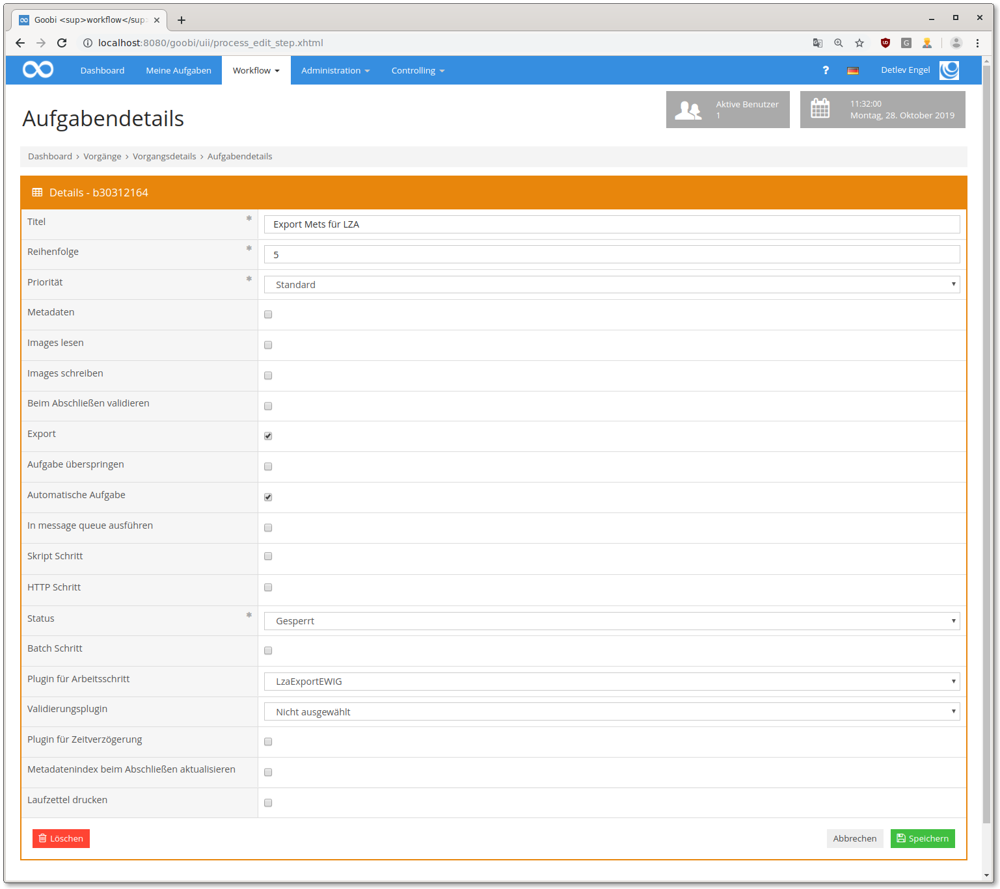

# EWIG Langzeitarchivierung

## Übersicht

Name                     | Wert
-------------------------|-----------
Identifier               | intranda_step_lza_ewig
Repository               | [https://github.com/intranda/goobi-plugin-step-ewig](https://github.com/intranda/goobi-plugin-step-ewig)
Lizenz              | GPL 2.0 oder neuer 
Letzte Änderung    | 25.07.2024 11:50:43


## Einführung
Die vorliegende Dokumentation beschreibt die Installation, Konfiguration und den Einsatz eines Plugins zum Erstellen einer METS Datei für die Langzeitarchivierung EWIG. ​


## Installation
Das Plugin besteht aus zwei Dateien:

```bash
plugin_intranda_step_LZA_EWIG-base.jar
plugin_intranda_step_lza_ewig.xml
```

Die Datei `plugin_intranda_step_LZA_EWIG-base.jar` enthält die Programmlogik und muss für den tomcat-Nutzer lesbar in folgendes Verzeichnis installiert werden:

```bash
/opt/digiverso/goobi/plugins/step/
```

Die Datei `plugin_intranda_step_lza_ewig.xml` muss ebenfalls für den tomcat-Nutzer lesbar sein und in folgendes Verzeichnis installiert werden:

```bash
/opt/digiverso/goobi/config/
```


## Überblick und Funktionsweise
Nachdem das Plugin installiert und konfiguriert wurde, kann es innerhalb eines Arbeitsschrittes genutzt werden. Dazu muss innerhalb der gewünschten Aufgabe das Plugin `intranda_step_lza_ewig` ausgewählt werden. Des Weiteren muss die Checkbox Automatische Aufgabe gesetzt sein.



Der Arbeitsschritt innerhalb von Goobi workflow exportiert alle notwendigen Dateien für den EWIG Ingest. Der Upload selbst erfolgt über den intranda TaskManager. Dies ist sinnvoll, um zu vermeiden, das mehrere parallel laufende Uploadvorgänge Konflikte mit einander haben und das System verlangsamen. Für den Upload siehe [Kapitel 4.17](https://docs.intranda.com/intranda-taskmanager-de/4/4.17-upload-von-dateien-in-das-ewig-langzeitarchiv) in der intranda TaskManager Dokumentation.


## Konfiguration
Die Konfigurationsdatei `plugin_intranda_step_lza_ewig.xml` muss wie folgt aufgebaut sein: ​

```xml
<?xml version="1.0" encoding="UTF-8"?>
<config_plugin>
    <config>
        <project>*</project>
        <step>*</step>
        <exportFolder>/opt/digiverso/</exportFolder>
        <exportXmlLog>true</exportXmlLog>
        <createManifest>true</createManifest>

        <manifestParameter
name="SubmissionManifestVersion">2.0</manifestParameter>
        <manifestParameter name="SubmittingOrganization">Example
organisation</manifestParameter>
        <manifestParameter
name="OrganizationIdentifier">DE-1</manifestParameter>
        <manifestParameter name="ContractNumber">1234567</manifestParameter>
        <manifestParameter name="Contact">Mustermann,
Max</manifestParameter>
        <manifestParameter name="ContactRole">Abteilungsleitung
Bibliothek</manifestParameter>
        <manifestParameter
name="ContactEmail">max.mustermann@example.com</manifestParameter>
        <manifestParameter name="TransferCurator">Doe,
John</manifestParameter>
        <manifestParameter
name="TransferCuratorEmail">john.doe@example.com</manifestParameter>
        <manifestParameter
name="SubmissionName">[Abteilungskürzel]_[eindeutiger
Name]</manifestParameter>
        <manifestParameter
name="SubmissionDescription">${meta.singleDigCollection};Digitalisierungsprojekt
der ZLB</manifestParameter>
        <manifestParameter
name="RightsHolder">${meta.rightsHolder};N/A</manifestParameter>
        <manifestParameter
name="Rights">http://id.loc.gov/vocabulary/preservation/copyrightStatus/pub</manifestParameter>
        <manifestParameter name="RightsDescription">''</manifestParameter>
        <manifestParameter
name="License">${meta.AccessLicense};${meta.AccessStatus};https://creativecommons.org/publicdomain/mark/1.0/</manifestParameter>
        <manifestParameter
name="AccessRights">${meta.AccessStatus};public</manifestParameter>
        <manifestParameter
name="MetadataFileFormat">http://www.loc.gov/METS/</manifestParameter>
        <manifestParameter
name="endpoint">https://goobi.example.com/api/endpoint/wi</manifestParameter>
    </config>
</config_plugin>
```

Der `<config>` Block ist wiederholbar und kann so in unterschiedlichen Projekten verschiedene Parameter definieren. Die Unterelemente `<project>` und `<step>` werden zur Prüfung genutzt, ob der vorliegende Block für den aktuellen Schritt genutzt werden soll. Dabei wird zuerst geprüft, ob es einen Eintrag gibt, der sowohl den Projektnamen als auch den Schrittenamen enthält. Ist dies nicht der Fall, wird nach einem Eintrag für durch den gekennzeichnete, beliebige Projekte und dem verwendeten Schrittenamen gesucht. Wenn dazu ebenfalls kein Eintrag gefunden wurde, erfolgt eine Suche nach dem Projektnamen und beliebigen Schritten, ansonsten greift der default Block, bei dem sowohl `<project>` als auch `<step>`_ enthalten.

Im Element `<exportFolder>` wird dabei festgelegt an welcher Stelle im Dateisystem die exportierten METS Dateien abgelegt werden.

Mittels `<exportXmlLog>` wird festgelegt, ob das XML Log ebenfalls exportiert und in die METS Datei geschrieben werden soll. Das Log enthält Informationen über den Workflow.

Das Element `<createManifest>` steuert, ob ein submission manifest erzeugt werden soll. Ist dies der Fall, müssen auch die `<manifestParameter>` konfiguriert werden.

Jeder `<manifestParameter>` besteht aus zwei Teilen, dem Attribut `name`, das den Namen des Parameters enthält, sowie dem Text, in dem die gewünschten Feldinhalte konfiguriert werden. Dabei können sowohl statische Texte als auch alle in Goobi bekannten Variablen genutzt werden. Mehrere Parameter können mittels Semikolon getrennt angegeben werden. Für den Fall, dass der erste Wert nicht bekannt ist, weil zum Beispiel das konfigurierte Metadatum nicht ausgefüllt wurde, wird dann der nächste Wert probiert.