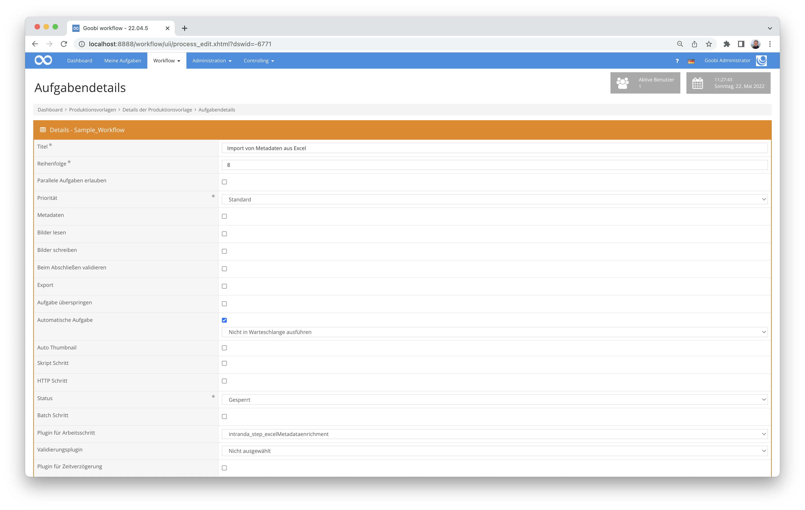

# Metadatenanreicherung via Excel-Datei

## Übersicht

Name                     | Wert
-------------------------|-----------
Identifier               | intranda_step_excelMetadataenrichment
Repository               | [https://github.com/intranda/goobi-plugin-step-excel-metadata-enrichment](https://github.com/intranda/goobi-plugin-step-excel-metadata-enrichment)
Lizenz              | GPL 2.0 oder neuer 
Letzte Änderung    | 25.07.2024 11:59:22


## Einführung
Dieses Plugin erlaubt es, dass Metadaten aus einer Excel-Datei gelesen und zu bestehenden Strukturelementen hinzugefügt werden.


## Installation
Zur Installation des Plugins muss die folgende Datei installiert werden:

```bash
/opt/digiverso/goobi/plugins/step/plugin_intranda_step_excelMetadataenrichment-base.jar
```

Um zu konfigurieren, wie sich das Plugin verhalten soll, können verschiedene Werte in der Konfigurationsdatei angepasst werden. Die Konfigurationsdatei befindet sich üblicherweise hier:

```bash
/opt/digiverso/goobi/config/plugin_intranda_step_excelMetadataenrichment.xml
```


## Überblick und Funktionsweise
Zur Inbetriebnahme des Plugins muss dieses für eine Aufgabe im Workflow aktiviert werden. Dies erfolgt wie im folgenden Screenshot aufgezeigt durch Auswahl des Plugins `plugin_intranda_step_excelMetadataenrichment` aus der Liste der installierten Plugins.



Da dieses Plugin üblicherweise automatisch ausgeführt werden soll, sollte der Arbeitsschritt im Workflow als automatisch konfiguriert werden.

Nachdem das Plugin vollständig installiert und eingerichtet wurde, wird es üblicherweise automatisch innerhalb des Workflows ausgeführt, so dass keine manuelle Interaktion mit dem Nutzer erfolgt. Stattdessen erfolgt der Aufruf des Plugins durch den Workflow im Hintergrund und führt die folgenden Arbeiten durch:

Als erstes wird eine passende Exceldatei gesucht. Dabei wird der konfigurierte Pfad durchsucht. Existiert dort eine einzelne Exceldatei, wird diese unabhängig von ihrem Namen geöffnet. Bei mehreren Exceldateien wird erwartet, dass die Exceldatei nach dem Vorgangsnamen benannt ist.

Wenn eine Exceldatei gefunden wurde, werden anschließend die Metadaten gelesen. Dabei werden alle vorhandenen Strukturelemente aufgelistet und geprüft, ob diese ein Metadatum enthalten, dass dem konfigurierten Wert im Feld `<docstructIdentifier>` entspricht. Wenn dies der Fall ist, wird in der Exceldatei nach einer Zeile gesucht, in der das Metadatum in der im Feld `<excelIdentifierColumn>` konfigurierten Spalte verwendet wurde. Wenn es gefunden wurde, werden die Metadaten der Zeile zum Strukturelement hinzugefügt.


## Konfiguration des Plugins
Die Konfiguration des Plugins ist folgendermaßen aufgebaut:

```xml
<config_plugin>
    <!--
        order of configuration is:
          1.) project name and step name matches
          2.) step name matches and project is *
          3.) project name matches and step name is *
          4.) project name and step name are *
    -->

    <config>
        <!-- which projects to use for (can be more then one, otherwise use *) -->
        <project>*</project>
        <step>*</step>

        <!-- name of the folder to find the excel file -->
        <!-- can be part of the process folder (master, media, import, ...) or an absolute path -->
        <!-- if more then one excel file was found, the filename must match the process name -->
        <excelFolder>master</excelFolder>

        <!-- name of the identifier field in existing docstructs-->
        <docstructIdentifier>shelfmarksource</docstructIdentifier>


        <!-- define which column is the one to use for catalogue requests -->
        <excelIdentifierColumn>0-Signatur</excelIdentifierColumn>

        <metadata ugh="CatalogIDSource" headerName="2-PPN-A" />
        <metadata ugh="CatalogIDDigital" headerName="3-PPN-O" />
        <metadata ugh="Subject" normdataHeaderName="13-GND Schlagwort 1" headerName="13a-GND Schlagwort 1"/>
        <metadata ugh="Subject" normdataHeaderName="14-GND Schlagwort 2" headerName="14a-GND Schlagwort 2"/>

        <person ugh="Author">
            <!-- use this field if the column contains the complete name -->
            <nameFieldHeader>Author</nameFieldHeader>
            <!-- set this field to true, if the name must be splitted into first- and lastname. The complete name gets written into lastname -->
            <splitName>true</splitName>
            <!-- define at which character the name is separated. @firstNameIsFirstPart defines, if the firstname is the first or last part of the name -->
            <splitChar firstNameIsFirstPart="false">, </splitChar>
            <!-- use this fields, if the firstname and lastname are in different columns -->
            <!--
            <firstname>5-Vorname</firstname>
            <lastname>6-Nachname</lastname>
            -->
        </person>
    </config>
</config_plugin>
 ```

Der Block `<config>` kann für verschiedene Projekte oder Arbeitsschritte wiederholt vorkommen, um innerhalb verschiedener Workflows unterschiedliche Aktionen durchführen zu können.

Im Feld `<excelFolder>` wird definiert, an welchem Ort die Exceldatei gesucht wird. Dabei können die Goobi-internen Variablen genutzt werden, um z.B. den Vorgangsordner oder den master Ordner zu definieren. Alternativ kann auch ein absoluter Pfad angegeben werden, an dem alle zu importierenden Exceldateien liegen. Wenn im konfigurierten Verzeichnis mehr als eine Exceldatei liegt, wird eine Datei `VORGANGSNAME.xlsx` erwartet.

Mit den Feldern `<docstructIdentifier>` und `<excelIdentifierColumn>` wird festgelegt, wie das Metadatum und die Excelspalte heißen sollen, über die sich die einzelnen Zeilen der Exceldatei zuordnen lassen.

Die Konfiguration der zu importierenden Metadaten und Personendaten wird bereits hier beschrieben:

[https://docs.goobi.io/goobi-workflow-plugins-de/import/intranda_import_excel#import-von-metadaten](https://docs.goobi.io/goobi-workflow-plugins-de/import/intranda_import_excel#import-von-metadaten)

[https://docs.goobi.io/goobi-workflow-plugins-de/import/intranda_import_excel#import-von-personen](https://docs.goobi.io/goobi-workflow-plugins-de/import/intranda_import_excel#import-von-personen)