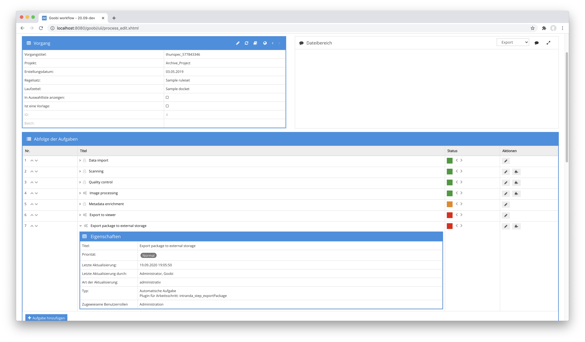

# Package Export

## Übersicht

Name                     | Wert
-------------------------|-----------
Identifier               | intranda_step_exportPackage
Repository               | [https://github.com/intranda/goobi-plugin-step-export-package](https://github.com/intranda/goobi-plugin-step-export-package)
Lizenz              | GPL 2.0 oder neuer 
Letzte Änderung    | 25.07.2024 11:59:15


## Einführung
Dieses Plugin erlaubt einen flexiblen Export von Daten eines Vorgangs in ein definiertes Zielverzeichnis. Dabei kann dieses Plugin sehr granular konfiguriert werden, um ausgewählte Daten im Export zu berücksichtigen. Darüber hinaus ist hier ebenfalls eine Transformation der internen und der Export-METS-Datei via XSLT möglich und erlaubt so verschiedenste Einsatzszenarien.


## Installation
Zur Installation des Plugins muss die folgende Datei installiert werden:

```bash
/opt/digiverso/goobi/plugins/step/plugin_intranda_step_exportPackage-base.jar
```

Um zu konfigurieren, wie sich das Plugin verhalten soll, können verschiedene Werte in der Konfigurationsdatei angepasst werden. Die Konfigurationsdatei befindet sich üblicherweise hier:

```bash
/opt/digiverso/goobi/config/plugin_intranda_step_exportPackage.xml
```


## Überblick und Funktionsweise
Zur Inbetriebnahme des Plugins muss dieses für einen oder mehrere gewünschte Aufgaben im Workflow aktiviert werden. Dies erfolgt wie im folgenden Screenshot aufgezeigt durch Auswahl des Plugins `intranda_step_exportPackage` aus der Liste der installierten Plugins.



Da dieses Plugin üblicherweise automatisch ausgeführt werden soll, sollte der Arbeitsschritt im Workflow als automatisch konfiguriert werden.

Nachdem das Plugin vollständig installiert und eingerichtet wurde, wird es üblicherweise automatisch innerhalb des Workflows ausgeführt, so dass keine manuelle Interaktion mit dem Nutzer erfolgt. Stattdessen erfolgt der Aufruf des Plugins durch den Workflow im Hintergrund und führt den konfigurierten Export in das Zielverzeichnis durch. Dabei werden die angegebenen Inhalte alle in ein Unterverzeichnes des definierten Export-Pfades kopiert.

Je nach Konfiguration kann dabei zusätzlich zu dem Export der Daten auch eine XSLT-Transformation der internen oder auch der Export-METS-Datei erfolgen, um diese in ein gewünschtes Format zu bringen. Abhängig von dieser Transformation sowie der Benennung der Transformationsdatei wird diese abschließend ebenfalls mit in dem Ordner des exportierten Vorganges gespeichert.


## Konfiguration
Die Konfiguration des Plugins ist folgendermaßen aufgebaut:

```xml
<config_plugin>
    <!--
        order of configuration is:
          1.) project name and step name matches
          2.) step name matches and project is *
          3.) project name matches and step name is *
          4.) project name and step name are *
    -->

    <config>
        <!-- which projects to use for (can be more then one, otherwise use *) -->
        <project>*</project>
        <step>*</step>

        <!-- export path -->
        <target>/opt/digiverso/export/</target>
        <!-- use subfolder for each process -->
        <useSubFolderPerProcess>true</useSubFolderPerProcess>
        <!-- a zip file with the subfolder-name will be created -->
        <createZipPerProcess>true</createZipPerProcess>
        <!-- which image folders to use (master|media|jpeg|source|...) -->
        <imagefolder>master</imagefolder>
        <!-- use the attribute filegroup, if you want to add checksums to the files within the filegroup. The checksums are taken from the configured folder -->
        <imagefolder filegroup="PRESENTATION">media</imagefolder>

        <!-- which additional folders to use -->
        <ocr>false</ocr>
        <source>false</source>
        <import>false</import>
        <export>false</export>
        <itm>false</itm>
        <validation>false</validation>

        <!-- generate UUIDs for each mets:fileGrp and mets:file -->
        <uuid>false</uuid>
        <!-- add checksums to mets:files -->
        <checksum>false</checksum>
        <!-- command to use to validate the exported images -->
        <checksumValidationCommand>/usr/bin/sha1sum</checksumValidationCommand>        

        <!-- if the internal METS file shall get transformed into another file define the path of the xsl file here -->
        <copyInternalMetaFile>true</copyInternalMetaFile>
        <transformMetaFile>true</transformMetaFile>
        <transformMetaFileXsl>/opt/digiverso/goobi/xslt/export_meta.xsl</transformMetaFileXsl>
        <transformMetaFileResultFileName>xslt_result_meta.xml</transformMetaFileResultFileName>

        <!-- if the METS file shall get transformed into another file define the path of the xsl file here -->
        <transformMetsFile>true</transformMetsFile>
        <transformMetsFileXsl>/opt/digiverso/goobi/xslt/export_mets.xsl</transformMetsFileXsl>
        <transformMetsFileResultFileName>xslt_result_mets.xml</transformMetsFileResultFileName>
    </config>

</config_plugin>
```

Der Block `<config>` kann für verschiedene Projekte oder Arbeitsschritte wiederholt vorkommen, um innerhalb verschiedener Workflows unterschiedliche Aktionen durchführen zu können. Die weiteren Parameter innerhalb dieser Konfigurationsdatei haben folgende Bedeutungen:

| Wert | Beschreibung |
| :--- | :--- |
| `project` | Dieser Parameter legt fest, für welches Projekt der aktuelle Block `<config>` gelten soll. Verwendet wird hierbei der Name des Projektes. Dieser Parameter kann mehrfach pro `<config>` Block vorkommen. |
| `step` | Dieser Parameter steuert, für welche Arbeitsschritte der Block `<config>` gelten soll. Verwendet wird hier der Name des Arbeitsschritts. Dieser Parameter kann mehrfach pro `<config>` Block vorkommen. |
| `target` | Mit diesem Parameter wird der Hauptpfad definiert, wohin der Export des Vorgangs als Unterordner mit dem Vorgangsnamen exportiert werden soll. |
| `useSubFolderPerProcess` | Mit diesem Parameter wird festgelegt ob für jeden Prozess ein Unterordner angelegt werden soll. |
| `createZipPerProcess` | Mit diesem Parameter kann festgelegt werden, ob eine zip-Datei je Prozess erstellt werden soll. |
| `imagefolder` | Es können mehrere Verzeichnisse für die Bilder bzw. Digitalisate angegeben werden. Dies kann unter anderem z.B. die Master-Bilder sowie die Derivate umfassen. Wenn die METS Datei Checksummen für die einzelnen Images enthalten soll, kann hier über das Attribut `filegroup` festgelegt werden, für welche `<mets:fileGrp>` die Checksummen der Dateien aus diesem Ordner genutzt werden sollen. |
| `ocr` | Mit diesem Parameter wird angegeben, ob die OCR-Ergebnisse mit exportiert werden sollen. |
| `source` | Wenn die Inhalte des `source` Ordners mit berücksichtigt werden sollen, kann dies hier angegeben werden. |
| `import` | Wenn die Inhalte des `import` Ordners mit berücksichtigt werden sollen, kann dies hier definiert werden. |
| `export` | Wenn die Inhalte des `export` Ordners mit berücksichtigt werden sollen, kann dies hier ebenfalls angegeben werden. |
| `itm` | Sollen die Inhalte des TaskManager-Verzeichnisses `itm` mit exportiert werden, wird dies hier definiert. |
| `validation` | Mit diesem Parameter kann festgelegt werden, dass die Inhalte des Verzeichnisses `validation` ebenfalls exportiert werden sollen. |
| `uuid` | Wenn für die Verlinkung zwischen `<mets:structMap>`, `<mets:fptr>` und `<mets:fileGrp>`, `<mets:file>` UUIDs (v4) genutzt werden sollen, kann dies hier angegeben werden. |
| `checksum` | Wenn diese Option aktiviert wurde, werden die exportierten Daten mit zuvor generierten Checksummen verglichen, um den erfolgreichen Export zu verifizieren. Wurden bei der Konfiguration der `imagefolder` auch Dateigruppen konfiguriert, werden die Checksummen auch in die entsprechenden Dateigruppen eingetragen. |
| `checksumValidationCommand` | Enthält das Kommandozeilentool, mit dem die Verifizierung durchgeführt wird. |
| `transformMetaFile` | Mit diesem Parameter wird festgelegt, ob die interne METS-Datei von Goobi workflow in das Zielverzeichnis kopiert werden soll. |
| `transformMetaFileXsl` | Mit diesem Parameter kann festgelegt werden, ob die interne METS-Datei mittels der hier definierten XSLT-Transformationsdatei verarbeitet werden soll. |
| `transformMetaFileResultFileName` | Wenn eine Transformation der internen METS-Datei mittels XSLT erfolgen soll, kann hier festgelegt werden, wie der Name der zu generierenden Datei lauten soll. |
| `transformMetsFile` | Mit diesem Parameter wird festgelegt, ob die Export-METS-Datei von Goobi workflow in das Zielverzeichnis kopiert werden soll. |
| `transformMetsFileXsl` | Mit diesem Parameter kann festgelegt werden, ob die Export-METS-Datei mittels der hier definierten XSLT-Transformationsdatei verarbeitet werden soll. |
| `transformMetsFileResultFileName` | Wenn eine Transformation der Export-METS-Datei mittels XSLT erfolgen soll, kann hier festgelegt werden, wie der Name der zu generierenden Datei lauten soll. |