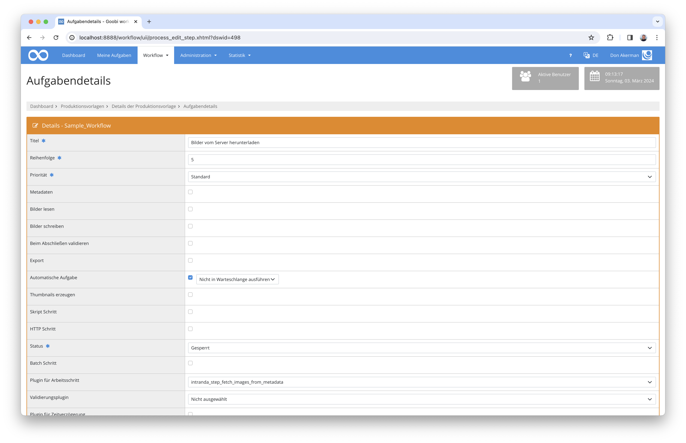

# Kopieren von Dateien aus Metadatenfeldern

## Übersicht

Name                     | Wert
-------------------------|-----------
Identifier               | intranda-step-fetch-images-from-metadata
Repository               | [https://github.com/intranda/goobi-plugin-step-fetch-images-from-metadata](https://github.com/intranda/goobi-plugin-step-fetch-images-from-metadata)
Lizenz              | GPL 2.0 oder neuer 
Letzte Änderung    | 30.01.2025 09:40:27


## Einführung
Die vorliegende Dokumentation beschreibt die Installation, Konfiguration und den Einsatz des Plugins. Mit Hilfe dieses Plugins können Bilder aus einem konfigurierten Ordner oder von bestimmten URLs anhand des im Vorgangs hinterlegten Dateinamens in den gewünschte Ordner des Vorgangs kopiert oder bewegt werden. 


## Installation
Das Plugin besteht aus zwei Dateien:

```bash
plugin_intranda_step_fetch_images_from_metadata-base.jar
plugin_intranda_step_fetch_images_from_metadata.xml
```

Die Datei `plugin_intranda_step_fetch_images_from_metadata-base.jar` enthält die Programmlogik und muss für den `tomcat`-Nutzer lesbar in folgendes Verzeichnis installiert werden:

```bash
/opt/digiverso/goobi/plugins/step/
```

Die Konfigurationsdatei `plugin_intranda_step_fetch_images_from_metadata.xml` muss ebenfalls für den `tomcat`-Nutzer lesbar sein und in folgendes Verzeichnis installiert werden:

```bash
/opt/digiverso/goobi/config/
```


## Überblick und Funktionsweise
Dieses Plugin wird in den Workflow so integriert, dass es automatisch ausgeführt wird. Eine manuelle Interaktion mit dem Plugin ist nicht notwendig. Zur Verwendung innerhalb eines Arbeitsschrittes des Workflows sollte es wie im nachfolgenden Screenshot konfiguriert werden.



Das Plugin wird üblicherweise vollautomatisch innerhalb des Workflows ausgeführt. Es ermittelt zunächst, ob das in der Konfiguration spezifizierte Metadatum vorhanden ist und wertet dieses anschließend aus. Die in dem Metadatum angegebene Datei wird anschließend anhand ihres Namens und der Dateiendung in den media-Ordner des Vorgangs kopiert oder bewegt. Dabei prüft das Plugin die vorhandenen Bilder im `media`-Ordner des Vorgangs, um zu sehen, ob das gewünschte Bild bereits importiert wurde, und wenn nicht:

In den beiden folgenden Fällen wird die Reihenfolge der importierten Bilder aktualisiert und in der Mets-Datei gespeichert:	
- wenn `useUrl` auf `true` gesetzt ist, wird das Plugin das Bild von der angegebenen URL herunterladen 
- wenn `useUrl` auf `false` oder gar nicht gesetzt ist, wird der Name jeder Datei geprüft, um zu ermitteln, ob an sie als erste Datei des Verzeichnis behandelt werden soll, während die anderen Bilder einfach nach ihren Namen sortiert werden.


## Konfiguration
Die Konfiguration des Plugins erfolgt über die Konfigurationsdatei `plugin_intranda_step_fetch_images_from_metadata.xml` und kann im laufenden Betrieb angepasst werden. Im folgenden ist eine beispielhafte Konfigurationsdatei aufgeführt:

```xml
<?xml version="1.0" encoding="UTF-8"?>
<config_plugin>
    <!--
        order of configuration is:
          1.) project name and step name matches
          2.) step name matches and project is *
          3.) project name matches and step name is *
          4.) project name and step name are *
	-->
    
    <config>
        <!-- which projects to use for (can be more then one, otherwise use *) -->
        <project>*</project>
        <step>*</step>
        
        <!-- true if the images should be fetched from a url, false if the images should be fetched from the following configured folder. DEFAULT false -->
        <useUrl>false</useUrl>
        <!-- true if all existing images and pagination should be removed before a re-run -->
        <clearExistingData>false</clearExistingData>
        
        <!-- metadata containing the file name -->
        <filenameMetadata>SeparatedMaterial</filenameMetadata>
        
        <!-- mode="copy|move"   ignoreFileExtension="true|false"-->
        <fileHandling mode="copy" ignoreFileExtension="true" folder="/opt/digiverso/import/images/" />
        
        <!-- enabled= true|false exportImages=true|false -->
        <export enabled="true" exportImages="true" />
    </config>

</config_plugin>
```

Die einzelnen Parameter haben die folgende Funktion:

| Parameter | Erläuterung |
| :--- | :--- |
| `project` | Dieser Parameter legt fest, für welches Projekt der aktuelle Block `<config>` gelten soll. Verwendet wird hierbei der Name des Projektes. Dieser Parameter kann mehrfach pro `<config>`-Block vorkommen. |
| `step` | Dieser Parameter steuert, für welche Arbeitsschritte der Block `<config>` gelten soll. Verwendet wird hier der Name des Arbeitsschritts. Dieser Parameter kann mehrfach pro `<config>`-Block vorkommen. |
| `useUrl` | Dieser Parameter bestimmt den Quellort der abzurufenden Bilder. Wenn er auf `true` gesetzt ist, werden die Bilder von den registrierten URLs in der mets-Datei geholt, wenn er auf `false` oder gar nicht gesetzt ist, werden die Bilder aus dem folgenden konfigurierten Ordner geholt. |
| `clearExistingData` | Dieser Parameter bestimmt, ob vor einem Durchlauf vorhandene Bilder gesucht und gelöscht werden sollen. Neben den Bildern wird auch die Paginierung und Seitenzuweisung entfernt. |
| `filenameMetadata` | Hier ist der Name des Metadatenfeldes (üblicherweise aus der METS-Datei) angegeben, das den Dateinamen der zu importierenden Datei enthält. |
| `fileHandling` | Das Attribut `@mode` definiert, ob die Bilder durch Kopieren oder Verschieben importiert werden sollen. Das Attribut `@ignoreFileExtension` steuert, ob die Dateiendung für den Kopiervorgang ignoriert werden soll oder exakt stimmen muss. Das Attribut `@folder` gibt den Ordner an, in dem sich die zu importierenden Dateien befinden.   |
| `export` | Das Attribut `@enabled` legt fest, ob der Vorgang exportiert werden soll oder nicht, während das Attribut `@exportImages` definiert, ob hierbei die Bilder berücksichtig werden sollen.  |