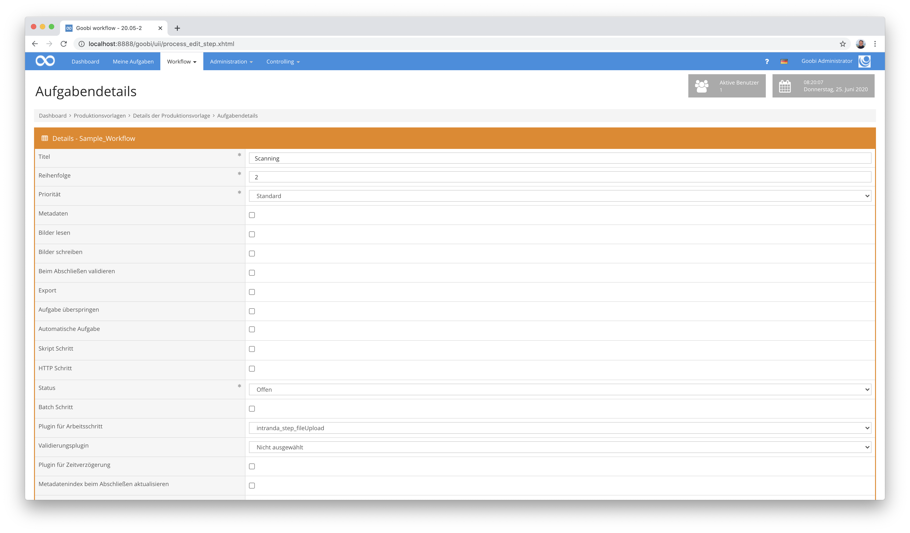
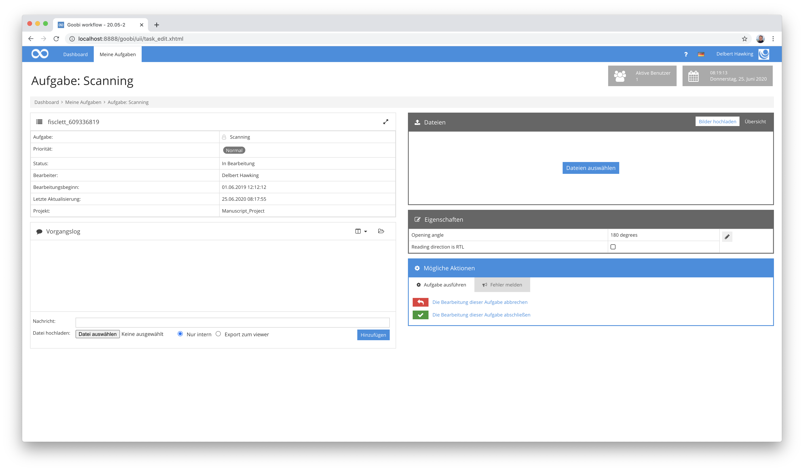
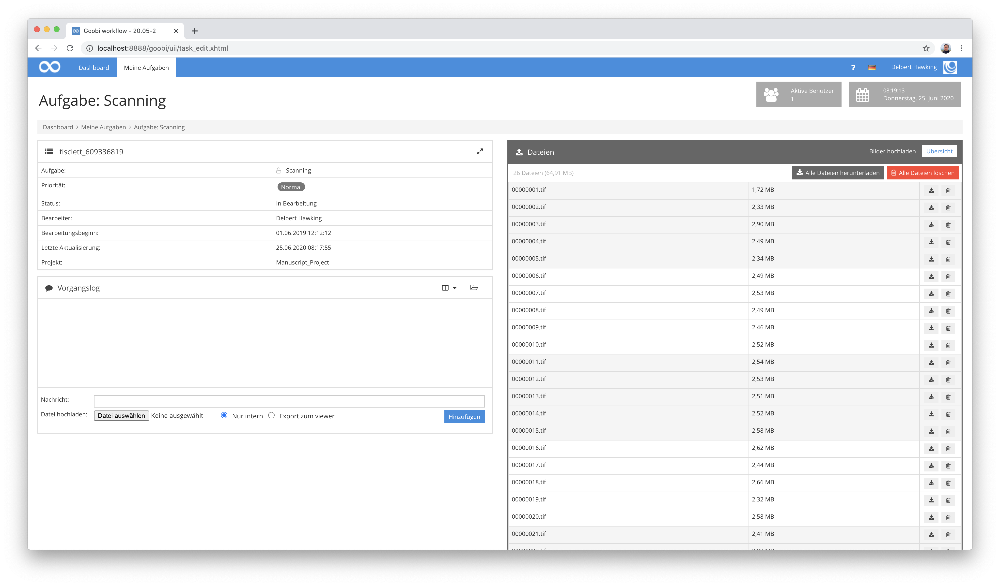

# Upload von Dateien

## Übersicht

Name                     | Wert
-------------------------|-----------
Identifier               | intranda_step_fileUpload
Repository               | [https://github.com/intranda/goobi-plugin-step-file-upload](https://github.com/intranda/goobi-plugin-step-file-upload)
Lizenz              | GPL 2.0 oder neuer 
Letzte Änderung    | 25.07.2024 11:58:57


## Einführung
Dieses Plugin dient zum Upload von Dateien innerhalb der Nutzeroberfläche einer angenommenen Aufgabe in Goobi workflow.


## Installation
Zur Installation des Plugins müssen folgende beiden Dateien installiert werden:

```bash
/opt/digiverso/goobi/plugins/step/plugin_intranda_step_fileUpload-base.jar
/opt/digiverso/goobi/plugins/GUI/plugin_intranda_step_fileUpload-gui.jar
```

Um zu konfigurieren, wie sich das Plugin verhalten soll, können verschiedene Werte in der Konfigurationsdatei angepasst werden. Die Konfigurationsdatei befindet sich üblicherweise hier:

```bash
/opt/digiverso/goobi/config/plugin_intranda_step_fileUpload.xml
```


## Überblick und Funktionsweise
Zur Inbetriebnahme des Plugins muss dieses für einen oder mehrere gewünschte Aufgaben im Workflow aktiviert werden. Dies erfolgt wie im folgenden Screenshot aufgezeigt durch Auswahl des Plugins `intranda_step_fileUpload` aus der Liste der installierten Plugins.



Nachdem das Plugin vollständig installiert und eingerichtet wurde, steht es für die Bearbeiter der entsprechenden Aufgaben zur Verfügung. Nach dem Betreten einer Aufgabe ist im rechten Bereich der Nutzeroberfläche nun ein Upload der Dateien möglich.



Dateien können entweder per Drag & Drop in diesen Bereich hochgeladen werden oder alternativ durch einen Klick auf den Button ausgewählt und somit hochgeladen werden.

Soll nach dem erfolgten Upload geprüft werden, welche Dateien in dem Ordner bereits vorhanden sind, so kann im rechten obereren Bereich die Anzeige umgeschaltet werden. Damit ist es dem Nutzer möglich, alle bereits vorhandenen Dateien in dem Ordner aufzulisten, einzelne Dateien herunterzuladen oder diese zu löschen.




## Konfiguration
Die Konfiguration des Plugins ist folgendermaßen aufgebaut:

```xml
<config_plugin>

    <config>
        <!-- which projects to use for (can be more than one, otherwise use *) -->
        <project>*</project>
        <step>*</step>
        <!-- which file types to allow -->
        <regex>/(\.|\/)(gif|jpe?g|png|tiff?|jp2|pdf)$/</regex>
        <!-- which folder to use (master|main|jpeg|source|...) -->
        <folder>master</folder>
    </config>

    <config>
        <!-- which projects to use for (can be more than one, otherwise use *) -->
        <project>My special project</project>
        <project>Archive_Project</project>
        <step>Upload derivatives</step>
        <!-- which file types to allow -->
        <regex>/(\.|\/)(gif|jpe?g|png|tiff?|jp2|pdf)$/</regex>
        <folder>media</folder>
        <folder>master</folder>
    </config>

</config_plugin>
```

Der Block `<config>` kann für verschiedene Projekte oder Arbeitsschritte wiederholt vorkommen, um innerhalb verschiedener Workflows unterschiedliche Aktionen durchführen zu können. Die weiteren Parameter innerhalb dieser Konfigurationsdatei haben folgende Bedeutungen:

| Wert | Beschreibung |
| :--- | :--- |
| `project` | Dieser Parameter legt fest, für welches Projekt der aktuelle Block `<config>` gelten soll. Verwendet wird hierbei der Name des Projektes. Dieser Parameter kann mehrfach pro `<config>` Block vorkommen. |
| `step` | Dieser Parameter steuert, für welche Arbeitsschritte der Block `<config>` gelten soll. Verwendet wird hier der Name des Arbeitsschritts. Dieser Parameter kann mehrfach pro `<config>` Block vorkommen. |
| `regex` | Mit diesem Parameter kann festgelegt werden, welche Dateitypen  für den Upload erlaubt sein sollen. Im oben angegebenen Beispiel sind mehrere Bildformate sowie pdf-Dateien erlaubt. |
| `folder` | Mit diesem Parameter läßt sich definieren, wohin der Upload der Dateien erfolgen soll. Dieser Parameter kann wiederholt vorkommen und erlaubt so einen Upload in mehrere Verzeichnisse, zwischen denen der Nutzer dann auswählen kann. Mögliche Werte hierfür sind z.B. `master`, `media` oder auch individuelle Ordner wie `photos` und `scans`. |