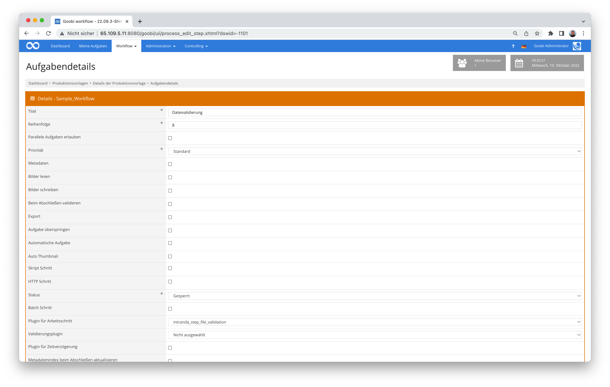

# Validierung von Dateien

## Übersicht

Name                     | Wert
-------------------------|-----------
Identifier               | intranda_step_file_validation
Repository               | [https://github.com/intranda/goobi-plugin-step-file-validation](https://github.com/intranda/goobi-plugin-step-file-validation)
Lizenz              | GPL 2.0 oder neuer 
Letzte Änderung    | 25.07.2024 11:58:49


## Einführung
Die vorliegende Dokumentation beschreibt die Installation, die Konfiguration und den Einsatz des Step Plugins für Validierung mit konfigurierbaren Prüfprofilen.


## Installation
Das Plugin besteht aus der folgenden Datei:

```bash
plugin_intranda_step_file_validation-base.jar
```

Diese Datei muss in dem richtigen Verzeichnis installiert werden, so dass diese nach der Installation an folgendem Pfad vorliegt:

```bash
/opt/digiverso/goobi/plugins/step/plugin_intranda_step_file_validation-base.jar
```

Daneben gibt es eine Konfigurationsdatei, die an folgender Stelle liegen muss:

```bash
/opt/digiverso/goobi/config/plugin_intranda_step_file_validation.xml
```


## Überblick und Funktionsweise
Das Plugin wird üblicherweise vollautomatisch innerhalb des Workflows ausgeführt. Es startet den konfigurierten Prüfprozess und gibt anschließend aus, ob das verlangte Prüflevel erreicht wurde. Falls eines der geprüften Dokumente das geforderte Level nicht erreicht, schlägt das Plugin fehl.

Dieses Plugin wird in den Workflow so integriert, dass es automatisch ausgeführt wird. Eine manuelle Interaktion mit dem Plugin ist nicht notwendig. Zur Verwendung innerhalb eines Arbeitsschrittes des Workflows sollte es wie im nachfolgenden Screenshot konfiguriert werden.




## Konfiguration
Die Konfiguration des Plugins erfolgt über die Konfigurationsdatei `plugin_intranda_step_file_validation.xml` und kann im laufenden Betrieb angepasst werden. Im folgenden ist eine beispielhafte Konfigurationsdatei aufgeführt:

```xml
<config_plugin>
	<!-- order of configuration is: 
		1.) project name and step name matches 
		2.) step name matches and project is * 
		3.) project name matches and step name is * 
		4.) project name and step name are * -->

	<config>
		<!-- which projects to use for (can be more then one, otherwise use *) -->
		<project>*</project>
		<!-- which stepss to use for (can be more then one, otherwise use *) -->
		<step>*</step>
		<!-- input folder where the documents are located, is only used in the STEP-Plugin -->
		<inputFolder>{processpath}/pdf</inputFolder>
		<!-- outputfolder where the folder with the tool reports will be created, is only used in the STEP-Plugin -->
		<outputFolder>{processpath}/validation</outputFolder>
		<!-- fileFilter: regex-Pattern that allows to filter by filename and fileextension -->
		<fileFilter>(?i).*\.pdf|.*\.epub</fileFilter>
		<!-- name of the profile that shall be used by this config blog -->
		<profileName>epubPdf</profileName>
		<!--targetLevel that must be reached for a successful plugin run -->
		<targetLevel>2</targetLevel>
	<config>
	</config>
		<!-- which institution to use for (can be more then one, otherwise use *) -->
		<institution>*</institution>
		<profileName>epubPdf</profileName>
		<targetLevel>0</targetLevel>

	</config>

	<!-- global has the child elements
		profile, namespaces and tools

		profile contains the definition of the ingest levels. It also has the attribute name,
		so you can refer to the profile in the config-blog element profileName
		the order of the levels defines their numbering, the first level element defines level zero and so on.

		a level element can contain check- and setValue- elements.

		a check element has following attributes
			name:		name of the check
			dependsOn:	name of the check that must have been successful, if this check shall be executed
					a check can only depend on a check that was defined before it.
					the parameter is optional
			tool:	name of the tool that must be executed to create the report
			group:  checks can be grouped. grouped checks are OR-operated which means, that the level won't fail if one check
				of the group is successful. ( i.e. check for isPDF-A and isPDFx in one level)
			code:	Errorcode or Errormessage that shall be displayed when the check fails /regex doesn't match node does not exist
			xpathSelector: xpathSelector to selct the node or attribute value
			regex:	regular expression that will be matched with the read value, if no regular expression is
				provided the check will only test if the node exists.
			namespace: (only needed if the specified check uses another namespace than the tool and if
					namespaces are used)

		a setValue element has following attributes
			name:		name of the check
			dependsOn:	name of the check that must have been successful if this setValue-Element shall be executed
					a setValue-Element can only depend on a check not on other setValue Elements. set value Elements will always be
					executed after the checks.
					the parameter is mandatory
			tool:	name of the tool that must have ben executed to create the report
			code:	Errorcode or Errormessage that shall be displayed when value retrival fails.
			xpathSelector: xpathSelector to selct an attribute value
			namespace: (only needed if the specified setValue-Element uses another namespace than the tool and if
					namespaces are used)

		a tools element contains multiple tool elements
		a tool element hast the attributes
			name:		name of the tool
			cmd:		the command that must be run to create the xml report. you can use the {pv.outputFile} variable to refer to
			stdout:		if stdout is true, the reportfile will be generated from the commandline output of the file. if it is set to false
					the plugins assumes the tool is able to create the file by itself
			xmlNamespace:	the name of the xml-namespace the generated report uses "jhove"

		a namespaces element can contain multiple namespace elements
		a namespace element has the attributes:
			name: 	the name of the xml namespace used in the xml and to address it in xmlNamespace attributes of tool-, check- and setValue-Elements
			uri:	the uri of the xml namespace
	-->
	<global>
		<profile name="epubPdf" >
			<level>
				<!-- 0 DI check Integrity of Document -->
				<!--checksum test should be done here -->
			</level>
			<level>
				<!-- 1 ID Document with File -->
				<check name="isPDF"
					tool="file"
					group="fileformat"
					code="This is not a PDF-File"
					xpathSelector="//format"
					regEx="(?i)^pdf document.*"
				/>

				<check name="isEPUB"
					tool="file"
					group="fileformat"
					code="This is not an EPUB-File"
					xpathSelector="//format"
					regEx="(?i)^epub document.*"
				/>
			</level>
			<level>
				<!-- 2 BF check for encryption or access restrictions -->
				<check name="checkEncryption"
					dependsOn="isPDF"
					tool="pdfinfo"
					code="The file is encrypted or has access restrictions"
					xpathSelector="//pdfinfo/Encrypted"
					regEx="^no$"
				/>

			</level>
			<level>
			<!-- 3 MD Extraction of Metadata -->

				<setValue name="PdfVersion"
					dependsOn="isPDF"
					tool="jhove_pdf"
					code="Could not read Version Information!"
					xpathSelector="//jhove:repInfo/jhove:version"
					processProperty="PDFVersion"
				/>
				<setValue name="FilesizePDF"
					dependsOn="isPDF"
					tool="jhove_pdf"
					code="Couldn't obtain Filesize"
					xpathSelector="//jhove:repInfo/jhove:size"
					processProperty="Filesize"
				/>
				<setValue name="EPUBVersion"
					dependsOn="isEPUB"
					tool="jhove_epub"
					code="Could not read Version Information!"
					xpathSelector="//jhove:repInfo/jhove:version"
					processProperty="EPUBVersion"
				/>
				<setValue name="FilesizeEPUB"
					dependsOn="isEPUB"
					tool="jhove_epub"
					code="Couldn't obtain Filesize"
					xpathSelector="//jhove:repInfo/jhove:size"
					processProperty="Filesize"
				/>
			</level>
			<level>
			<!-- 4 V Validity -->
				<check name="checkPDFVersion"
					dependsOn="isPDF"
					tool="jhove_pdf"
					code="The Version of the PDF-File is not supported by this Version of JHOVE"
					xpathSelector="//jhove:repInfo/jhove:version"
					regEx="^1\.[012456]$|^2\.0$"
				/>
				<check name="isValidPDF"
					dependsOn="checkPDFVersion"
					tool="jhove_pdf"
					code="PDF Validation failed"
					xpathSelector="//jhove:repInfo/jhove:status"
					regex="Well-Formed and valid"
				/>
				<check name="isValidEPUB"
					dependsOn="isEPUB"
					tool="jhove_epub"
					code="EPUB Validation failed"
					xpathSelector="//jhove:repInfo/jhove:status"
					regex="Well-Formed and valid"
				/>
			<!--
				<check name="pdf-a validation"
          dependsOn="isPDF"
					tool="verapdf"
					code="pdfa_validation_failed"
					xpathSelector="xpathSelector"
					regEx="regEx"
				/>
				-->
			</level>
		</profile>
		<namespaces>
			<namespace name="jhove" uri="http://hul.harvard.edu/ois/xml/ns/jhove" />
		</namespaces>
		<tools>
			<tool name="jhove_pdf"
				cmd="/usr/bin/jhove -m PDF-hul -h XML -o {pv.outputFile} {pv.inputFile}"
				stdout="false"
				xmlNamespace ="jhove"
			 />

			<tool name="jhove_epub"
				cmd="/usr/bin/jhove -m EPUB-ptc -h XML -o {pv.outputFile} {pv.inputFile}"
				stdout="false"
				xmlNamespace ="jhove"
			 />
			<tool name="verapdf"
				cmd="/opt/digiverso/verapdf/verapdf --format mrr {pv.inputFile}"
				stdout="true"
			 />
			<tool name="pdfinfo"
				cmd="/opt/digiverso/goobi/config/pdfinfogawk.sh {pv.inputFile}"
				stdout="true"
			 />
			 <tool name="file"
				cmd="/opt/digiverso/goobi/config/filegawk.sh {pv.inputFile}"
				stdout="true"
			 /> 					
		</tools>
	</global>
</config_plugin>
```

Das `config_plugin`-Element kann zwei Kindelementtypen haben: `config` und `global`. Zunächst wird hier die Funktionalität des `config`-Elements beschrieben.


### Aufbau des config-Elements
| Parameter | Erläuterung |
| :--- | :--- |
| `project` | Dieser Parameter legt fest, für welches Projekt der aktuelle Block `<config>` gelten soll. Verwendet wird hierbei der Name des Projektes. Dieser Parameter kann mehrfach pro `<config>` Block vorkommen. |
| `step` | Dieser Parameter steuert, für welche Arbeitsschritte der Block `<config>` gelten soll. Verwendet wird hier der Name des Arbeitsschritts. Dieser Parameter kann mehrfach pro `<config>` Block vorkommen. |
| `institution` | Dieser Parameter steuert im Rahmen des Dashboard-delivery, für welche Einrichtung der Block <config> gelten soll. Verwendet wird hier der Name der Einrichtung. Dieser Parameter kann mehrfach pro <config> Block vorkommen. |
| `inputFolder` | Hier muss spezifiziert werden, wo sich die Dokumente befinden, die geprüft werden sollen. Bei der Angabe können Goobivariablen wie `{processpath}` verwendet werden.  |
| `outputFolder` | Hier muss spezifiziert werden, wo sich die Berichte, die von den Werkzeugen (`tools`) erzeugt werden, gespeichert werden sollen. Bei der Angabe können Goobivariablen wie `{processpath}` verwendet werden. |
| `fileFilter` | Hier kann ein regulärer Ausdruck formuliert werden, um anhand des Dateinamens (i.d.R. die Dateiendung) einzugrenzen, welche Dateien geprüft werden sollen. |
| `profileName` | Hier kann das Prüfprofil spezifiziert werden, das für diese Institution bzw. diese `project`/`step`-Kombination verwendet werden soll. |
| `targetLevel` | Hier muss spezifiziert werden, welches Level des Prüfprozesses vom Dokument erreicht werden muss. |


### Aufbau des global-Elementes
Das `global`-Element kann 3 Kindelementtypen haben: `profile`, `namespaces` und `tools`.


### Aufbau des namespace-Elementes
Das `namespace`-Element kann mehrere Kinder des Typs `namespace` haben.
Ein `namespace` beschreibt hier einen XML-Namensraum und hat folgende Attribute:


| Attribut | Erläuterung |
| :--- | :--- |
| `name` | Ermöglicht es, den Namen des Namensraumes zu spezifizieren. In den Elementen `tool`, `check` und `setValue` kann der `namespace` dann über diesen Namen adressiert werden.  |
| `uri` | Hier muss der URI des XML-Namensraumes spezifiziert werden.   |


### Aufbau des tools-Elementes
Das `tools`-Element kann mehrere Kinder des Typs `tool` haben.
Mithilfe des tool-Elements können die Parameter beschrieben werden, die benötigt werden, um ein Werkzeug/Script vom Plugin ausführen zu lassen.

| Attribut | Erläuterung |
| :--- | :--- |
| `name` | Ermöglicht es, den Namen des Tools zu spezifizieren. In den Elementen `check` und `setValue` kann das `tool` dann über diesen Namen referenziert werden.|
| `uri` | Hier muss der URI des XML-Namensraumes spezifiziert werden.   |
| `cmd` | Hier muss der Befehl spezifiziert werden, mit dem das Werkzeug (z.B. `jhove`) aufgerufen werden kann. Im `cmd`-Attribut können die pluginspezifischen Variablen `{pv.outputFile}` (Pfad zur Ausgabedatei) und `{pv.inputFile}` (Pfad zum Dokument) verwendet werden.  |
| `stdout` | Hier kann angegeben werden, ob das Tool seinen Output nach Stdout (`true`) oder in eine Konfigurationsdatei (`false`) schreibt. |
| `xmlNamespace` | Hier kann ein `namespace`-Element anhand seines Namens referenziert werden.  |


### Aufbau des profile-Elementes
Das `profile`-Element kann mehrere Kinder des Typs `tool` haben. Es hat ausserdem das Attribut `name` mit dessen Wert es im 'config'-Element `profileName` referenziert werden kann.
Ein Profil hat mehrere Elemente des Typs `level`. In jedem Level können mehere `check` und `setValue`-Elemente enthalten sein. Die Level werden intern nach ihrer Reihenfolge nummeriert. Das erste `level`-Element ist dabei Level `0`, das zweite Level `1` usw.


### Aufbau von check- und setValue- Elementen
Ein `Check` ermöglicht es, einen Wert in einem der erzeugten xml-Reports zu prüfen. Zum Prüfen des Wertes wird ein regulärer Ausdruck herangezogen. Falls kein regulärer Ausdruck spezifiziert wird, wird nur überprüft, ob das angegebene xml-Element existiert. Wenn ein Check fehlschlägt, gilt das Level als gescheitert. Es sei denn, der gescheiterte Check ist in einer Gruppe, dann müssen auch alle anderen Checks der Gruppe scheitern, damit der Level als gescheitert gilt.

Die Attribute des `check`-Elementes sehen wie folgt aus:

| Attribut | Erläuterung |
| :--- | :--- |
| `name` | Hier muss der Name des Checks angegeben werden z.B. `isPDF`. Mithilfe des Names kann der Check dann von anderen `check`/`setValue`-Elementen referenziert werden. Der Checkname wird außerdem im erzeugten Report verwendet. |
| `group` | Dieses Attribut ist optional. Checks in der gleichen Gruppe sind ODER-verknüpft, d.h. das Level gilt erst als nicht erreicht, wenn alle Checks dieser Gruppe fehlgeschlagen sind. |
| `dependsOn` | Dieses Attribut ist optional. Wenn es angegeben ist, muss der in `dependsOn` aufgeführte Check erfolgreich ausgeführt werden, damit dieser Check ausgeführt wird. |
| `tool` | Hier muss angegeben werden, welches Tool den zugrundeliegenden XML-Report erzeugt. |
| `code` | Hier muss eine Fehlermeldung spezifiziert werden. |
| `xpathSelector` | Hier muss der xpath-Selektor spezifiziert werden, der den entsprechenden XML-Node im XML-Dokument auswählt. |
| `regex` | Dieses Attribut ist optional. Wird es angegeben, wird geprüft ob der ausgewählte Wert mit dem regulären Ausdruck matcht. Wird kein regulärer Ausdruck spezifiziert, wird nur überprüft, ob das XML-Element existiert. |
| `xmlNamespace` | Dieses Attribut ist optional. Mit diesem Attribut kann ein `namespace` spezifiziert werden, der vom Namespace des `tool` abweicht. Dies kann z.B. notwendig sein, wenn in einem Report verschiedene Namensräume verwendet werden. |

Ein `setValue`-Element ermöglicht es einen Wert aus einem der erzeugten Reports auszulesen und in den Prozesseigenschaften oder den Metadaten des obersten Strukturelements zu speichern. Die Attribute des `setValue`-Elements sehen wie folgt aus:

| Attribut | Erläuterung |
| :--- | :--- |
| `name` | Hier muss der Name des `setValue`-Elements angegeben werden z.B. `readPDFVersion`. Der Name wird außerdem im erzeugten Report verwendet. |
| `dependsOn` | Dieses Attribut ist obligatorisch. Ein `setValue`-Element hängt immer von einem Check ab. Der in `dependsOn` aufgeführte Check muss erfolgreich ausgeführt werden, damit dieses `setValue`-Element ausgewertet wird. |
| `tool`| Hier muss angegeben werden, welches Tool den zugrundeliegenden XML-Report erzeugt. |
| `code`| Hier muss eine Fehlermeldung spezifiziert werden. |
| `xpathSelector` | Hier muss der xpath-Selektor spezifiziert werden, der den entsprechenden XML-Node im XML-Dokument auswählt. |
| `xmlNamespace` | Dieses Attribut ist optional. Mit diesem Attribut kann ein Namespace spezifiziert werden, der vom Namespace des `tool` abweicht. Dies kann z.B. notwendig sein, wenn in einem Report verschiedene Namensräume verwendet werden. |
| `processProperty` | Dieses Attribut ist optional. Hier kann man spezifizieren, in welcher Prozesseigenschaft der eingelesene Wert gespeichert werden soll. |
| `mets` | Dieses Attribut ist optional. Hier kann man spezifizieren, in welchem Metadatum des obersten Strukturelements der eingelesene Wert gespeichert werden soll. Hierfür muss sichergestellt werden, dass die angegebenen Werte mit dem Regelsatz übereinstimmen. |


## Lösung für Programme, die keinen XML-Output erzeugen
Eine Grundvoraussetzung dieses Plugins ist es, dass die verwendeten Wertzeuge XML-Output erzeugen. Es kommt jedoch häufig vor, dass das gewünschte Werkzeug keine XML-Ausgabe erzeugt. In diesem Fall raten wir dazu den Output mit einem GAWK-Script nach XML zu transformieren.
Als Beispiel dient hier der Output des `file`-Befehls:

```bash
LoremIpsum-a3b.pdf: PDF document, version 1.6
```

Statt das Tool direkt aufzurufen, würde man nun ein Shellscript mit folgendem Inhalt erstellen und im `cmd`- Attribut des Tools hinterlegen:

```bash
file $1 | gawk -f {absoluter pfad zum awk-script} | xmllint --format -
```

Wenn wir vom Output des `file`-Befehles nur den zweiten Parameter benötigen, könnte das (g)awk script wie folgt aussehen:

```bash
BEGIN {
   FS="|";
   printf("<?xml version=\"1.0\" ?>\n<file>\n");
}
{
   split($1, a, ":");
   # remove whitespace
   gsub(/^[ \t]+/,"",a[2]);
   # remove unwanted Version Information
   sub(/,.*/,"",a[2])
   # ignore key value and only print second value
   printf("<format>%s</format>\n",a[2]);   
}
END {
   printf("</file>\n");
}
```

Das Resultat wäre dann der folgende XML-Output:

```xml
<?xml version="1.0"?>
<file>
  <format>PDF document</format>
</file>
```


## Konfigurationsbeispiele


### Plugin-Konfiguration
Vollständiges Beispiel für die Pluginskonfiguration innerhalb der Datei `plugin_intranda_step_file_validation.xml`:

```xml
<config_plugin>
	<!-- order of configuration is: 1.) project name and step name matches 2.) 
		step name matches and project is * 3.) project name matches and step name 
		is * 4.) project name and step name are * -->
		
	<config>
		<!-- which projects to use for (can be more then one, otherwise use *) -->
		<project>*</project>
		<!-- which stepss to use for (can be more then one, otherwise use *) -->
		<step>*</step>
		<!-- input folder where the documents are located, is only used in the STEP-Plugin -->
		<inputFolder>/opt/digiverso/pdf</inputFolder>
		<!-- outputfolder where the folder with the tool reports will be created, is only used in the STEP-Plugin --> 
		<outputFolder>{processpath}/validation</outputFolder>
		<!-- fileFilter: regex-Pattern that allows to filter by filename and fileextension -->
		<fileFilter>(?i).*\.pdf|.*\.epub</fileFilter>
		<!-- name of the profile that shall be used by this config blog -->
		<profileName>epubPdf</profileName>
		<!--targetLevel that must be reached for a successful plugin run -->
		<targetLevel>4</targetLevel>
	<config>
	</config>
		<!-- which institution to use for (can be more then one, otherwise use *) -->
		<institution>*</institution>
		<profileName>epubPdf</profileName>
		<targetLevel>0</targetLevel>
	</config>
	
	<!-- global has the child elements
		profile, namespaces and tools
		
		profile contains the definition of the ingest levels. It also has the attribute name, 
		so you can refer to the profile in the config-blog element profileName 
		the order of the levels defines their numbering, the first level element defines level zero and so on.
		
		a level element can contain check- and setValue- elements.
		
		a check element has following attributes
			name:		name of the check
			dependsOn:	name of the check that must have been successful, if this check shall be executed
					a check can only depend on a check that was defined before it.
					the parameter is optional
			tool:	name of the tool that must be executed to create the report
			group:  checks can be grouped. grouped checks are OR-operated which means, that the level won't fail if one check
				of the group is successful. ( i.e. check for isPDF-A and isPDFx in one level)
			code:	Errorcode or Errormessage that shall be displayed when the check fails /regex doesn't match node does not exist
			xpathSelector: xpathSelector to selct the node or attribute value
			regex:	regular expression that will be matched with the read value, if no regular expression is
				provided the check will only test if the node exists.
			namespace: (only needed if the specified check uses another namespace than the tool and if 
					namespaces are used)
					
		a setValue element has following attributes
			name:		name of the check
			dependsOn:	name of the check that must have been successful if this setValue-Element shall be executed
					a setValue-Element can only depend on a check not on other setValue Elements. set value Elements will always be 
					executed after the checks.
					the parameter is mandatory
			tool:	name of the tool that must have ben executed to create the report
			code:	Errorcode or Errormessage that shall be displayed when value retrival fails.
			xpathSelector: xpathSelector to selct an attribute value
			namespace: (only needed if the specified setValue-Element uses another namespace than the tool and if 
					namespaces are used)
					
		a tools element contains multiple tool elements
		a tool element hast the attributes
			name:		name of the tool
			cmd:		the command that must be run to create the xml report. you can use the {pv.outputFile} variable to refer to 
			stdout:		if stdout is true, the reportfile will be generated from the commandline output of the file. if it is set to false 
					the plugins assumes the tool is able to create the file by itself
			xmlNamespace:	the name of the xml-namespace the generated report uses "jhove"
		
		a namespaces element can contain multiple namespace elements
		a namespace element has the attributes:
			name: 	the name of the xml namespace used in the xml and to address it in xmlNamespace attributes of tool-, check- and setValue-Elements 
			uri:	the uri of the xml namespace
	-->
	<global>
		<profile name="epubPdf" >
			<level>
				<!-- 0 DI check Integrity of Document -->
				<!--checksum test should be done here -->
			</level>
			<level>
				<!-- 1 ID Document with JHOVE -->
				<check name="isPDF"
					tool="jhove"
					group="fileformat"
					code="This is not a PDF-File" 
					xpathSelector="//jhove:repInfo/jhove:format"
					regEx="(?i)pdf$" 
				/>
				
				<check name="isEPUB"
					tool="jhove" 
					group="fileformat"
					code="This is not an EPUB-File" 
					xpathSelector="//jhove:repInfo/jhove:format"
					regEx="(?i)epub$" 
				/>
			
			</level>
			<level>	
				<!-- 2 BF check for encryption or access restrictions -->
				<check name="checkEncryption"
					dependsOn="isPDF"
					tool="pdfinfo" 
					code="The file is encrypted or has access restrictions" 
					xpathSelector="//pdfinfo/Encrypted"
					regEx="^no$" 
				/>
				
			</level>
			<level>
			<!-- 3 MD Extraction of Metadata -->
				<setValue name="PdfVersion"
					dependsOn="isPDF"
					tool="jhove"
					code="Could not read Version Information!"
					xpathSelector="//jhove:repInfo/jhove:version"
					processProperty="PDFVersion"
				/>
				<setValue name="FilesizePDF"
					dependsOn="isPDF"
					tool="jhove"
					code="Couldn't obtain Filesize"
					xpathSelector="//jhove:repInfo/jhove:size"
					processProperty="Filesize"
				/>
				<setValue name="FilesizeEPUB"
					dependsOn="isEPUB"
					tool="jhove"
					code="Couldn't obtain Filesize"
					xpathSelector="//jhove:repInfo/jhove:version"
					processProperty="EPUBVersion"
				/>		
			</level>
			<level>
			<!-- 4 V Validity -->
				<check name="checkPDFVersion"
					dependsOn="isPDF"
					tool="jhove" 
					code="The Version of the PDF-File is not supported by this Version of JHOVE" 
					xpathSelector="//jhove:repInfo/jhove:version"
					regEx="^1\.[012456]$|^2\.0$" 
				/>
				<check name="isValidPDF"
					dependsOn="checkPDFVersion"
					tool="jhove" 
					code="PDF Validation failed" 
					xpathSelector="//jhove:repInfo/jhove:status"
					regex="Well-Formed and valid"
				/>
				<check name="isValidEPUB"
					dependsOn="isEPUB"
					tool="jhove" 
					code="EPUB Validation failed" 
					xpathSelector="//jhove:repInfo/jhove:status"
					regex="Well-Formed and valid"
				/>
			<!--
				<check name="pdf-a validation"
					tool="verapdf" 
					code="pdfa_validation_failed" 
					xpathSelector="xpathSelector"
					regEx="regEx" 
				/>
				-->
			</level>
		</profile>
		<namespaces>
			<namespace name="jhove" uri="http://schema.openpreservation.org/ois/xml/ns/jhove" />
		</namespaces>
		<tools>
			<tool name="jhove" 
				cmd="/opt/digiverso/tools/jhove/jhove -h XML -m PDF-hul -o {pv.outputFile} {pv.inputFile}"
				stdout="false"
				xmlNamespace ="jhove"
			 />
			<tool name="verapdf" 
				cmd="/home/michael/verapdf/verapdf --format mrr {pv.inputFile}"
				stdout="true"
			 />
			<tool name="pdfinfo" 
				cmd="/opt/digiverso/tools/pdfinfogawk.sh {pv.inputFile}"
				stdout="true"
			 /> 			
		</tools>
	</global>
</config_plugin>
```


### Beispiel für PDF-Validierung
Beispiel für PDF-Validierungsaufruf mittels `pdfinfogawk.sh`:

```bash
pdfinfo $1 | gawk -f /opt/digiverso/tools/namedKeys.awk | xmllint --format -
````

Beispieldatei `namedKeys.awk`:

```bash
BEGIN { 
   FS="|";
   printf("<?xml version=\"1.0\" ?>\n<pdfinfo>\n");
}
NF==1 {
   sub(/:/,"^",$1); 
   split($1, a, "^"); for (i in a) {
    if (i == 1) {
    	gsub(/[ \t]+/,"",a[1]);
        printf("<%s>", a[1]);
        }
    if (i == 2) {
    	gsub(/^[ \t]+/,"",a[2]);
        printf("%s", a[2]);
        printf("</%s>\n", a[1]);
        }
   } 
}
END {
   printf("</pdfinfo>\n");
}
```


### Beispiel für File-Validierung
Beispiel für Validierung mittels file-Befehl via `filegawk.sh`:

```bash
file $1 | gawk -f /opt/digiverso/tools/fileFormat.awk | xmllint --format -
```

Beispieldatei `fileFormat.awk`:

```bash
BEGIN { 
   FS="|";
   printf("<?xml version=\"1.0\" ?>\n<file>\n");
}
NF==1 {
   sub(/:/,"^",$1); 
   split($1, a, "^"); for (i in a) {
      if (i == 2) {
    	gsub(/^[ \t]+/,"",a[2]);
        printf("<format>%s</format>\n", a[2]);
      } 
   }
}
END {
   printf("</file>\n");
}
```