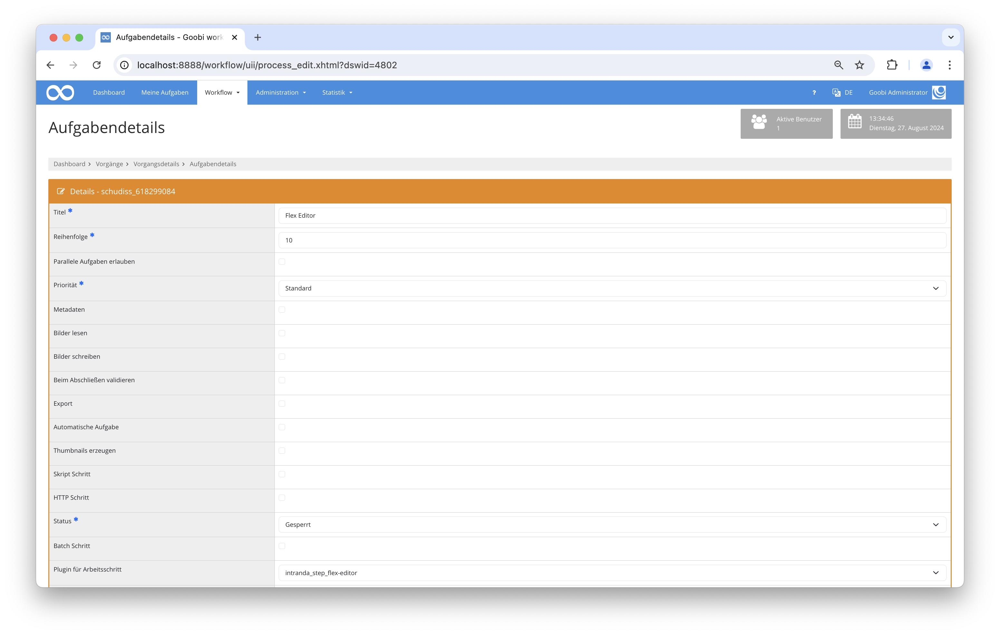
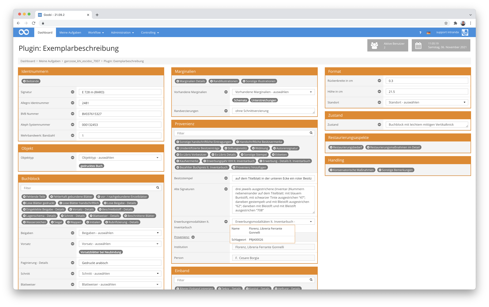
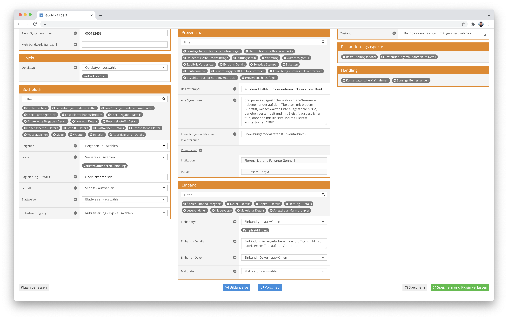
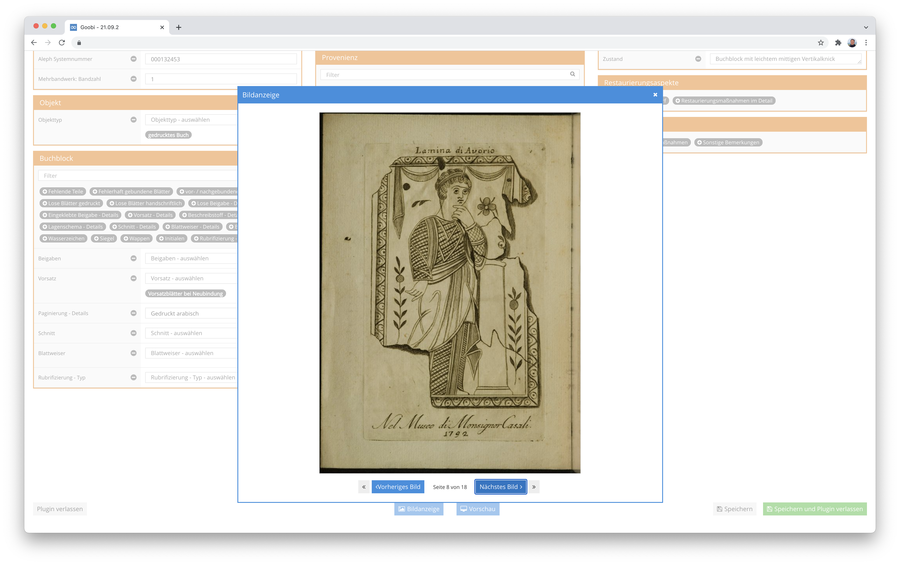

# Flex Editor

## Übersicht

Name                     | Wert
-------------------------|-----------
Identifier               | intranda_step_flex_editor
Repository               | [https://github.com/intranda/goobi-plugin-step-flex-editor](https://github.com/intranda/goobi-plugin-step-flex-editor)
Lizenz              | GPL 2.0 oder neuer 
Letzte Änderung    | 04.09.2024 09:22:22


## Einführung
Dieses Plugin ermöglicht die dynamische Anpassung der Benutzeroberfläche, sodass spezifische Anforderungen an die Metadatenverwaltung effizient umgesetzt werden können.

## Installation
Dieses Plugin wird als tar-Archiv ausgeliefert. Um es zu installieren, muss das Archiv plugin_intranda_step_flex-editor.tar in den Goobi-Ordner entpackt werden:

```bash
tar -C /opt/digiverso/goobi/ -xf plugin_intranda_step_flex-editor.tar --exclude="pom.xml"
```

Dieses Plugin verfügt außerdem über eine Konfigurationsdatei mit dem Namen `plugin_intranda_step_flex-editor.xml`. Sie muss unter folgendem Pfad abgelegt werden:

```bash
/opt/digiverso/goobi/config/plugin_intranda_step_flex-editor.xml
```

Für die Verwendung des Plugins muss dieses in einem Arbeitsschritt ausgewählt sein:



## Überblick und Funktionsweise
Der Flex Editor für Goobi Workflow ermöglicht die flexible Anpassung der Metadaten-Eingabeoberfläche. Über eine XML-Konfigurationsdatei wird definiert, wie Metadatenfelder in Spalten und Boxen organisiert und angezeigt werden. Verschiedene Feldtypen, wie Textfelder, Checkboxen und Dropdowns, bieten verschiedene Eingabeoptionen.





## Konfiguration
Die Konfiguration des Plugins erfolgt in der Datei `plugin_intranda_step_flex-editor.xml` wie hier aufgezeigt:

```xml
<config>
    <column>
        <box name="bla 1">
            <field type="MULTISELECT" defaultDisplay="true">
                <metadatatype>unknown</metadatatype>
                <name>My multi select field</name>
                <sourceVocabulary>testVocabforDropdown</sourceVocabulary>
            </field>
            <field type="INPUT">
                <metadatatype>unknown</metadatatype>
                <name>My input field</name>
            </field>
        </box>
    </column>
    <column>
        <box name="bla 2">
            <field type="TEXTAREA">
                <metadatatype>unknown</metadatatype>
                <name>My textarea</name>
            </field>
        </box>
    </column>
    <column>
        <box name="bla 3">
            <field type="BOOLEAN">
                <metadatatype>unknown</metadatatype>
                <name>My checkbox</name>
            </field>
            <field type="TEXTAREA">
                <metadatatype>unknown</metadatatype>
                <name>My textarea</name>
            </field>
            <field type="DROPDOWN">
                <metadatatype>unknown</metadatatype>
                <name>My dropdown</name>
                <sourceVocabulary>testVocabforDropdown</sourceVocabulary>
            </field>
        </box>
        <box name="bla 5">
            <field type="TEXTAREA">
                <metadatatype>unknown</metadatatype>
                <name>My textarea</name>
            </field>
        </box>
    </column>
</config>

```

### Allgemeine Parameter 
Der Block `<config>` kann für verschiedene Projekte oder Arbeitsschritte wiederholt vorkommen, um innerhalb verschiedener Workflows unterschiedliche Aktionen durchführen zu können. Die weiteren Parameter innerhalb dieser Konfigurationsdatei haben folgende Bedeutungen: 

| Parameter | Erläuterung | 
| :-------- | :---------- | 
| `project` | Dieser Parameter legt fest, für welches Projekt der aktuelle Block `<config>` gelten soll. Verwendet wird hierbei der Name des Projektes. Dieser Parameter kann mehrfach pro `<config>` Block vorkommen. | 
| `step` | Dieser Parameter steuert, für welche Arbeitsschritte der Block `<config>` gelten soll. Verwendet wird hier der Name des Arbeitsschritts. Dieser Parameter kann mehrfach pro `<config>` Block vorkommen. | 


### Weitere Parameter 
Neben diesen allgemeinen Parametern stehen die folgenden Parameter für die weitergehende Konfiguration zur Verfügung: 


Die Konfigurationsdatei beschreibt den Aufbau der in Goobi zu sehenden Nutzeroberfläche. Die Konfiguration besteht aus mehreren `<column>`-Elementen, die in der Oberfläche jeweils eine Spalte ergeben. In den `<column>`-Elementen gibt es wiederum `<box>`-Elemente, die in der Oberfläche mehrere Metadatenfelder zu einer Box gruppieren. In den `<box>`-Elementen wiederum befinden sich `<field>`-Elemente, die ein Metadatenfeld im Vorgang repäsentieren. Die `<field>`-Elemente können verschiedene Typen haben, die ihnen eine bestimmte Funktionalität in der Nutzeroberfläche geben:

Parameter               | Erläuterung
------------------------|------------------------------------
`INPUT`                      | Ein einzeiliges Eingabefeld, das verwendet wird, um einfache Texteingaben zu erfassen. Es muss immer auch ein Metadatentyp angegeben werden. |
`TEXTAREA`                      | Hierbei handelt es sich um ein mehrzeiliges Eingabefeld. Auch hier ist die Angabe eines Metadatentyps erforderlich. |
`BOOLEAN`                      | Eine Checkbox, die für Ja/Nein-Entscheidungen oder binäre Optionen verwendet wird. Ein Metadatentyp muss ebenfalls angegeben werden. |
`DROPDOWN`                      | Ein Dropdown-Menü, dessen Werte aus dem vorgegebenen Vokabular stammen. Zusätzlich zum Metadatentyp muss der Name des zu verwendenden Vokabulars angegeben werden. |
`MODAL_PROVENANCE`                      | Erstellt eine Metadatengruppe, in der mehrere Felder zusammengefasst sind. Diese Felder können ebenfalls aus Vokabularen stammen. Das Feld ist wiederholbar und kann mehrere Vokabulare verwenden. |