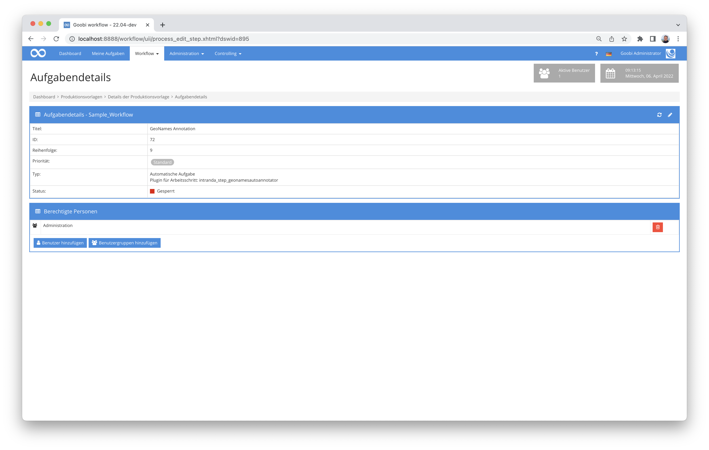

# Automatische Geonames Annotierung

## Übersicht

Name                     | Wert
-------------------------|-----------
Identifier               | intranda_step_geonamesautoannotator
Repository               | [https://github.com/intranda/goobi-plugin-step-geonames-auto-annotator](https://github.com/intranda/goobi-plugin-step-geonames-auto-annotator)
Lizenz              | GPL 2.0 oder neuer 
Letzte Änderung    | 25.07.2024 11:58:33


## Einführung
Dieses Step Plugin für Goobi workflow annotiert automatisch vorhandene "location" NER Tags in ALTO Dateien mit Geonames URLs. Dabei wird immer der erste Treffer der Suchanfrage genommen. Es ist also empfehlenswert, die Ergebnisse noch einmal zu überprüfen und zu korrigieren.


## Installation
Das Plugin besteht aus folgenden Dateien:

```bash
goobi_plugin_step_geonamesautoannotator-base.jar
plugin_intranda_step_geonamesautoannotator.xml
```

Die Datei `goobi_plugin_step_geonamesautoannotator-base.jar` muss in dem richtigen Verzeichnis installiert werden, so dass diese nach der Installation an folgendem Pfad vorliegt:

```bash
/opt/digiverso/goobi/plugins/step/plugin_intranda_step_geonamesautoannotator-base.jar
```

Daneben gibt es eine Konfigurationsdatei, die an folgender Stelle liegen muss:

```bash
/opt/digiverso/goobi/config/plugin_intranda_step_geonamesautoannotator.xml
```


## Überblick und Funktionsweise
Dieses Plugin wird in den Workflow so integriert, dass es automatisch ausgeführt wird. Eine manuelle Interaktion mit dem Plugin ist nicht notwendig. Zur Verwendung innerhalb eines Arbeitsschrittes des Workflows sollte es wie im nachfolgenden Screenshot konfiguriert werden.



Das Plugin durchsucht für alle `location` NER Tags die Geonames-Datenbank. Sollten ein oder mehrere Suchtreffer zurückgegeben werden, wird der erste Suchtreffer in der Liste in das ALTO übernommen.


## Konfiguration
Die Konfiguration des Plugins erfolgt über die Konfigurationsdatei `plugin_intranda_step_geonamesautoannotator.xml` und kann im laufenden Betrieb angepasst werden. Im folgenden ist eine beispielhafte Konfigurationsdatei aufgeführt:

```xml
<?xml version="1.0" encoding="UTF-8"?>
<config_plugin>
    <!--
        order of configuration is:
          1.) project name and step name matches
          2.) step name matches and project is *
          3.) project name matches and step name is *
          4.) project name and step name are *
	-->

    <config>
        <!-- which projects to use for (can be more then one, otherwise use *) -->
        <project>*</project>
        <step>*</step>

        <!-- geonames account -->
        <geonamesAccount>testuser</geonamesAccount>
        <!-- geonames API URL - if you have a paid plan, use http://ws.geonames.net here -->
        <geonamesApiUrl>http://api.geonames.org</geonamesApiUrl>
    </config>

</config_plugin>
```

| Parameter | Erläuterung |
| :--- | :--- |
| `project` | Dieser Parameter legt fest, für welches Projekt der aktuelle Block `<config>` gelten soll. Verwendet wird hierbei der Name des Projektes. Dieser Parameter kann mehrfach pro `<config>` Block vorkommen. |
| `step` | Dieser Parameter steuert, für welche Arbeitsschritte der Block `<config>` gelten soll. Verwendet wird hier der Name des Arbeitsschritts. Dieser Parameter kann mehrfach pro `<config>` Block vorkommen. |
| `geonamesAccount` | Mit diesem Parameter wird der Account-Name für den GeoNames-Zugriff definiert.  |
| `geonamesApiUrl` | Hier wird die URL für den Zugriff auf die API von GeoNames festgelegt.  |

Es empfielt sich für den Betrieb des Plugins eine höhere Quota bei geonames einzukaufen. Wenn dies getan wurde, muss die `geonamesApiUrl` auf  `http://ws.geonames.net` umgestellt werden.