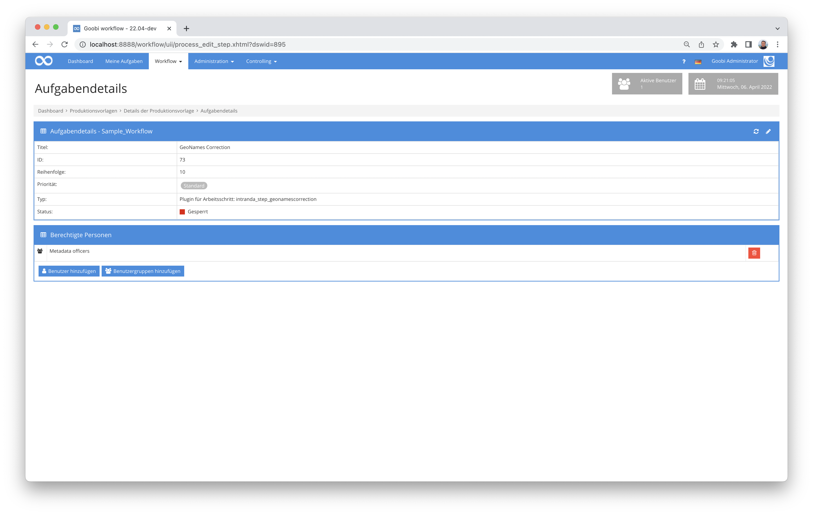
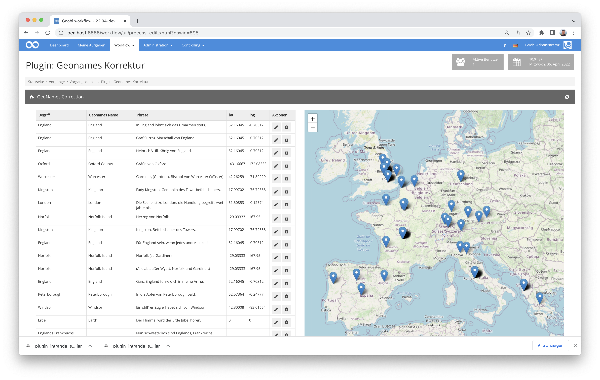
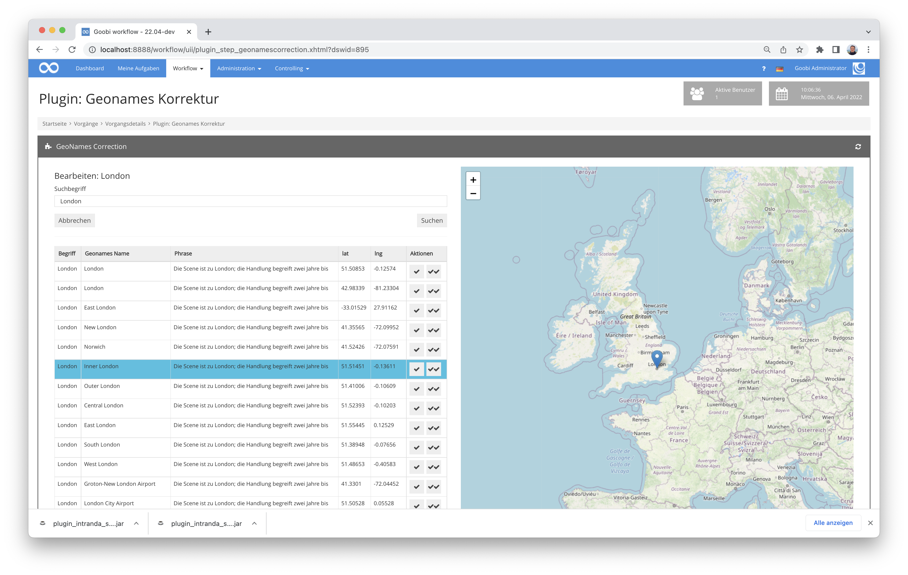

# GeoNames Korrektur

## Übersicht

Name                     | Wert
-------------------------|-----------
Identifier               | intranda_step_geonamescorrection
Repository               | [https://github.com/intranda/goobi-plugin-step-geonames-correction](https://github.com/intranda/goobi-plugin-step-geonames-correction)
Lizenz              | GPL 2.0 oder neuer 
Letzte Änderung    | 25.07.2024 11:58:21


## Einführung
Dieses Step Plugin für Goobi workflow erlaubt die Annotierung mit - beziehungsweise Korrektur von - zuvor automatisch erstellten GeoNames Identifiern in ALTO OCR-Ergebnissen. Dazu werden die innerhalb von ALTO annotierten NER-Ergebnisse mit dem Typ `location` in einer Tabelle angezeigt. Sollten schon automatisch erzeugte Geonames-Identifer in der ALTO-Datei vorliegen, werden diese auf einer Karte visualisiert.


## Installation
Das Plugin besteht aus folgenden Dateien:

```bash
goobi_plugin_step_geonamescorrection-base.jar
goobi_plugin_step_geonamescorrection_GUI-base.jar
plugin_intranda_step_geonamescorrection.xml
```

Diese jar-Dateien müssen in den richtigen Verzeichnissen installiert werden, so dass diese nach der Installation an folgendem Pfad vorliegen:

```bash
/opt/digiverso/goobi/plugins/step/plugin_intranda_step_geonamescorrection-base.jar
/opt/digiverso/goobi/plugins/GUI/plugin_intranda_step_geonamescorrection-gui.jar
```

Daneben gibt es eine Konfigurationsdatei, die an folgender Stelle liegen muss:

```bash
/opt/digiverso/goobi/config/plugin_intranda_step_geonamescorrection.xml
```


## Überblick und Funktionsweise
Zur Inbetriebnahme des Plugins muss dieses für einen oder mehrere gewünschte Aufgaben im Workflow aktiviert werden. Dies erfolgt wie im folgenden Screenshot aufgezeigt durch Auswahl des Plugins `intranda_step_geonamescorrection` aus der Liste der installierten Plugins.



Nach dem Betreten des Plugins werden links in einer Tabelle alle gefundenen named entities vom Typ `location` angezeigt. Sollten schon GeoNames URLs mit an den NER Tags in den OCR Ergebnissen gespeichert sein, werden diese auf einer Karte auf der rechten Bildschirmhälfte visualisiert.



Durch einen Klick auf einen der Marker in der Karte kann der zugehörige Eintrag in der Tabelle markiert werden und durch einen Klick auf einen Eintrag in der Tabelle wird dieser in der Karte herangezoomt. Ein Klick außerhalb der Tabelle und der Karte zoomt wieder heraus und alle Marker werden angezeigt.

Einträge können über das Löschen-Icon gelöscht und durch einen Klick auf das Bearbeiten-Icon editiert werden. Dadurch öffnet sich links eine neue Eingabemaske.



Es werden die Suchergebnisse zum Begriff in einer neuen Tabelle angezeigt. Der Suchbegriff kann auch im Eingabeschlitz ganz oben durch den Nutzer geändert und durch einen Klick auf `Suchen` eine neue Suche veranlasst werden.  
Um einen GeoNames Identifier zu übernehmen, muss auf das entsprechende Icon (ein Haken) geklickt werden. Der Button mit zwei Haken übernimmt diesen Identifier hingegen für alle gleichlautenden Begriffe im ganzen Werk.

Durch einen Klick auf `Speichern` oder `Speichern und verlassen` unten rechts werden die angepassten GeoNames Identifier in die ALTO-Dateien geschrieben. Bei `Speichern und verlassen` wird außerdem noch das Plugin verlassen.


## Konfiguration
Die Konfiguration des Plugins erfolgt über die Konfigurationsdatei `plugin_intranda_step_ark.xml` und kann im laufenden Betrieb angepasst werden. Im folgenden ist eine beispielhafte Konfigurationsdatei aufgeführt:

```xml
<?xml version="1.0" encoding="UTF-8"?>
<config_plugin>
    <!--
        order of configuration is:
          1.) project name and step name matches
          2.) step name matches and project is *
          3.) project name matches and step name is *
          4.) project name and step name are *
	-->

    <config>
        <!-- which projects to use for (can be more then one, otherwise use *) -->
        <project>*</project>
        <step>*</step>

        <!-- geonames account -->
        <geonamesAccount>testuser</geonamesAccount>
        <!-- geonames API URL - if you have a paid plan, use http://ws.geonames.net here -->
        <geonamesApiUrl>http://api.geonames.org</geonamesApiUrl>
    </config>

</config_plugin>
```

| Parameter | Erläuterung |
| :--- | :--- |
| `project` | Dieser Parameter legt fest, für welches Projekt der aktuelle Block `<config>` gelten soll. Verwendet wird hierbei der Name des Projektes. Dieser Parameter kann mehrfach pro `<config>` Block vorkommen. |
| `step` | Dieser Parameter steuert, für welche Arbeitsschritte der Block `<config>` gelten soll. Verwendet wird hier der Name des Arbeitsschritts. Dieser Parameter kann mehrfach pro `<config>` Block vorkommen. |
| `geonamesAccount` | Mit diesem Parameter wird der Account-Name für den GeoNames-Zugriff definiert.  |
| `geonamesApiUrl` | Hier wird die URL für den Zugriff auf die API von GeoNames festgelegt.  |

Es empfielt sich für den Betrieb des Plugins eine höhere Quota bei geonames einzukaufen. Wenn dies getan wurde, muss die `geonamesApiUrl` auf  `http://ws.geonames.net` umgestellt werden.