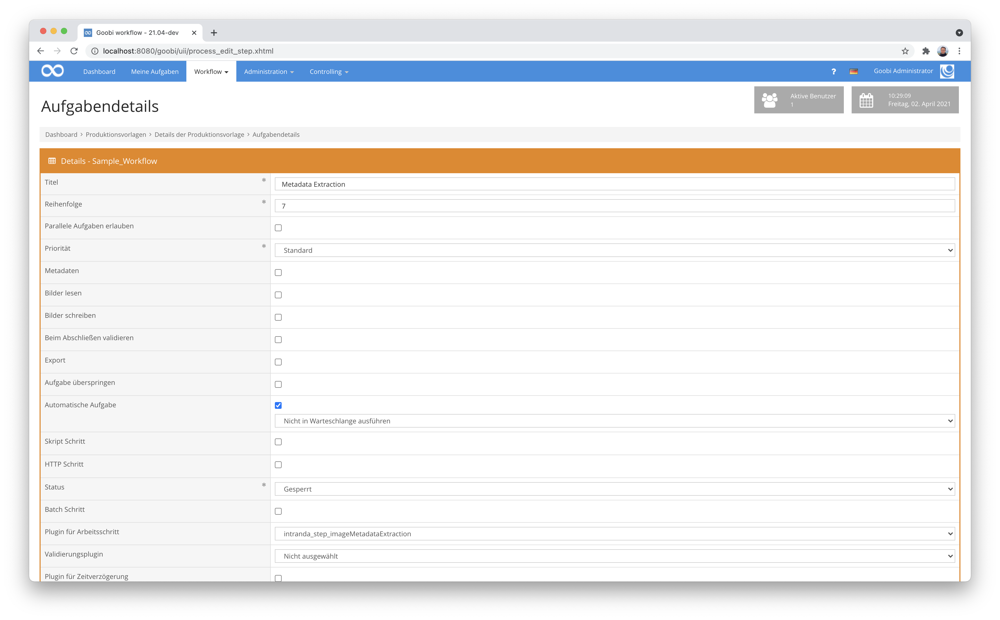

# Extraktion von Bildmetadaten

## Übersicht

Name                     | Wert
-------------------------|-----------
Identifier               | intranda_step_imageMetadataExtraction
Repository               | [https://github.com/intranda/goobi-plugin-step-image-metadata-extraction](https://github.com/intranda/goobi-plugin-step-image-metadata-extraction)
Lizenz              | GPL 2.0 oder neuer 
Letzte Änderung    | 25.07.2024 11:58:06


## Einführung
Mit Hilfe dieses Plugins können Metadaten aus Bilddateien extraiert und innerhalb der METS-Dateien von Goobi gespeichert werden. Hier findet im Hintergrund eine Nutzung des Linux-Programms ExifTool statt, um dessen gelesene Bildmetadaten gemäß individueller Konfiguration zu überführen.


## Installation
Zur Installation des Plugins muss die folgende Datei installiert werden:

```xml
/opt/digiverso/goobi/plugins/step/plugin_intranda_step_imageMetadataExtraction-base.jar
```

Um zu konfigurieren, wie sich das Plugin verhalten soll, können innerhalb der Konfigurationsdatei verschiedene Parameter angepasst werden. Die Konfigurationsdatei befindet sich üblicherweise unter folgendem Pfad:

```xml
/opt/digiverso/goobi/config/plugin_intranda_step_imageMetadataExtraction.xml
```


## Überblick und Funktionsweise
Zur Inbetriebnahme des Plugins muss dieses in einer Aufgabe im Workflow aktiviert werden. Dies erfolgt durch Auswahl des Plugins `intranda_step_imageMetadataExtraction` aus der Liste der installierten Plugins. Da das Plugin auf eine METS/MODS Datei angewiesen ist, sollte der Arbeitsschritt nach der Metadatenbearbeitung stattfinden.



Nachdem das Plugin vollständig installiert und eingerichtet wurde, wird es üblicherweise automatisch innerhalb des Workflows ausgeführt, so dass keine manuelle Interaktion mit dem Nutzer erfolgt. Stattdessen erfolgt der Aufruf des Plugins durch den Workflow im Hintergrund und führt die Extraktion der Bildmetadaten automatisch aus. Hierzu wird die erst Bilddatei aus dem media-Verzeichnis des Goobi-Vorgangs geöffnet, deren Metadaten ausgelesen und auf der obersten logischen Ebene der METS-Datei als das konfigurierte Metadatum gespeichert.


## Konfiguration
Die Konfiguration des Plugins ist folgendermaßen aufgebaut:

```xml
<config_plugin>

    <config>
        <!-- which projects to use for (can be more then one, otherwise use *) -->
        <project>*</project>
        <step>*</step>

        <command>/usr/bin/exiftool</command>
        <field line="Object Name" metadata="TitleDocMain" />
        <field line="Keywords" metadata="SubjectTopic" />
        <field line="Special Instructions" metadata="Footnote" />
        <field line="City" metadata="PlaceOfPublication" />
        <field line="Source" metadata="singleDigCollection" />
        <field line="Copyright Notice" metadata="AccessCondition" />
        <field line="Caption-Abstract" metadata="Abstract" />
    </config>

</config_plugin>
```

Der Block `<config>` kann für verschiedene Projekte oder Arbeitsschritte wiederholt vorkommen, um innerhalb verschiedener Workflows unterschiedliche Aktionen durchführen zu können. Die weiteren Parameter innerhalb dieser Konfigurationsdatei haben folgende Bedeutungen:

| Wert | Beschreibung |
| :--- | :--- |
| `project` | Dieser Parameter legt fest, für welches Projekt der aktuelle Block `<config>` gelten soll. Verwendet wird hierbei der Name des Projektes. Dieser Parameter kann mehrfach pro `<config>` Block vorkommen. |
| `step` | Dieser Parameter steuert, für welche Arbeitsschritte der Block `<config>` gelten soll. Verwendet wird hier der Name des Arbeitsschritts. Dieser Parameter kann mehrfach pro `<config>` Block vorkommen. |
| `command` | Innerhalb dieses Parameters wird der Pfad zu dem Program `ExifTool` angegeben. Hierbei handelt es sich um ein serverseitig installiertes Programm, das die Metdaten aus Bilddateien auslesen kann. |
| `field` | Für jedes gewünschte Metadatum, das pro Bild ausgelesen werden soll, kann jeweils ein `field` gegeben werden, das aus den Attributen `line` und `metadata` besteht. |

Die Definition von Feldern, erfolgt mit den folgenden Parametern:

| Wert | Beschreibung |
| :--- | :--- |
| `line` | Mit diesem Parameter wird festgelegt, wie das Metdatum innerhalb des Ergebnisses von ExifTool heisst. Geben Sie hier entsprechend den Namen an, wie das Metadatum innerhalb des Bildes vorliegt. |
| `metadata` | Dieser Parameter legt fest, unter welchem Metadatentyp der Inhalt des gelesenen Metatums in der METS-Datei gespeichert wird. Verwendet wird hierbei der interne Name des Metadatentyps, wie er im zugehörigen Regelsatz definiert wurde. Zu beachten ist hierbei, dass die Metaten jeweils auf der Ebene des höchsten logischen Strukturelements (z.B. einer Monographie) gespeichert werden und nicht an untergeordneten logischen oder physischen Elementen. |