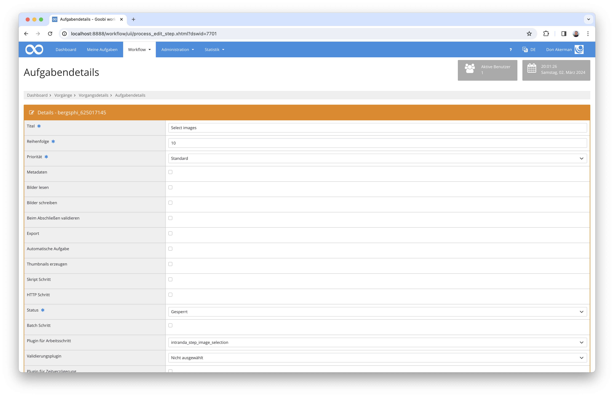

# Auswahl von Bildern

## Übersicht

Name                     | Wert
-------------------------|-----------
Identifier               | intranda_step_image_selection
Repository               | [https://github.com/intranda/goobi-plugin-step-image-selection](https://github.com/intranda/goobi-plugin-step-image-selection)
Lizenz              | GPL 2.0 oder neuer 
Letzte Änderung    | 25.07.2024 11:57:45


## Einführung
Diese Plugin dient zur visuellen Auswahl von Bildern. Es erlaubt Auswahl, Abwahl und Sortierung der ausgewählten Bilder per Drag & Drop.


## Installation
Zur Nutzung des Plugins müssen diese beiden Dateien an folgende Orte kopiert werden:

```bash
/opt/digiverso/goobi/plugins/step/plugin_intranda_step_image_selection-base.jar
/opt/digiverso/goobi/plugins/GUI/plugin_intranda_step_image_selection-gui.jar
```

Die Konfiguration des Plugins findet innerhalb dessen Konfigurationsdatei `plugin_intranda_step_image_selection.xml` statt. Diese wird unter folgendem Pfad erwartet:

```bash
/opt/digiverso/goobi/config/plugin_intranda_step_image_selection.xml
```


## Überblick und Funktionsweise
Zur Inbetriebnahme des Plugins muss dieses für eine oder mehrere Aufgaben im Workflow konfiguriert werden. Dies erfolgt wie im folgenden Screenshot aufgezeigt durch Auswahl des Plugins `intranda_step_image_selection` aus der Liste der installierten Plugins.



Das Plugin zeigt einige Bilder aus dem konfigurierten Ordner im linken Bereich an. Wird innerhalb des Bereichs nach unten gescrollt, werden weitere Bilder nachgeladen, sofern weitere Bilder vorhanden sind. Wenn sich der Mauszeiger über einem Bild befindet, wird eine vergrößerte Ansicht des Bildes angezeigt, mit der die Details des Bildes überprüft werden können.

Bilder können aus dem linken Bereich per Drag & Drop ausgewählt werden. Wenn die relative Position zum Ablegen korrekt erfasst wird, wird das neu ausgewählte Bild dort eingefügt, andernfalls wird es am Ende angehängt. Die ausgewählten Bilder können per Drag & Drop neu sortiert werden.

Wird die konfigurierte Maximalanzahl an ausgewählten Bildern erreicht oder wird versucht, das gleiche Bild mehrfach auszuwählen, funktioniert die Auswahl nicht.

Ausgewählte Bilder können per Drag & Drop wieder abgewählt werden. Ziehen Sie einfach das Bild aus der rechten Box und legen Sie es in der linken Box ab. 

Die relative Position eines ausgewälten Bildes kann mit seinem Nachbarn getauscht werden, indem man die obere bzw. untere Hälfte des Bildes anklickt. Es gibt hierbei zwei Ausnahmen ohne Tauschen: wenn man die obere Hälfte des ersten ausgewälten Bildes anklickt, dann wird es zum Ende der Liste angehängt; wenn man die untere Hälfte des letzten Bildes anklickt, dann wird es an den Anfang der Liste verschoben. Um ein ausgewähltes Bild zum Anfang der Liste zu verschieben, kann man auch auf dieses Bild mit der rechte Maustaste klicken.

Bitte beachten Sie, dass die Schaltfläche zum Speichern angeklickt werden muss, um die Informationen der ausgewählten Bilder innerhalb der Vorgangseigenschaften zu speichern. 


## Konfiguration
Die Konfiguration des Plugins ist folgendermaßen aufgebaut:

```xml
<config_plugin>
    <!--
        order of configuration is:
          1.) project name and step name matches
          2.) step name matches and project is *
          3.) project name matches and step name is *
          4.) project name and step name are *
    -->
    
    <config>
        <!-- which projects to use for (can be more then one, otherwise use *) -->
        <project>*</project>
        <step>*</step>
        
        <!-- define how many images shall be loaded in the beginning, DEFAULT 20 -->
        <defaultNumberToLoad>20</defaultNumberToLoad>
        
        <!-- define how many more images shall be loaded when the window is scrolled to the bottom, DEFAULT 10 -->
        <defaultNumberToAdd>10</defaultNumberToAdd>
        
        <!-- define which folder shall be used to display the thumbnails, possible values are master | main | jpeg | source | ... -->
        <folder>main</folder>
        
        <!-- define how many images shall be selected as maximum, DEFAULT 5 -->
        <!-- if smaller than min, then no selection is permitted -->
        <max>5</max>
        
        <!-- define how many images shall be selected as minimum, DEFAULT 1 -->
        <!-- if greater than max, then no selection is permitted -->
        <min>0</min>
        
        <!-- display button to finish the task directly from within the entered plugin -->
        <allowTaskFinishButtons>true</allowTaskFinishButtons>
    </config>

</config_plugin>
```

Die Parameter innerhalb dieser Konfigurationsdatei haben folgende Bedeutungen:

| Wert | Beschreibung |
| :--- | :--- |
| `defaultNumberToLoad` | Mit diesem Parameter können Sie festlegen, wie viele Bilder zu Beginn geladen werden sollen. Default `20`. |
| `defaultNumberToAdd` | Mit diesem Parameter können Sie festlegen, wie viele weitere Bilder beim Scrollen nach unten geladen werden sollen. Default `10`. |
| `folder` | Geben Sie hier den konfigurierten Namen des Ordners an, aus dem die Bilder angezeigt werden sollen. Mögliche Werte sind `master`, `main`, `jpeg`, `source` etc., sofern diese richtig konfiguriert sind. |
| `max` | Hier können Sie die maximale Anzahl von Thumbnails festlegen, die auswählbar sein soll. |
| `min` | Hier können Sie die Mindestanzahl von Thumbnails festlegen, die ausgewählt werden können, um als Vorgangseigenschaft gespeichert zu werden. |
| `allowTaskFinishButtons` | Mit diesem Parameter können Sie festlegen, ob diese Schaltfläche zum Abschließen der Aufgabe aktiviert werden soll. |