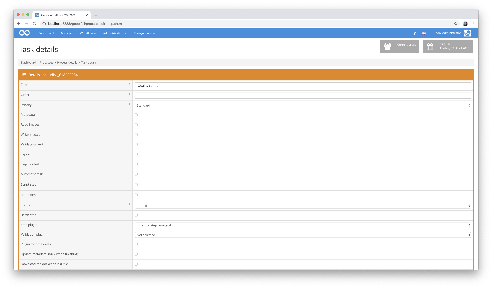
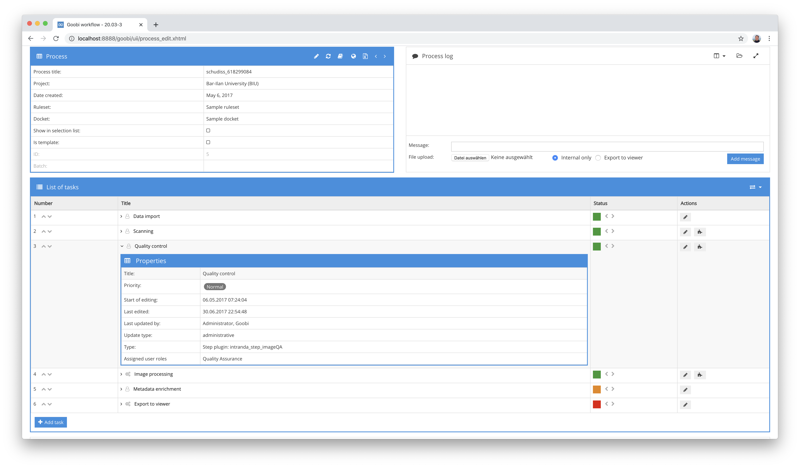
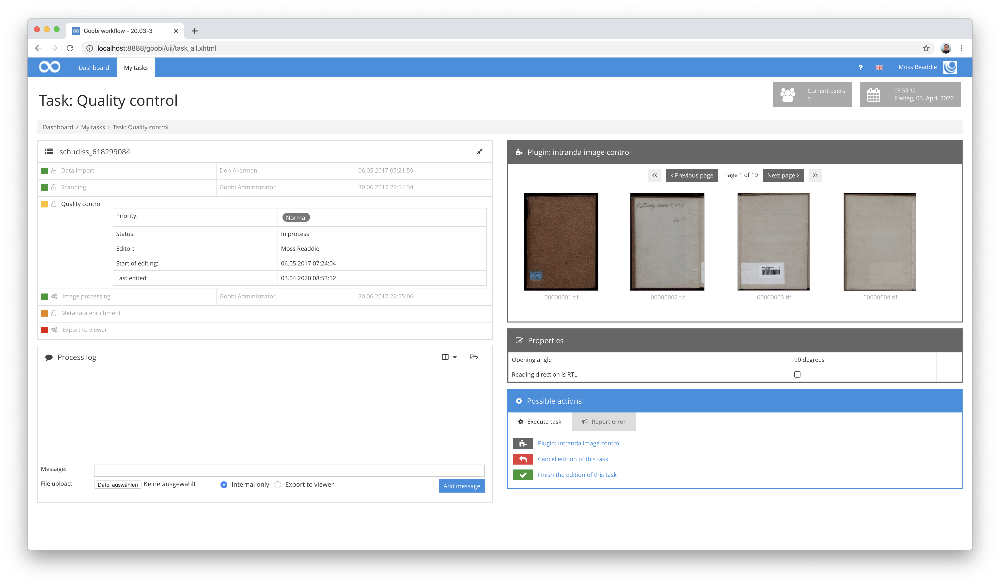

# Qualitätskontrolle von Bildern

## Übersicht

Name                     | Wert
-------------------------|-----------
Identifier               | intranda_step_imageQA
Repository               | [https://github.com/intranda/goobi-plugin-step-imageqa](https://github.com/intranda/goobi-plugin-step-imageqa)
Lizenz              | GPL 2.0 oder neuer 
Letzte Änderung    | 27.08.2024 13:41:56


## Einführung
Diese Plugin dient zur visuellen Prüfung der Qualität von Bildern. Es erlaubt verschiedene Sichten auf Bilder als Thumbnails, in großer Anzeige oder auch in einem Vollbildmodus. Darüber hinaus lassen sich parallel zur Bildanzeige ebenso der ggf. vorhandene Volltext einblenden und verschiedene Funktionen für einen Download oder zur Bildmanipulation aktivieren.


## Installation
Zur Nutzung des Plugins müssen diese beiden Dateien an folgende Orte kopiert werden:

```bash
/opt/digiverso/goobi/plugins/step/plugin_intranda_step_imageQA-base.jar
/opt/digiverso/goobi/plugins/GUI/plugin_intranda_step_imageQA-gui.jar
```

Die Konfiguration des Plugins findet innerhalb dessen Konfigurationsdatei `plugin_intranda_step_imageQA.xml` statt. Diese wird unter folgendem Pfad erwartet:

```bash
/opt/digiverso/goobi/config/plugin_intranda_step_imageQA.xml
```

## Überblick und Funktionsweise
Zur Inbetriebnahme des Plugins muss dieses für einen oder mehrere gewünschte Aufgaben im Workflow aktiviert werden. Dies erfolgt wie im folgenden Screenshot aufgezeigt durch Auswahl des Plugins `intranda_step_imageQA` aus der Liste der installierten Plugins.





Nachdem das Plugin vollständig installiert und eingerichtet wurde, steht es für die Bearbeiter der entsprechenden Aufgaben zur Verfügung. Nach dem Betreten einer Aufgabe ist je nach Konfiguration gegebenenfalls sofort eine Anzeige einiger Bilder möglich.



Betritt man nun das Plugin durch Klick auf `Plugin: intranda image control` so gelangt man die volle Anzeige, bei der sowohl Thumbnails als auch eine große Bildanzeige erfolgt.


Hier lassen sich gezielt die gewünschten Bilder auswählen, die in höherer Qualität betrachtet werden sollen. Das große Bild im rechten Bereich lässt sich zoomen und für die Anzeige rotieren. Eine Navigation zwischen den Bildern ist mit den gleichen Tastenkombinationen möglich, wie sie auch innerhalb des METS-Editors von Goobi workflow möglich ist.

Zur größeren Anzeige lassen sich Bilder auch in einer Vollbildanzeige darstellen. Sowohl in der regulären Bildanzeige als auch in der Vollbildanzeige lässt sich hierbei ebenfalls der zugehörige Volltext einblenden, sofern dieser denn im Vorfeld mittels OCR erzeugt wurde.


Neben der reinen Bildanzeige kann das Plugin ebenfalls mit anderen Objekttypen umgehen. So ist unter anderem auch eine Anzeige von 3D-Objekten möglich, die mittels zusätzlicher Navigationsbuttons auch zur Anzeige rotiert und vergrößert werden können.

Je nach individueller Konfiguration erlaubt das Plugin noch viele weitere Funktionen, die zumeist innerhalb der Thumbnaildarstellung sichtbar werden. Wurden diese Funktionen in der oben beschriebenen Konfigurationsdatei konfiguriert, so lassen sich diese zum Beispiel für einen Download von PDF-Dateien, Bilddateien, Rotationen, Spiegelungen, Löschungen und andere Operationen nutzen.


## Konfiguration
Die Konfiguration des Plugins ist folgendermaßen aufgebaut:

```xml
<config_plugin>
    <!--
        order of configuration is:
          1.) project name and step name matches
          2.) step name matches and project is *
          3.) project name matches and step name is *
          4.) project name and step name are *
-->
    <config>
        <!-- define plugin type in which screen the plugin is displayed, allowed values are 'part', 'full' (default) or 'both' -->
        <guiType>full</guiType>
        <!-- which projects to use for (can be more then one, otherwise use *) -->
        <project>*</project>
        <step>*</step>
        <!-- which images to use , possible values are master|main|jpeg|source|... -->
        <foldername>master</foldername>
        <!-- how to display the thumbnails -->
        <numberOfImagesPerPage>12</numberOfImagesPerPage>
        <thumbnailsize>200</thumbnailsize>
        <!-- number of thumbnails in preview area, default value is 8 -->
        <numberOfImagesInPartGUI>8</numberOfImagesInPartGUI>
        <!-- which image sizes to use for the big image -->
        <thumbnailFormat>jpg</thumbnailFormat>
        <mainImageFormat>jpg</mainImageFormat>
        <!-- use the high speed JavaScript fullscreen view -->
        <useJSFullscreen>false</useJSFullscreen>

        <imagesize>800</imagesize>
        <imagesize>1800</imagesize>
        <imagesize>3000</imagesize>
        <tileSize>256</tileSize>
        <scaleFactors>1</scaleFactors>
        <scaleFactors>32</scaleFactors>
        <useTiles>false</useTiles>
        <useTilesFullscreen>true</useTilesFullscreen>
        <noShortcutPrefix>false</noShortcutPrefix>
        <thumbnailsOnly>false</thumbnailsOnly>

        <!-- allow deletion of images -->
        <allowDeletion>false</allowDeletion>
        <deletion command="/opt/digiverso/goobi/scripts/deleteImage.sh|IMAGE_FOLDER|IMAGE_FILE"/>
        <!-- allow rotation of images -->
        <allowRotation>false</allowRotation>
        <rotationCommands>
            <left command="/usr/bin/mogrify|-rotate|-90|IMAGE_FILE" />
            <right command="/usr/bin/mogrify|-rotate|90|IMAGE_FILE" />
        </rotationCommands>
        <!-- allow flipping of images -->
        <allowFlipping>true</allowFlipping>
        <flippingCommands>
            <horizontal command="/usr/bin/mogrify|-flop|IMAGE_FILE" />
            <vertical command="/usr/bin/mogrify|-flip|IMAGE_FILE" />
        </flippingCommands>
        <!-- allow renaming of images -->
        <allowRenaming>false</allowRenaming>
        <!-- allow reordering of images -->
        <allowReordering>false</allowReordering>
        <reorderingPrefix>REORDER_</reorderingPrefix>
        <!-- allow selection of images -->
        <allowSelection>false</allowSelection>
        <allowSelectionPage>false</allowSelectionPage>
        <allowSelectionAll>false</allowSelectionAll>
        <allowDownload>false</allowDownload>
        <allowDownloadAsPdf>false</allowDownloadAsPdf>
        <!-- allow the user to finish the task directly out of the plugin -->
        <allowTaskFinishButtons>true</allowTaskFinishButtons>
        <!-- configure button to display ocr -->
        <displayocr>true</displayocr>
    </config>

    <config>
        <!-- which projects to use for (can be more then one, otherwise use *) -->
        <project>My special project</project>
        <project>Archive_Project</project>
        <step>MasterQA</step>
        <step>DerivateQA</step>
        <!-- which images to use -->
        <foldername>master</foldername>
        <foldername>main</foldername>
        <!-- how to display the thumbnails -->
        <numberOfImagesPerPage>12</numberOfImagesPerPage>
        <thumbnailsize>200</thumbnailsize>
        <!-- which image sizes to use for the big image -->
        <imagesize>800</imagesize>
        <imagesize>3000</imagesize>
        <!-- allow deletion of images -->
        <allowDeletion>false</allowDeletion>
        <deletion command="/opt/digiverso/goobi/scripts/deleteImage.sh|IMAGE_FOLDER|IMAGE_FILE"/>
        <!-- allow rotation of images -->
        <allowRotation>false</allowRotation>
        <rotationCommands>
            <left command="/usr/bin/mogrify|-rotate|-90|IMAGE_FILE" />
            <right command="/usr/bin/mogrify|-rotate|90|IMAGE_FILE" />
        </rotationCommands>
        <!-- allow flipping of images -->
        <allowFlipping>true</allowFlipping>
        <flippingCommands>
            <horizontal command="/usr/bin/mogrify|-flop|IMAGE_FILE" />
            <vertical command="/usr/bin/mogrify|-flip|IMAGE_FILE" />
        </flippingCommands>
        <!-- allow renaming of images -->
        <allowRenaming>false</allowRenaming>
        <!-- allow reordering of images -->
        <allowReordering>false</allowReordering>
        <reorderingPrefix>REORDER_</reorderingPrefix>
        <!-- allow selection of images -->
        <allowSelection>false</allowSelection>
        <allowDownload>false</allowDownload>
        <allowDownloadAsPdf>false</allowDownloadAsPdf>
        <!-- allow the user to finish the task directly out of the plugin -->
        <allowTaskFinishButtons>false</allowTaskFinishButtons>
        <displayocr>true</displayocr>
    </config>

    <config>
        <project>*</project>
        <step>ImageQA</step>
        <foldername>master</foldername>
        <!-- how to display the thumbnails -->
        <numberOfImagesPerPage>12</numberOfImagesPerPage>
        <thumbnailsize>200</thumbnailsize>
        <!-- which image sizes to use for the big image -->
        <imagesize>800</imagesize>
        <imagesize>3000</imagesize>
        <!-- allow renaming of images -->
        <allowRenaming>false</allowRenaming>
        <renamingPattern>
            <field defaultValue="${process:Archive}"></field>
            <field defaultValue="${process:Object}"></field>
            <field defaultValue="1" number="true" format="0000"></field>
        </renamingPattern>
        <displayocr>true</displayocr>

    </config>

</config_plugin>
```

Die Parameter innerhalb dieser Konfigurationsdatei haben folgende Bedeutungen:

| Wert | Beschreibung                                                                                                                                                                                                                                                                                                                                                                                                                                                                                                                                       |
| :--- |:---------------------------------------------------------------------------------------------------------------------------------------------------------------------------------------------------------------------------------------------------------------------------------------------------------------------------------------------------------------------------------------------------------------------------------------------------------------------------------------------------------------------------------------------------|
| `guiType` | Mittels dieses Parameters lässt sich festlegen, wie sich die Nutzeroberfläche verhalten soll. Mögliche Werte hierfür sind `part`, `full` und `both`.                                                                                                                                                                                                                                                                                                                                                                                               |
| `project` | Dieser Parameter legt fest, für welches Projekt der aktuelle Block `<config>` gelten soll. Verwendet wird hierbei der Name des Projektes. Dieser Parameter kann mehrfach pro `<config>` Block vorkommen.                                                                                                                                                                                                                                                                                                                                           |
| `step` | Dieser Parameter steuert, für welche Arbeitsschritte der Block `<config>` gelten soll. Verwendet wird hier der Name des Arbeitsschritts. Dieser Parameter kann mehrfach pro `<config>` Block vorkommen.                                                                                                                                                                                                                                                                                                                                            |
| `foldername` | Legen Sie hier fest, aus welchem Verzeichnis die Bilder angezeigt werden sollen. Werden hierbei mehrere Verzeichnisse in dem wiederholbaren Parameter verwendet, so kann der Nutzer zwischen diesen Verzeichnissen auswählen. Mögliche Werte hierfür sind z.B. `master`, `media` oder auch individuelle Ordner wie `photos` und `scans`.                                                                                                                                                                                                           |
| `numberOfImagesPerPage` | Definieren Sie hier, wie viele Thumbnails in der regulären Anzeige gleichzeitig dargestellt werden sollen.                                                                                                                                                                                                                                                                                                                                                                                                                                         |
| `thumbnailsize` | Hiermit lässt sich festlegen, in welcher Größe die Thumbnails angezeigt werden sollen.                                                                                                                                                                                                                                                                                                                                                                                                                                                             |
| `numberOfImagesInPartGUI` | Mit diesem Parameter lässt sich festlegen, wieviele Thumbnails gleich innerhalb der angenommenen Aufgabe angezeigt werden sollen.                                                                                                                                                                                                                                                                                                                                                                                                                  |
| `thumbnailFormat` | Definieren Sie hier das Dateiformat für die Darstellung der Thumbnails.                                                                                                                                                                                                                                                                                                                                                                                                                                                                            |
| `mainImageFormat` | Definieren Sie hier das Dateiformat für die Darstellung des großen Bildes.                                                                                                                                                                                                                                                                                                                                                                                                                                                                         |
| `imagesize` | Mit diesem wiederholt vorkommbaren Parameter können die einzelnen Zoomstufen der Bilder festgelegt werden. Je mehr Stufen definiert werden, um so öfter wird beim Zoomen des Bildes eine höher aufgelöste Fassung des Bildes erzeugt und geladen.                                                                                                                                                                                                                                                                                                  |
| `tileSize` | Mit diesem Parameter lässt sich festlegen, welche Größe die Kacheln für eine gekachelte Darstellung der Bilder haben sollen.                                                                                                                                                                                                                                                                                                                                                                                                                       |
| `useTilesFullscreen` | Legen Sie hier fest, ob innerhalb der Vollbildanzeige ebenfalls eine Anzeige basierend auf Kacheln erfolgen soll.                                                                                                                                                                                                                                                                                                                                                                                                                                  |
| `allowDeletion` | Mit diesem Parameter kann ein Löschen von einzelnen Bildern erlaubt werden.                                                                                                                                                                                                                                                                                                                                                                                                                                                                        |
| `deletionCommand` | Hiermit wird das Kommando für das Löschen festgelegt. Dies kann unter anderem auch anstelle einer tatsächlichen Löschung ein Bewegen der Bilder in andere Verzeichnisse ermöglichen.                                                                                                                                                                                                                                                                                                                                                               |
| `allowRotation` | Wird diese Funktion aktiviert, so dürfen die angezeigten Bilder in 90-Grad-Schritten rotiert werden.                                                                                                                                                                                                                                                                                                                                                                                                                                               |
| `rotationCommands` | Hiermit lässt sich festlegen, mit welchen Kommandozeilenaufrufen die Rotation der Bilder erfolgen soll.                                                                                                                                                                                                                                                                                                                                                                                                                                            |
| `allowRenaming` | Mittels dieses Parameters lässt sich eine Funktionalität zur gezielten Benennung der Bilddateien aktivieren. Um diese Funktion zu aktivieren, muss möglicherweise die Konfigurationsoption `ImagePrefix` in der Konfigurationsdatei `goobi_config.properties` geändert werden.                                                                                                                                                                                                                                                                     |
| `allowReordering` | Mittels dieses Parameters lässt sich eine Funktionalität zur Umsortierung der Bilddateien aktivieren. Um diese Funktion zu aktivieren, muss möglicherweise die Konfigurationsoption `ImagePrefix` in der Konfigurationsdatei `goobi_config.properties` geändert werden (das Präfix `REORDER_` muss erlaubt sein).                                                                                                                                                                                                                                  |
| `reorderingPrefix` | Mittels dieses Parameters lässt sich der Anfang des Dateinamens nach Umsortierung steuern. Standardmäßig beginnen Dateien nach einer Umsortierung mit: "REORDER_".                                                                                                                                                                                                                                                                                                                                                                                 |
| `allowSelection` | Mit diesem Parameter kann pro Bild eine Checkbox aktiviert werden, die eine einzelne Auswahl jedes Bildes erlaubt.                                                                                                                                                                                                                                                                                                                                                                                                                                 |
| `allowSelectionPage` | Mit diesem Parameter lässt sich festlegen, ob ein Button zur Auswahl aller Bilder auf der aktuellen Seite angezeigt werden soll.                                                                                                                                                                                                                                                                                                                                                                                                                   |
| `allowSelectionAll` | Mit diesem Parameter lässt sich festlegen, ob ein Button zur Auswahl aller Bilder angezeigt werden soll.                                                                                                                                                                                                                                                                                                                                                                                                                                           |
| `allowDownload` | Hiermit lässt sich festlegen, ob ein Download der ausgewählten Seiten innerhalb einer zip-Datei erlaubt sein soll.                                                                                                                                                                                                                                                                                                                                                                                                                                 |
| `allowDownloadAsPdf` | Hiermit lässt sich festlegen, ob ein Download der ausgewählten Seiten als eine große PDF-Datei erlaubt sein soll.                                                                                                                                                                                                                                                                                                                                                                                                                                  |
| `allowTaskFinishButtons` | Mit diesem Parameter kann ermöglicht werden, dass in der regulären Plugin-Oberfläche bereits Buttons zum Abschließen der Aufgabe angezeigt werden sollen, so dass das Plugin nicht zunächst verlassen werden muss.                                                                                                                                                                                                                                                                                                                                 |
| `displayocr` | Hier kann festgelegt werden, ob der Button für die Anzeige von Volltextergebnissen aktiviert werden soll.                                                                                                                                                                                                                                                                                                                                                                                                                                          |
| `useJSFullscreen` | Mit diesem Parameter kann festgelegt werden, dass die Vollbildanzeige allein mittels JavaScript erfolgen soll. Diese Anzeige ist deutlich performanter, erlaubt jedoch keine Anzeige des Volltextes parallel zum Bild.                                                                                                                                                                                                                                                                                                                             |
| `allowFlipping`	| Wird diese Funktion aktiviert, so dürfen die angezeigten Bilder horizontal und vertikal gespiegelt werden.                                                                                                                                                                                                                                                                                                                                                                                                                                         
| `flippingCommands`	| Hiermit lässt sich festlegen, mit welchen Kommandozeilenaufrufen die Spiegelung der Bilder erfolgen soll.