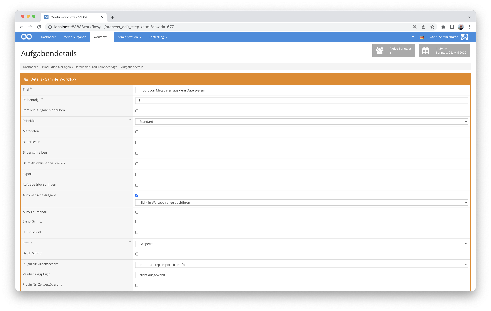

# Metatatenübernahme aus einem Verzeichnis

## Übersicht

Name                     | Wert
-------------------------|-----------
Identifier               | intranda_step_folderimport
Repository               | [https://github.com/intranda/goobi-plugin-step-import-from-folder](https://github.com/intranda/goobi-plugin-step-import-from-folder)
Lizenz              | GPL 2.0 oder neuer 
Letzte Änderung    | 25.07.2024 11:57:21


## Einführung
Dieses Plugin erlaubt einen automatischen Import von Bilderdateien, sowie das Erstellen einer Struktur und Paginierung basierend auf vorliegenden Dateien eines Verzeichnisses.


## Installation
Zur Installation des Plugins muss die folgende Datei installiert werden:

```bash
/opt/digiverso/goobi/plugins/step/plugin_intranda_step_folderimport-base.jar
```

Um zu konfigurieren, wie sich das Plugin verhalten soll, können verschiedene Werte in der Konfigurationsdatei angepasst werden. Die Konfigurationsdatei befindet sich üblicherweise hier:

```bash
/opt/digiverso/goobi/config/plugin_intranda_step_folderimport.xml
```


## Überblick und Funktionsweise
Zur Inbetriebnahme des Plugins muss dieses für eine Aufgabe im Workflow aktiviert werden. Dies erfolgt wie im folgenden Screenshot aufgezeigt durch Auswahl des Plugins `intranda_step_folderimport` aus der Liste der installierten Plugins.



Da dieses Plugin üblicherweise automatisch ausgeführt werden soll, sollte der Arbeitsschritt im Workflow als automatisch konfiguriert werden.

Als erstes wird die METS Datei geöffnet und der Haupttitel gesucht. Über diesen findet das Matching im Importordner statt. Innerhalb des zu importerienden Ordners wird folgende Struktur erwartet:

```xml
/path/to/folder
└── Konsulatsprotokolle 1636-01-21 - 1638-04-17
    ├── 1636-01-05; 1637-10-23
    │   ├── 0001.tif
    │   └── Thumbs.db
    ├── 1636-01-12
    │   └── 0001.tif
    ├── 1636-01-16; 1636-02-09
    │   └── 0001.tif
    ├── 1636-01-21
    │   ├── 0001.tif
    │   ├── 0002.tif    
    │   └── Thumbs.db
    ...
    ├── Buchrücken
    │   └── 0001.tif
    ├── Titelblatt
    │   └── 0001.tif
    └── Vorderdeckel
        └── 0001.tif
  ```

Pro Vorgang gibt es einen Ordner pro Vorgang, in diesem Beispiel ist dies `Konsulatsprotokolle 1636-01-21 - 1638-04-17`. Da der importierte Haupttitel jedoch `Konsulatsprotokolle 1636-1638` lautet, wird nicht nach einer exakten Entsprechung gesucht, sondern nur bis einschließlich der ersten Jahreszahl.

Innerhalb des zu importierenden Ordners gibt es Unterordner für jedes zu erzeugende Strukturelement und darin Bilder. Andere Dateien werden ignoriert.

Die gefundenen Ordner werden aufgelistet und sortiert, zuerst die in `<prefixType>` konfigurierten Ordner in der Reihenfolge aus der Konfigurationsdatei, anschließend alle undefinierten Ordner alphanumerisch sortiert und als letztes die in `<suffixType>` definierten Ordner, wiederum in der Reihenfolge aus der Konfigurationsdatei.

Für jeden Ordner wird nun das konfigurierte Strukturelement erzeugt, als Titel wird der Ordnername genutzt. Falls es sich dabei um eine oder mehrere Datumsangaben handelt, werden diese noch einmal gesondert als Datierung ausgezeichnet.

Anschließend werden die Bilder des Ordners importiert und dabei umbenannt, so dass es zu keinen Doppelungen kommt.


## Konfiguration
Die Konfiguration des Plugins ist folgendermaßen aufgebaut:

```xml
<config_plugin>
    <!--
        order of configuration is:
        1.) project name and step name matches
        2.) step name matches and project is *
        3.) project name matches and step name is *
        4.) project name and step name are *
    -->
    <config>

         <!-- which projects to use for (can be more then one, otherwise use *) -->
        <project>*</project>
        <step>*</step>
        <!-- main image folder -->
        <imageFolder>/path/to/folder</imageFolder>

        <prefixType foldername="Vorderdeckel" doctype="Cover"/>
        <prefixType foldername="Titelblatt" doctype="TitlePage"/>

        <mainType>Sequence</mainType>

        <suffixType foldername="Rückendeckel" doctype="Cover"/>        
        <suffixType foldername="Buchrücken" doctype="Spine"/>
    </config>
</config_plugin>
 ```

Der Block `<config>` kann für verschiedene Projekte oder Arbeitsschritte wiederholt vorkommen, um innerhalb verschiedener Workflows unterschiedliche Aktionen durchführen zu können. Im Feld `<imageFolder>` wird der Pfad angegeben, an dem die zu importierenden Daten liegen.

Das Feld `<mainType>` enthält den Namen des Strukturelements, das für alle gefundenen Ordner genutzt wird, die nicht gesondert definiert wurden.
Mittels `<prefixType>` und `<suffixType>` können besondere Ordner ausgezeichnet werden. PrefixType enthält die Ordner, die den regulären Ordner vorangestellt werden und suffixType die Ordner, die nach den regulären Ordnern importiert werden. Der Import erfolgt in der konfigurierten Reihenfolge. Das Attribut `foldername` enthält den Ordnernamen und `doctype` das zu erzeugende Strukturelement.