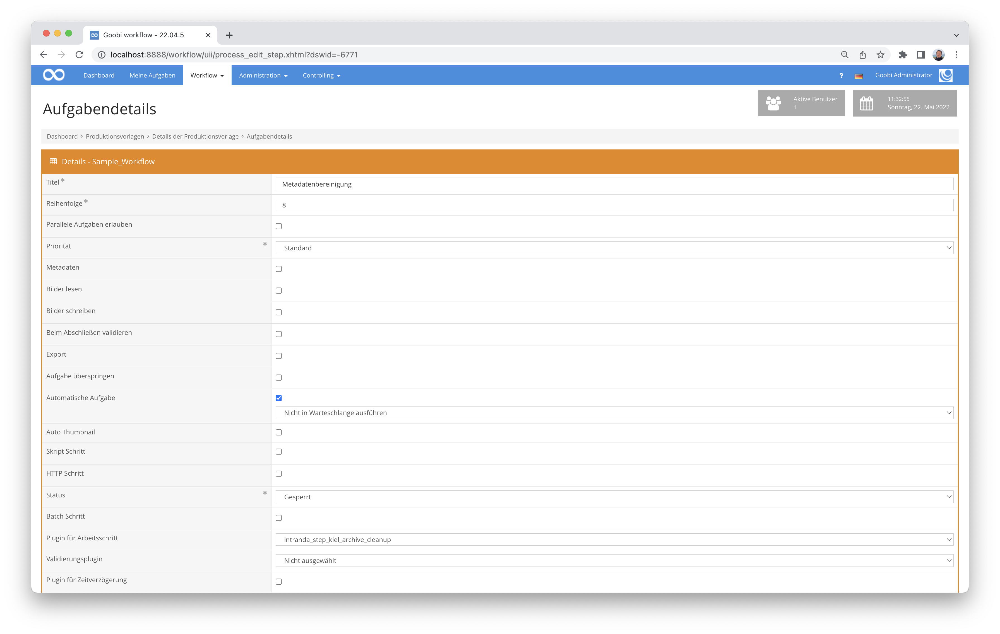

# Bereinigung von Metadaten

## Übersicht

Name                     | Wert
-------------------------|-----------
Identifier               | intranda_step_kiel_archive_cleanup
Repository               | [https://github.com/intranda/goobi-plugin-step-kiel-archive-cleanup](https://github.com/intranda/goobi-plugin-step-kiel-archive-cleanup)
Lizenz              | GPL 2.0 oder neuer 
Letzte Änderung    | 25.07.2024 11:57:14


## Einführung
Die vorliegende Dokumentation beschreibt die Installation, die Konfiguration und den Einsatz des Step Plugins zum Bereinigen von Metadaten für das Stadtarchiv Kiel. Konkret geht es hierbei um die automatisierte Auswertung von Metadaten, die in einzelne Felder separiert werden sollen, so unter anderem Informationen zu Maßstabsangaben historischer Karten. Darüber hinaus kopiert dieses Plugin im Anschluß ebenfalls die zugehörigen Bild-Dateien in den master-Ordner des jeweiligen Vorgangs.


## Installation
Das Plugin besteht insgesamt aus den folgenden zu installierenden Dateien:

```bash
plugin_intranda_step_kiel_archive_cleanup-base.jar
plugin_intranda_step_kiel_archive_cleanup.xml
```

Die erste Datei muss in dem folgenden Verzeichnis installiert werden:

```bash
/opt/digiverso/goobi/plugins/step/plugin_intranda_step_kiel_archive_cleanup-base.jar
```

Daneben gibt es eine Konfigurationsdatei, die an folgender Stelle liegen muss:

```bash
/opt/digiverso/goobi/plugins/config/plugin_intranda_step_kiel_archive_cleanup.xml
```


## Überblick und Funktionsweise
Das Plugin wird üblicherweise vollautomatisch innerhalb des Workflows ausgeführt. Es ermittelt zunächst, ob sich innerhalb der Konfigurationsdatei ein Block befindet, der für den aktuellen Workflow bzgl. des Projektnamens und Arbeitsschrittes konfiguriert wurde. Wenn dies der Fall ist, wird die METS-Datei geöffnet und die notwendigen Änderungen an der METS-Datei finden statt. Abschließend ermittelt das Plugin diejenigen Bilder, die im Dateinamen einen Präfix beinhalten, der ebenfalls aus der METS-Datei gelesen wird, um sie in den Master-Ordner des Vorgangs zu kopieren.

Dieses Plugin wird in den Workflow so integriert, dass es automatisch ausgeführt wird. Eine manuelle Interaktion mit dem Plugin ist nicht notwendig. Zur Verwendung innerhalb eines Arbeitsschrittes des Workflows sollte es wie im nachfolgenden Screenshot konfiguriert werden.




## Konfiguration
Die Konfiguration des Plugins erfolgt über die Konfigurationsdatei `plugin_intranda_step_kiel_archive_cleanup.xml` und kann im laufenden Betrieb angepasst werden. Im folgenden ist eine beispielhafte Konfigurationsdatei aufgeführt:

```xml
<config_plugin>
    <!--
        order of configuration is:
          1.) project name and step name matches
          2.) step name matches and project is *
          3.) project name matches and step name is *
          4.) project name and step name are *
	-->

    <config>
        <!-- which projects to use for (can be more then one, otherwise use *) -->
        <project>*</project>
        <step>*</step>

        <!-- folder where to import images from -->
        <importFolder>/opt/digiverso/import/kiel/</importFolder>

        <!-- METS field which contains the map ID that can be used to automatically find the images for the process -->		
        <fieldForImagePrefix>UnitID</fieldForImagePrefix>

        <!-- Name of workflow steps which shall be deactivated if image files were found -->
        <stepToSkipIfImagesAvailable>Bilder einspielen</stepToSkipIfImagesAvailable>

        <!-- METS field that contains width, length and scale to be splitted into individual fields -->
        <size field="SizeSourcePrint"/>

        <!--  METS fields to create from splitted size field and terms to use for splitting the size field (used as "startsWith") -->
        <sizeWidth field="MapWidth" term="Breite"/>
        <sizeLength field="MapLength" term="Länge"/>
        <sizeScale field="MapScale" term="Maßstab"/>

    </config>

</config_plugin>
```

| Parameter | Erläuterung |
| :--- | :--- |
| `project` | Dieser Parameter legt fest, für welches Projekt der aktuelle Block `<config>` gelten soll. Verwendet wird hierbei der Name des Projektes. Dieser Parameter kann mehrfach pro `<config>` Block vorkommen. |
| `step` | Dieser Parameter steuert, für welche Arbeitsschritte der Block `<config>` gelten soll. Verwendet wird hier der Name des Arbeitsschritts. Dieser Parameter kann mehrfach pro `<config>` Block vorkommen. |
| `<importFolder>` | Dieser Parameter legt das Verzeichnis fest, aus dem die Bilder kopiert werden sollen. |
| `<fieldForImagePrefix>` | Mit diesem Parameter wird gesteuert, welches Metadatum der METS-Datei für die Auswahl der zu kopierenden Bilder als Präfix maßgeblich ist. |
| `<stepToSkipIfImagesAvailable>` | Hier kann festgelegt werden, wie sich der Workflow im Falle fehlender Bilder verhalten soll. |
| `<size>` | Festlegung des auszuwertenden Maßstabsfeldes. |
| `<sizeWidth>` | Festlegung des zu generierenden Feldes für die Breite. |
| `<sizeLength>` | Festlegung des zu generierenden Feldes für die Länge |
| `<sizeScale>` | Festlegung des zu generierenden Feldes für den Maßstab |