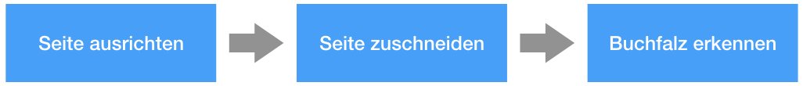
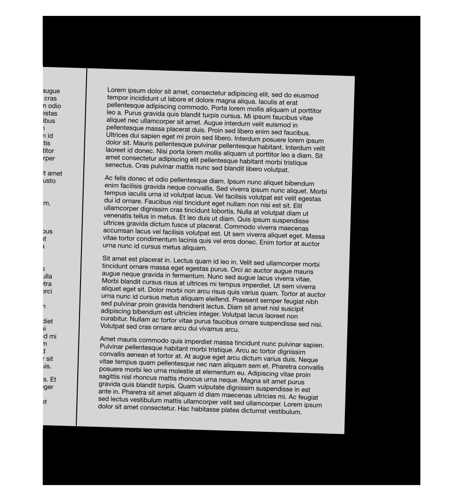
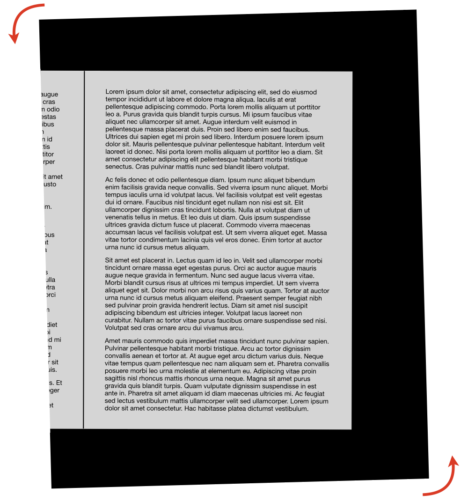
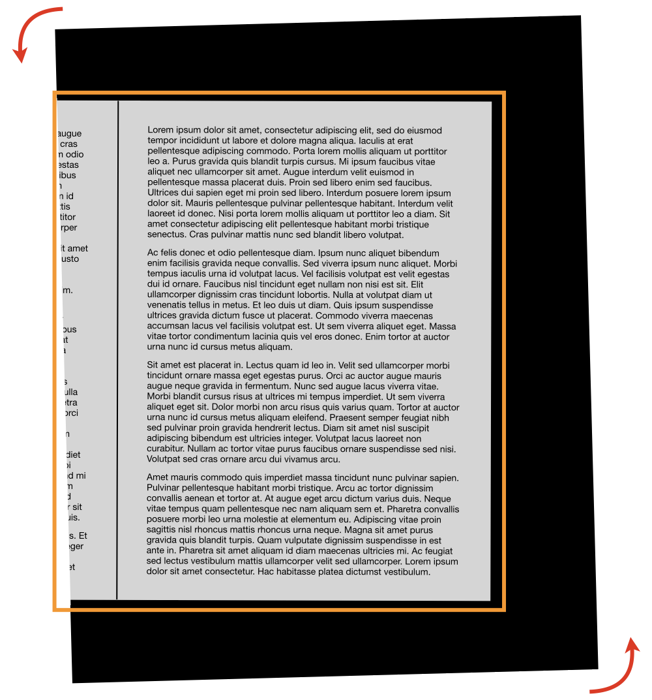
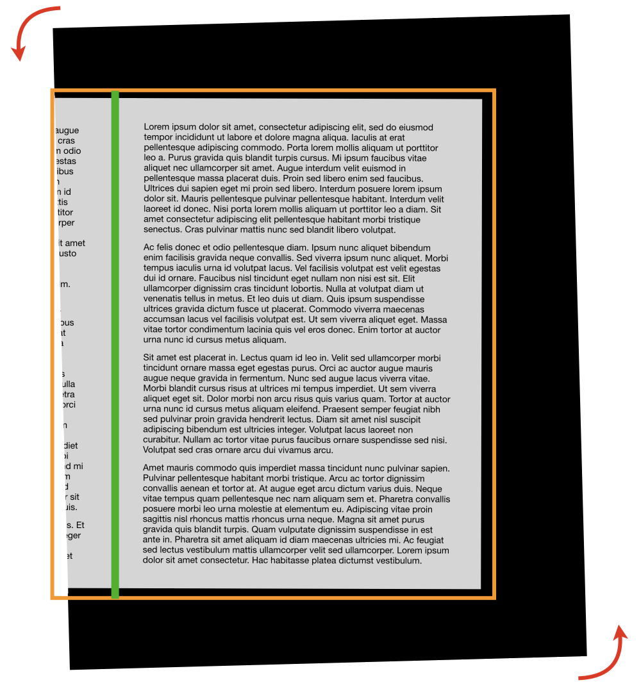
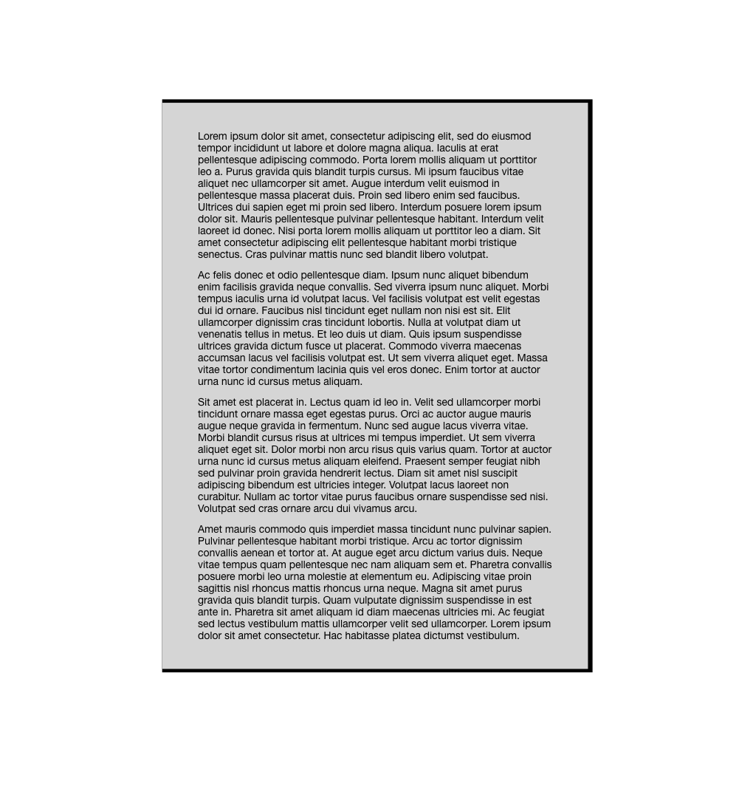

# Layout Wizzard

## Übersicht

Name                     | Wert
-------------------------|-----------
Identifier               | intranda_step_layoutwizzard
Repository               | [https://github.com/intranda/goobi-plugin-step-layoutwizzard](https://github.com/intranda/goobi-plugin-step-layoutwizzard)
Lizenz              | Proprietary commercial 
Letzte Änderung    | 27.07.2024 13:42:37

## Einführung
Der LayoutWizzard ist ein Werkzeug zur Analyse vom digitalisierten Buchseiten und ähnlicher Materialien, das die Position der physischen Seite im digitalisierten Bild erkennt und das Bild entsprechend ausrichten und schneiden kann.

## Arbeitsweise
Die Analyse im LayoutWizzard findet halbautomatisch statt. Sie beginnt in der Regel mit einem automatischen Arbeitsschritt, in dem alle Bilder nach festen Algorithmen analysiert werden. Anschließend werden die Ergebnisse in einem manuellen Schritt überprüft und gegebenenfalls korrigiert. Abschließend werden in einem weiteren automatischen Schritt zugeschnittene Derivate der Ausgangsbilder erzeugt, üblicherweise innerhalb des Derivate-Ordners im entsprechenden Goobi-Vorgang.

Die automatischen Arbeitsschritte (`Automatische Bildanalyse` und `Automatisches Croppen`) finden in aller Regel ausgelagert in einem TaskManager-Plugin statt, um andere Arbeiten innerhalb von Goobi nicht durch eine hohe Rechenlast auf dem Goobi-Server einzuschränken. Aber auch eine Ausführung ohne TaskManager-Plugin ist möglich, so dass diese automatische Arbeitsschritte innerhalb von Goobi Step Plugins ohne eigenen Nutzeroberfläche unmittelbar innerhalb von Goobi workflow erfolgen.

Die manuelle Kontrolle der Analyseergebnisse mit dem Vorschlag für das Croppen erfolgt innerhalb eines eigenständigen Goobi Step Plugins mit Nutzeroberläche, so dass dessen Bedienung vollständig in Goobi workflow integriert ist.

Je nach individueller Installation von Goobi workflow und der jeweiligen Workflows können die einzelnen Arbeitsschritte natürlich individuell benannt werden. Im folgenden Screenshot wurden für die drei nacheinander folgenden Arbeitsschritte beispielsweise andere Namen vergeben:

## Details zur Bildanalyse
Die Bildanalyse des LayoutWizzard arbeitet in mehreren Phasen, um ausgehend von dem originalen Bild zu dem gewünschten Bildderivat zu gelangen. Hierzu durchläuft jedes Bild eine Bildanalyse, in der die Seiten ausgerichtet, das Objekt erkannt und die Buchfalz ermittelt wird. Die Bildanalyse besteht entsprechend zumeist aus den folgenden Phasen:

<table>
  <thead>
    <tr>
      <th style="text-align:left">Beispiel</th>
      <th style="text-align:left">Phase</th>
    </tr>
  </thead>
  <tbody>
    <tr>
      <td style="text-align:left">
        
      </td>
      <td style="text-align:left">
        
<b>Start</b>
        

        
Das originale Bild (Master-Scan) ist oft etwas verdreht und enthält
          häufig einen sichtbarem Bereich der gegenüberliegenden Buchseite.

      </td>
    </tr>
    <tr>
      <td style="text-align:left">
        
      </td>
      <td style="text-align:left">
        
<b>1. Phase: Seite ausrichten</b>
        

        
In der ersten Phase erfolgt die Erkennung der Ausrichtung der Seite und
          deren Rotation gegenüber einer waagerechten Leserichtung. Diese Rotation
          wird beim Speichern herausgerechnet, so dass die Seite idealerweise waagerecht
          ausgerichtet ist. Diese Phase wird häufig auch als Deskewing bezeichnet.

      </td>
    </tr>
    <tr>
      <td style="text-align:left">
        
      </td>
      <td style="text-align:left">
        
<b>2. Phase: Seite zuschneiden</b>
        

        
In der zweiten Phase findet die Erkennung des erfassten Objektes statt,
          üblicherweise z.B. das Buch. Um das ermittelte Objekt wird hierbei
          ein rechteckiger Zuschneiderahmen berechnet, der das Objekt vollständig
          mit möglichst wenig zusätzlichem Rand enthält. Damit dieser
          Rahmen möglichst genau auf ein rechteckiges Objekt wie ein Buch passt,
          sollte die Ausrichtung der Seite (Phase 1) zuvor angewandt werden. Diese
          Phase wird häufig auch als das Abschneiden von Rändern bezeichnet,
          da die zumeist dunklen Bildränder hierbei entfernt werden.

      </td>
    </tr>
    <tr>
      <td style="text-align:left">
        
      </td>
      <td style="text-align:left">
        
<b>3. Phase: Falz erkennen</b>
        

        
In der dritten Phase erfolgt die Ermittlung der Buchfalz. Diese ist nur
          notwendig, wenn die Buchfalz tatsächlich teil des Bildes ist und an
          diesem Bild entlang der Falz geschnitten werden soll, um den Teil der gegenüberliegenden
          Seite zu verbergen. Diese Analysephase ist hochgradig abhängig von
          der ermittelten Ausrichtung der Seite, also ob es sich hierbei um eine
          rechte oder linke Seite im Buch oder um eine Doppelseite handelt. In letzterem
          Fall wird das Bild beim Speichern in zwei Einzelbilder unterteilt, je eines
          rechts und links der ermittelten Falz.

      </td>
    </tr>
    <tr>
      <td style="text-align:left">
        
      </td>
      <td style="text-align:left">
        
<b>Ende</b>
        

        
Der Vorschlag des LayoutWizzards wird dem Nutzer nach dem Durchlaufen
          aller Analysephasen zur Prüfung übergeben und dort ggf. angepasst.

      </td>
    </tr>
  </tbody>
</table>