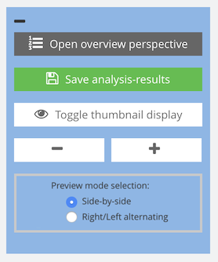
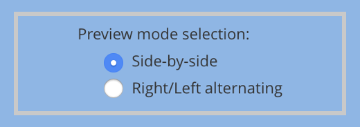

# Anzeige- und Navigationsoptionen

## Übersicht

Name                     | Wert
-------------------------|-----------
Identifier               | intranda_step_layoutwizzard
Repository               | [https://github.com/intranda/goobi-plugin-step-layoutwizzard](https://github.com/intranda/goobi-plugin-step-layoutwizzard)
Lizenz              | GPL 2.0 oder neuer 
Letzte Änderung    | 25.07.2024 14:16:33

Innerhalb der Vorschauansicht existiert im linken Bereich ein Menü mit mehreren Buttons für die Konfiguration der Bildanzeige.

Die in diesem Menü angebotenen Funktionen haben die folgende Bedeutung:

| Funktion | Beschreibung |
| :--- | :--- |
|  | Mittels dieses Buttons gelangen Sie zur Übersichtsseite des LayoutWizzards. Je nach Konfiguration handelt es sich hierbei ebenfalls um die Einstiegsseite. Von dort aus gelangen Sie zurück zur Vorschauansicht, indem Sie dort auf den Button `Vorschauansicht öffnen` klicken. |
|  | Mit diesem Button können Sie Ihre bisher vorgenommenen Änderungen speichern. Eine Verwendung dieses Buttons ist insbesondere dann ratsam, wenn eine Unterbrechung der Arbeit vorherzusehen ist, die ggf. länger dauert und somit zu einem Timeout der aktuellen Benutzersession führen könnte. |
|  | Ein Klick auf diesen Button schaltet die Anzeige der Vorschaubilder um, so dass entweder eine Vorschau des finalen Bildes oder aber eine Anzeige des Ursprungsbildes mit Buchfalz und Rahmenlinien erfolgt. |
|  | Diese Buttons ändern die Größe der dargestellten Vorschaubilder. Größere Bilder erlauben eine bessere direkte Bearbeitung. Kleinere Bilder hingegen erlauben, dass mehr Bilder gleichzeitig gesehen werden können. |
|  | Diese Optionen erlauben ein Umschalten zwischen der getrennten Anzeige von rechten und linken Seiten und der Anzeige von linken und rechten Seiten gleichzeitig. |