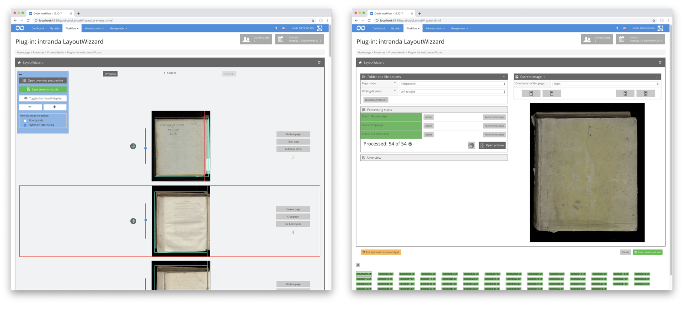

# Verwendung des Plugins

## Übersicht

Name                     | Wert
-------------------------|-----------
Identifier               | intranda_step_layoutwizzard
Repository               | [https://github.com/intranda/goobi-plugin-step-layoutwizzard](https://github.com/intranda/goobi-plugin-step-layoutwizzard)
Lizenz              | GPL 2.0 oder neuer 
Letzte Änderung    | 25.07.2024 14:14:44

Die meisten Arbeiten des LayoutWizzards finden im Allgemeinen im Hintergrund von Goobi statt. Dies betrifft die automatische Bildanalyse und das abschließende Croppen der Bilder, nachdem zwischenzeitlich ein Nutzer den Vorschlag für das Croppen aus der Bildanalyse geprüft hatte.

Die Prüfung dieser Cropping-Vorschläge jedoch ist der wichtigste Interaktionspunkt der Goobi-Anwender mit dem LayoutWizzard. Hier ist es für den Nutzer möglich, für jedes Bild zu sehen, wie dieses analysiert wurde und wie der LayoutWizzard dieses croppen würde. Dabei kann nun für jedes einzelne Bild vom Anwender entschieden werden, ob das Croppen gegebenenfalls anders erfolgen soll. Entsprechend stellt das Plugin eine Nutzeroberfläche zur Verfügung, die eine Rotation der Bilder erlaubt, die Position der Buchfalz ändern läßt und auch den Zuschneiderahmen in seiner Größe und Position bearbeiten läßt. Zur Durchführung dieser Bearbeitung bietet der LayoutWizzard zwei verschiedene Ansichten: die `Vorschauansicht` zur Sichtung und direkten Korrektur aller Bilder eines Vorganges und die `Einzelseitenansicht` zur detaillierten Bearbeitung einzelner Bilder.

Alle allgemeinen Einstellungen zur Konfiguration und zu dem Analyseworkflow sind in der `Einzelseitenansicht` untergebracht. Die eigentliche Kontrolle und Korrektur wird in den meisten Fällen jedoch ausschließlich in der `Vorschauansicht` stattfinden. Aus diesem Grund sollte der LayoutWizzard möglichst so konfiguriert werden, dass der Einstieg in das Plugin aus einer angenommenen Aufgabe möglichst direkt in die Vorschauansicht erfolgt.

[Vorschauansicht](goobi-plugin-step-layoutwizzard_page_01_01_de.md)

[Einzelseitenansicht](goobi-plugin-step-layoutwizzard_page_01_02_00_de.md)