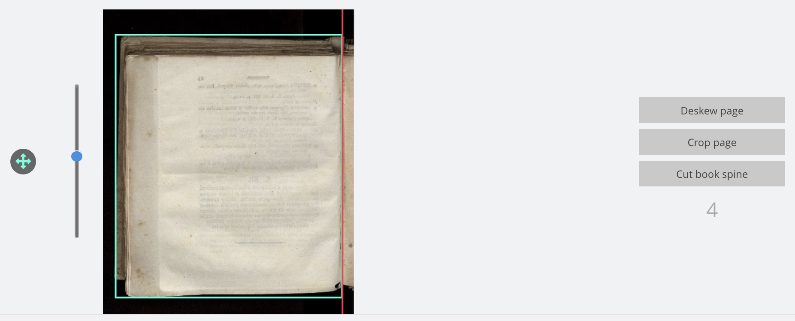
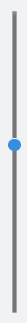

Die Vorschauansicht beinhaltet für jede Bilddatei einen Bildbereich wie den folgenden. Er besteht aus der eigentlichen Bildanzeige, den Steuerelementen für die Rotation und den Zuschneiderahmen sowie mehreren Buttons zum Betreten der Detailansicht für eine bestimmte Analysephase.

## Bildanzeige

Die Bildanzeige enthält das eigentliche Bild. Das Bild ist den Analyseergebnissen entsprechend rotiert und enthält Marker für die Falzposition (rot) und den Zuschneiderahmen (türkis). Beide Marker können mit der Maus angefasst und bewegt werden, um somit die Analysedaten zu korrigieren. Ein Klicken, Halten und Ziehen mit der Maus innerhalb des Zuschneiderahmens bewegt den gesamten Rahmen.

**Tip:** Hält man bei einer dieser Aktionen die `Shift-Taste` gedrückt, wird die Änderung auf alle folgenden Bilder der selben Ausrichtung auf der aktuellen Seite übertragen. Dabei werden relative Koordinaten verwendet. Verschiebt man also bei gedrückter `Shift-Taste` die Falz eines rechten Bildes auf eine Position 10% vom linken Bildrand entfernt, wird für alle folgenden rechten Bilder auf der Seite die Falz ebenfalls 10% vom linken Bildrand positioniert; unabhängig von der absoluten Größe der Bilder.

Zusätzlich gelangt man durch einen Doppelklick auf das Bild in einen Rotationsmodus, in dem man durch auf- und Abwärtsbewegungen der Maus die Bildrotation verändern kann. Diese Rotation ist nicht proportional zur Mausbewegung sondern umso stärker je weiter man die Maus vom Ursprung fortbewegt hat. Ein erneuter Doppelklick beendet den Rotationsmodus wieder.

## Steuerelement für die Rotation

Mit dem Schieberegler neben der Bildanzeige kann die Rotation des Bildes verändert werden. Klicken Sie hierzu einfach auf den Button und verschieben Sie diesen nach oben oder unten, um die Rotation des gewählten Bildes zu verändern.

## Steuerelement zum Verschieben

Neben der Bildanzeige gibt es ein Steuerelement zum Verschieben des Zuschneiderahmens. Dieser Button kann mit der Maus in alle Richtungen bewegt werden und verschiebt somit die Position des Zuschneiderahmens. Zu beachten ist dabei, dass die Verschiebung des Rahmen nicht proportional erfolgt. Je weiter der Button nach dem Klicken gezogen wird, desto schneller wird der Rahmen verschoben.

## Buttons zum Betreten der Detailansicht

Die drei Buttons neben der Bildanzeige erlauben das Betreten der Einzelseitenansicht für die gewählte Analysephase, um dort gezielt einzelne Analyseparameter justieren zu können. Klicken Sie innerhalb der Detailansicht erneut auf den Button `Vorschauansicht öffnen` gelangen Sie wieder zum selben Bild innerhalb der Vorschauansicht.

Unterhalb der Buttons für die Detailansicht befindet sich die Bildnummer innerhalb des Eingabeordners. Hierbei handelt es sich nicht um den Dateinamen der Bilddatei sondern um einen einfachen Zähler, der im Falle vieler gleichartiger angezeigter Bilder eine Orientierung geben soll, an welcher Stelle innerhalb der Bilddateien man sich derzeit befindet.

Abhängig von der Konfiguration des LayoutWizzards wird in diesem Bereich gegebenenfalls ebenso ein DropDown-Menü angezeigt. Dieses erlaubt eine Änderung der Ausrichtung für die jeweiligen Seite. Beachten Sie bitte, dass die hier vorgenommene Änderung ausschließlich für das aktuell ausgewählte Bild erfolgt und keine Auswirkungen auf die nachfolgenden Bilder hat.