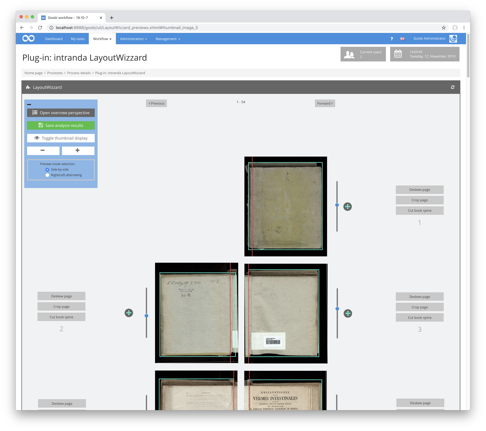
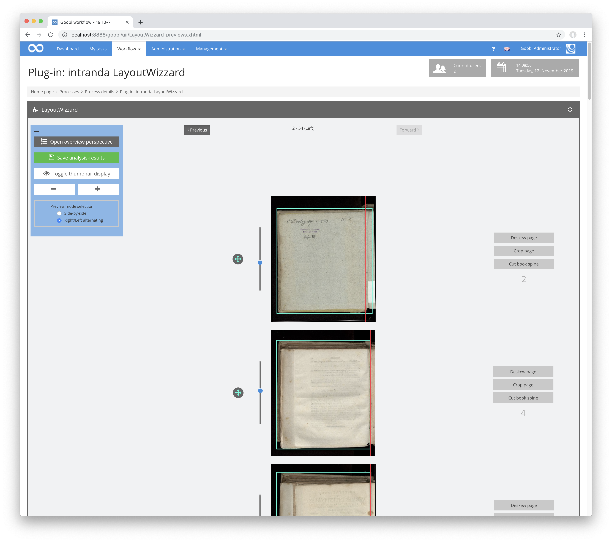

# Vorschauansicht

## Übersicht

Name                     | Wert
-------------------------|-----------
Identifier               | intranda_step_layoutwizzard
Repository               | [https://github.com/intranda/goobi-plugin-step-layoutwizzard](https://github.com/intranda/goobi-plugin-step-layoutwizzard)
Lizenz              | GPL 2.0 oder neuer 
Letzte Änderung    | 25.07.2024 14:14:44

Die Vorschauansicht enthält eine Liste aller Bilder im Eingabeordner. Diese sind jedoch in der Regel auf mehrere Seiten verteilt, um die Ladezeiten der anzuzeigenden Bilder möglichst gering zu halten. Je nach gewählter Einstellung werden dabei gegenüberliegende rechte und linke Buchseiten nebeneinander angezeigt, oder es werden abwechselnd jeweils nur rechte und nur linke Bilder angezeigt, so dass diese jeweils schnell verglichen verglichen werden können.

Innerhalb der Vorschauansicht läßt sich festlegen, wie groß die Bilder angezeigt werden sollen und ob der Schneiderahmen oberhalb des originalen Bildes angezeigt werden soll oder stattdessen eine Vorschau, des späteren beschnittenen Bildes.

Für jedes einzelne Bild lassen sich direkt aus dieser Anzeige Korrekturen vornehmen. So kann über den Schieberegler neben dem Bild die Rotation, mit dem Mauszeiger die Buchfalz anders positioniert und mittels Klicken und Ziehen die Größe und Position des Zuschneiderahmens geändert werden.

**Tip:** Beachten Sie, dass Sie eine Anpassung eines Bildes (Rotation, Buchfalz oder Rahmen) auch mit gedrückter `Shift-Taste` durchführen können. In diesem Fall wird Ihre Korrektur nicht nur für das aktuell gewählte Bild angewendet, sondern ebenfalls für alle nachfolgenden angezeigten Bilder. Dies spart unter Umständen sehr viel Zeit für manuelle Korrekturarbeiten.

Neben der Möglichkeit, jedes Bild direkt aus der Vorschauansicht zu ändern, erlauben die drei Buttons neben jedem Bild einen direkten Zugang in die Detailansicht der Bildanalyse für das entsprechende Bild innerhalb der Einzelseitenansicht.

Über die Buttons `Vorwärts` und `Rückwärts` ober- und unterhalb der Vorschauliste kann der Nutzer durch die Seiten der dargestellten Bilder blättern.