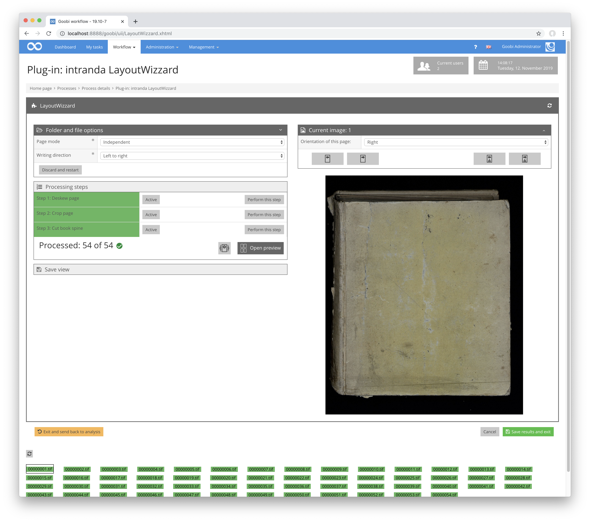

# Einzelseitenansicht

## Übersicht

Name                     | Wert
-------------------------|-----------
Identifier               | intranda_step_layoutwizzard
Repository               | [https://github.com/intranda/goobi-plugin-step-layoutwizzard](https://github.com/intranda/goobi-plugin-step-layoutwizzard)
Lizenz              | GPL 2.0 oder neuer 
Letzte Änderung    | 25.07.2024 14:15:06

Die Einzelseitenansicht, bisweilen auch als `Übersichtsseite` bezeichnet, enthält globale Einstellungen des LayoutWizzards sowie alle Einstellungen zur aktuell betrachteten Seite. Diese Ansicht gliedert sich in mehrere Teilbereiche, wobei die Details einiger dieser Bereiche jeweils nur dann sichtbar sind, wenn die entsprechenden Bereiche aktiv sind. Ein Umschalten zwischen den Bereichen ist möglich, indem die Titelleiste eines Bereichs angeklickt wird. Die Titelleiste enthält außerdem bei manchen Bereichen rechts einen Knopf um den `erweiterten Modus` für diesen Bereich an- und auszuschalten. Im `erweiterten Modus` sind jeweils zusätzliche Optionen verfügbar die im normalen Betrieb üblicherweise nicht benötigt werden. Die Teilbereiche sind im Folgenden einzeln beschrieben.

