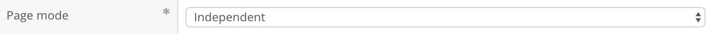
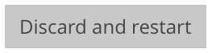
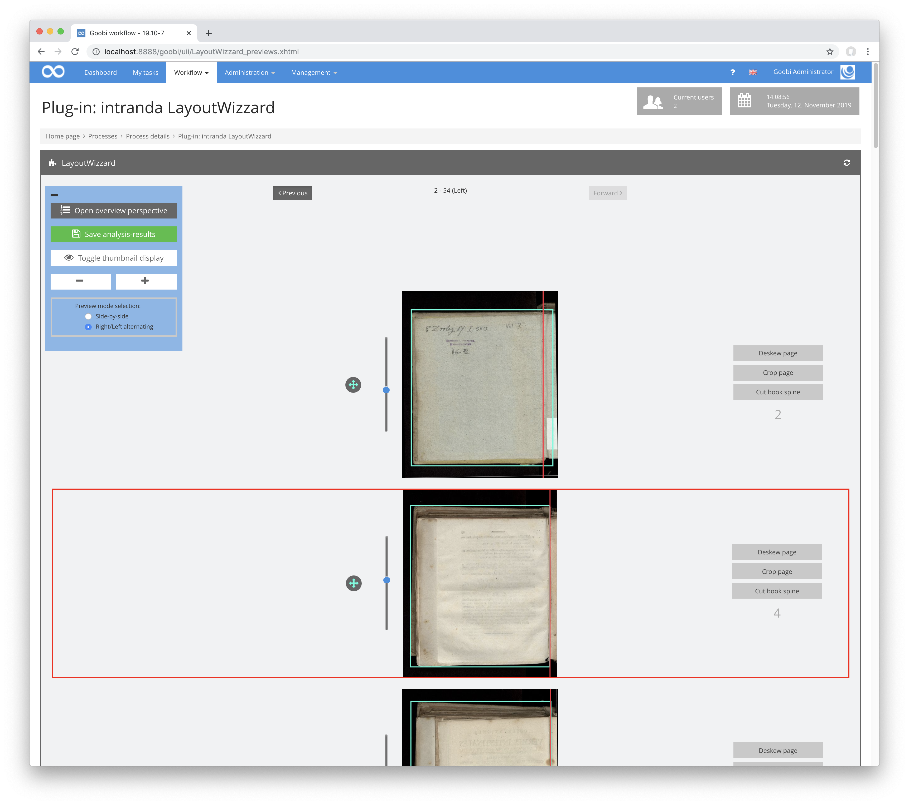

# Ordner- und Dateioptionen

## Übersicht

Name                     | Wert
-------------------------|-----------
Identifier               | intranda_step_layoutwizzard
Repository               | [https://github.com/intranda/goobi-plugin-step-layoutwizzard](https://github.com/intranda/goobi-plugin-step-layoutwizzard)
Lizenz              | GPL 2.0 oder neuer 
Letzte Änderung    | 25.07.2024 14:15:06

Im Bereich Ordner- und Dateioptionen können globale Einstellungen zur Handhabung der Dateien getätigt werden. Außerdem lässt sich von hier aus der komplette LayoutWizzard-Workflow zurücksetzen.

## Umschaltung zwischen den Anzeigemodi

Innerhalb der Übersicht kann links oben der Modus für die Anzeige umgeschaltet werden. Üblicherweise öffnet sich der LayoutWizzard im normalen Modus. Hier sind die wichtigsten Einstellungen bereits direkt bearbeitbar. Sollen hingegen die erweiterten Einstellungsoptionen angezeigt werden, so kann der erweiterte Modus aktiviert werden. Eine Umschaltung zwischen den beiden Anzeigemodi ist mit der Nutzung dieses Buttons in der Titelleiste möglich:

## Normaler Modus

Folgende Optionen sind im Bereich des normalen Anzeigemodus verfügbar.

### Seitenmodus

Der Seitenmodus dient für die Festlegung der Seitenverarbeitung in rechte, linke, Doppel- oder Einzelseiten. Jeder Modus setzt die Ausrichtung für alle Bilder einmalig fest. Spätere Änderungen der Ausrichtung einzelner Seiten ändern die Ausrichtung aller Folgeseiten wie vom Seitenmodus vorgegeben.  
Der interne Name innerhalb der nachfolgenden Tabelle ist derjenige, wie er in der LayoutWizzard-Konfigurationsdatei für den Seitenmodus verwendet wird.

| Seitenmodus | Beschreibung | Interner Name |
| :--- | :--- | :--- |
| **Alternierend** | Die Bilder werden alternierend als rechte und linke Seiten behandelt. Die Ausrichtung der ersten Seite hängt von der Einstellung  `Schreibrichtung` ab. | `ALTERNATING` |
| **Nur linke Seiten** | Alle Bilder werden als linke Seiten behandelt. | `ALL_LEFT` |
| **Nur rechte Seiten** | Alle Bilder werden als rechte Seiten behandelt. | `ALL_RIGHT` |
| **Doppelseiten** | Alle Bilder werden als Doppelseiten behandelt. Das heißt, dass sie beim Speichern in jeweils zwei Einzelbilder zerlegt werden, wenn eine Falzlinie gesetzt wurde. | `DOUBLE_PAGES` |
| **Doppelseiten mit Einband** | Die Bilder werden wie im Modus `Doppelseiten` behandelt, mit Ausnahme der ersten und letzten Seite. Diese beiden Seiten werden hingegen als `Einzelblätter` behandelt. | `DOUBLE_PAGES_WITH_COVERS` |
| **Einzelblätter** | Jede Seite wird als Einzelblatt behandelt. Dies bedeutet, dass keine Buchfalz geschnitten wird. | `SINGLE_PAGES` |
| **Unabhängig** | In diesem Modus behalten alle Seiten die aktuell eingestellte Ausrichtung. Änderungen der Orientierung von einzelnen Seiten haben keine Auswirkung auf die Folgeseiten. | `INDEPENDENT` |

### Schreibrichtung

Die Einstellung für die Schreibrichtung legt fest, in welche Richtung der Textfluss erfolgt. Ist die Schreibrichtung `Rechts-nach-Links` ist beim alternierenden Seitenmodus die erste Seite nach dem Einband eine rechte Seite. Ist die Schreibrichtung hingegen `Links-nach-Rechts`, so ist die erste Seite nach dem Einband eine linke Seite. Im Falle des `Doppelseitenmodus` wird der jeweilige Teil der Doppelseite in der entsprechenden Reihenfolge vor dem anderen Teil der Doppelseite als eigene Datei gespeichert.

| **Schreibrichtung** | Beschreibung |
| :--- | :--- |
| **Links-nach-rechts** | Im alternierenden Seitenmodus ist die erste Seite nach dem Einband eine linke Seite. Im Doppelseiten Modus kommt die linke Seite einer Doppelseite vor der rechten in der Seitenreihenfolge. |
| **Rechts-nach-Links** | Im alternierenden Seitenmodus ist die erste Seite nach dem Einband eine rechte Seite. Im Doppelseiten Modus kommt die rechte Seite einer Doppelseite vor der linken in der Seitenreihenfolge. |

### Verwerfen und neu Anfangen

Mit dem Button `Verwerfen und neu anfangen` können alle LayoutWizzard-Daten für diesen Vorgang gelöscht werden. Dies betrifft sowohl alle Analysedaten als auch die für diesen Vorgang spezifische Konfiguration. Nach dem Klick auf diesen Button öffnet sich ein Menü, um darin die gewünschte Vorlage für die neue Konfiguration auszuwählen. Ein anschließender Klick auf `OK` verwirft alle bisherigen Daten und erstellt eine neue Konfiguration für den Vorgang aufgrund des ausgewählten Templates.

## Erweiterter Modus

Die folgenden Optionen sind nur im erweiterten Modus verfügbar.

### Eingabe-Ordner

Der Eingabe-Ordner definiert denjenigen Ordner innerhalb des `images`-Ordners des Goobi-Vorgangs, aus dem die Originalbilder gelesen werden. Dies ist üblicherweise der Ordner mit den Master-Digitalisaten.

### Ausgabe-Ordner

Der Ausgabe-Ordner legt denjenigen Ordner innerhalb des `images`-Ordners des Goobi-Vorgangs fest, in den die gecroppten Derivate gespeichert werden sollen. Dies ist zumeist der Derivate-Ordner.

### Komprimierung der Ausgabebilder

Mit dieser Option kann festgelegt werden, wie die Kompression der Bilder erfolgen soll, die nach dem Croppen entstanden sind. Grundsätzlich werden die Derivate im Tiff-Format gespeichert. Hier kann jedoch angegeben werden, ob die Bilder innerhalb des Tiff-Containers mit einer JPEG-Kompression komprimiert werden sollen.

| **Komprimierung** | Beschreibung |
| :--- | :--- |
| **Keine** | Unkomprimiertes Tiff |
| **JPEG** | JPEG-komprimiertes Tiff |

### Ausreißer markieren

Bei Ausreißern handelt es sich um Bilder, die in der Analyse auffällig andere Werte aufweisen als die maximal 12 Bilder vor und nach ihnen. Ebenso handelt es sich um Ausreißer bei Bildern, deren Analyse aufgrund von Fehlern oder Zeitüberschreitungen nicht abgeschlossen werden konnte.  
Ausreißer werden in der Dateiliste rot dargestellt und in der Vorschauansicht von einem roten Rahmen umgeben.

Folgende Ausreißertypen werden unterschieden und können als zu markieren ausgewählt werden:

| Ausreißertyp | Beschreibung |
| :--- | :--- |
| **Rotation** | Der Winkel der Seitenausrichtung ist auffällig. |
| **Seitengröße** | Die Größe des Zuschneiderahmens ist auffällig. |
| **Falzposition** | Der Abstand der Falz vom Seitenrand ist auffällig. |
| **Nicht bearbeitet** | Das Bild konnte nicht vollständig analysiert werden. |
| **Alle** | Alle oben genannten Typen von Ausreißern sollen markiert werden. |
| **Keine** | Ausreißer sollen überhaupt nicht markiert werden. |

### Zuschneidebereiche anpassen

Wenn rechte und linke Bilder einzeln gescannt werden und sie dennoch in einer Doppelseitenansicht zusammenpassen sollen, kann der LayoutWizzard Seiten so zuschneiden, dass der Inhalt jeweils auf gleicher Höhe beginnt, so dass der obere Buchrand auf allen Seiten möglichst bündig ist. Zu beachten ist hierbei jedoch, dass es je nach Aufnahme oft nicht möglich ist, zwei Seiten komplett ohne Verzerrungen bündig zu schneiden. Für eine optimale Doppelseitendarstellung ist daher immer auch ein Doppelseitenscan anstelle dieser Option zu empfehlen.

| Anpassungsmodus | Beschreibung |
| :--- | :--- |
| **Keine Angleichung** | Die Angleichung ist ausgeschaltet. |
| **Angleichung gegenüberliegender Seiten, links nach rechts** | Jeweils gegenüberliegende Seiten werden bündig geschnitten. Als gegenüberliegende Seite einer linken Seiten gilt jeweils die folgende rechte Seite. |
| **Angleichung gegenüberliegender Seiten, rechts nach links** | Jeweils gegenüberliegende Seiten werden bündig geschnitten. Als gegenüberliegende Seite einer rechten Seiten gilt jeweils die folgende linke Seite. |
| **Angleichung über alle Seiten** | Alle Seiten werden möglichst bündig geschnitten. Dies verursacht oft große ungeschnittene Ränder, benötigt relativ viel Bearbeitungszeit und ist daher zumeist nicht empfehlenswert. |