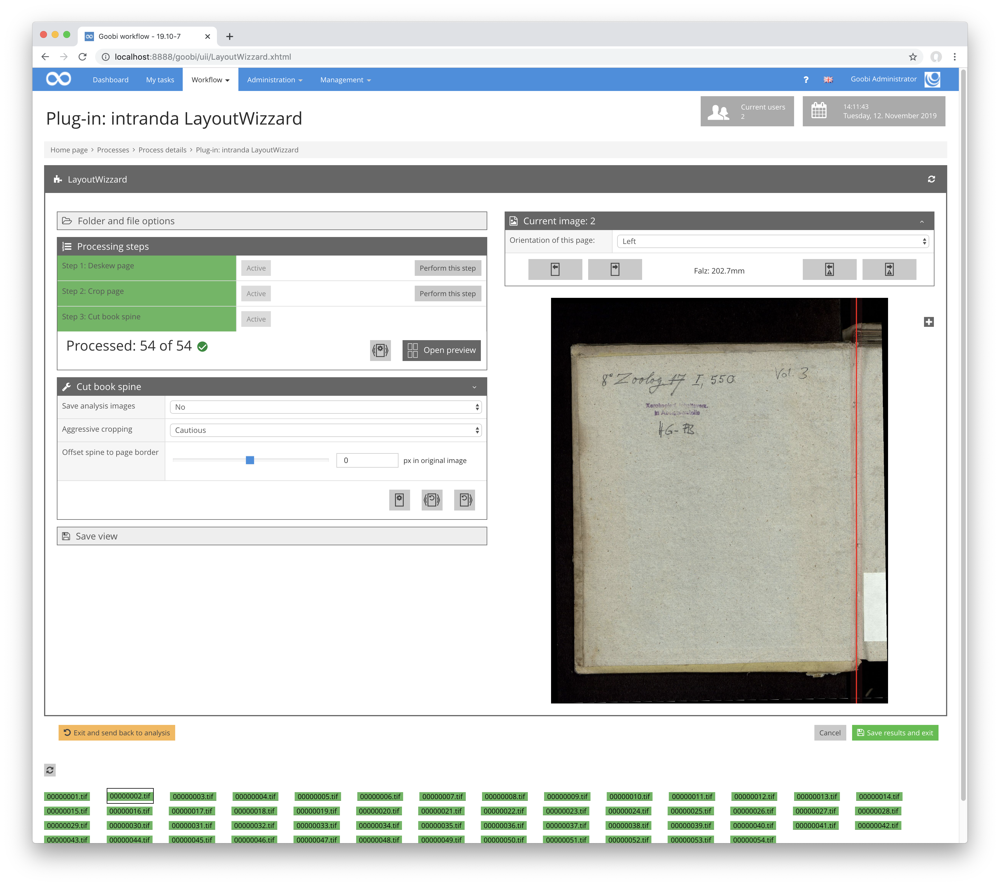

Der rechte Bereich umfasst die Anzeige des aktuellen Bildes und einen Kopfbereich mit einigen Informationen zur Bilddatei. Wichtig ist hier vor allem das DropDown-Menü zur Auswahl der Ausrichtung der aktuellen Seite. Es ist zu beachten, dass eine Änderung der Ausrichtung auch die Ausrichtung aller Folgeseiten ändert, nach den im `Seitenmodus` gewählten Regeln.

In der Kopfzeile lässt sich außerdem zum nächsten und vorherigen Bild, sowie zum nächsten oder vorherigen Ausreißer wechseln.

In der eigentlichen Bildanzeige ist, wenn einer der Analyseschritte ausgewählt ist, das Analyseergebnis des gewählten Schrittes sichtbar, das sich direkt mit der Maus bearbeiten lässt.