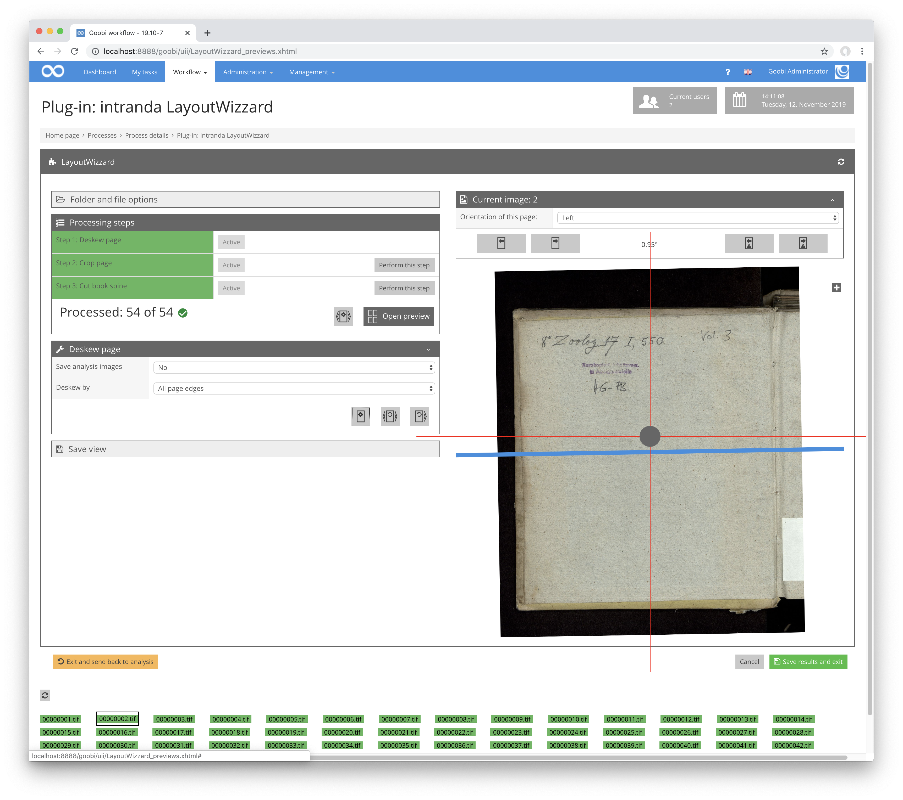
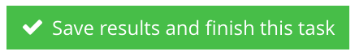
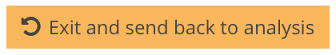
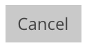

Unterhalb des Bildbereichs liegen mehrere Buttons, um das Plugin zu verlassen und den Workflow fortzusetzen.

| Icon | Beschreibung |
| :--- | :--- |
|  | Dieser Button speichert alle in der Oberfläche vorgenommenen Konfigurationen und Bilddaten für den aktuellen Vorgang und schließt das Plugin. Der Benutzer gelangt anschließend wieder zu der Ansicht, aus der er das Plugin betreten hat. |
|  | Dieser Button speichert alle in der Oberfläche vorgenommenen Konfigurationen und Bilddaten für den aktuellen Vorgang und schließt das Plugin sowie den aktuellen Goobi-Workflow Schritt. Der Benutzer gelangt anschließend zur `Meine Aufgaben` Ansicht. Ist der folgende Workflowschritt ein automatischer Schritt, wird dieser sofort gestartet. |
|  | Dieser Button speichert alle in der Oberfläche vorgenommenen Konfigurationen und Bilddaten für den aktuellen Vorgang und schließt das Plugin.  Der Benutzer gelangt anschließend zur Ansic Ansicht `Meine Aufgaben`. Der Goobi-Workflow wird um einen Schritt zurückgedreht, also in aller Regel zum vorhergehenden Schritt für die LayoutWizzard-Analyse. handelt es sich hierbei um einen automatischen Schritt, wird er sofort ausgeführt. |
|  | Dieser Button beendet das Plugin sofort ohne zuvor Daten zu speichern, mit Ausnahme von Bildderivaten, die über die Speicheransicht oder durch das Zurücksetzen der gesamten Analyse gespeichert wurden. Der Benutzer gelangt anschließend wieder zu der Ansicht, aus der er das Plugin betreten hat. |