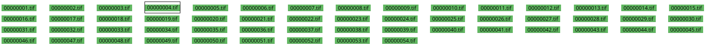

In der Dateiliste im unteren Bereich sind sämtliche Bilddateien im Eingabeordner mit ihrem Dateinamen aufgelistet. Ein Klick auf einen der Dateinamen öffnet das jeweilige Bild in der Einzelseitenansicht.

Der Dateiname ist ganz oder teilweise grün hinterlegt, wenn bereits Analyseschritte für das Bild abgeschlossen sind. Sind noch gar keine Analyseschritte abgeschlossen, ist der Dateiname komplett weiß hinterlegt. Für jeden abgeschlossenen Analyseschritt füllt sich der Hintergrund grün, und ist komplett grün hinterlegt, wenn sämt Analyseschritte abgeschlossen sind.

Bitte beachten Sie, dass das automatische Speichern nur dann erfolgreich durchlaufen kann kann, wenn alle Bilder komplett grün hinterlegt sind. In der Dateiliste lassen sich dafür schnell diejenigen Bilder identifizieren, die noch bearbeitet werden müssen, bevor der aktuelle Workflowschritt abgeschlossen werden kann.