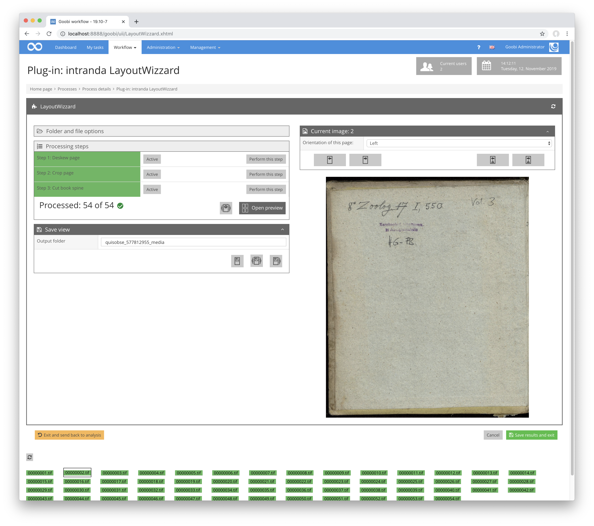
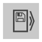
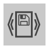

Die Speicheransicht zeigt das Bild in der Regel so, wie das zugeschnittene Derivat gespeichert wird. Eine Ausnahme davon sind Bilder mit Doppelseitenausrichtung. Diese werden als ein einziges Bild angezeigt, also ohne Teilung an der Falzlinie.

Im erweiterten Modus kann man den Ordner, in den die Bilder gespeichert werden, festlegen. Der hier angegebene Pfad ist immer ein Unterordner des `images` Ordner des Goobi-Vorgangs. Außerdem sind mehrere Optionen zum direkten Speichern der Bilder verfügbar:

| Icon | Beschreibung |
| :--- | :--- |
|  | Dieser Button speichert das aktuelle Bild zugeschnitten in den Ausgabeordner. |
|  | Dieser Button speichert das aktuelle und alle folgenden Bilder zugeschnitten in den Ausgabeordner. |
|  | Dieser Button speichert alle Bilder des Vorgangs zugeschnitten in den Ausgabeordner. |