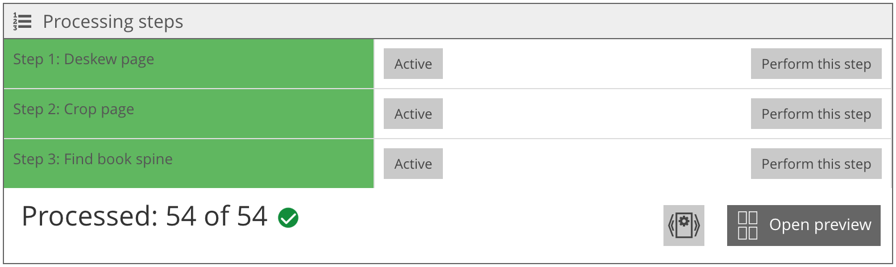
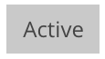
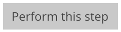

# Arbeitsschritte

## Übersicht

Name                     | Wert
-------------------------|-----------
Identifier               | intranda_step_layoutwizzard
Repository               | [https://github.com/intranda/goobi-plugin-step-layoutwizzard](https://github.com/intranda/goobi-plugin-step-layoutwizzard)
Lizenz              | GPL 2.0 oder neuer 
Letzte Änderung    | 25.07.2024 14:15:32

Der Bereich der Arbeitsschritte enthält eine Liste aller konfigurierten Analyseschritte. Diese werden jeweils mit mehreren Schaltflächen aufgelistet.

| Icon | Beschreibung |
| :--- | :--- |
|  | Die Hintergrundfarbe des Schritts gibt an, ob dieser Schritt für das aktuelle Bild bereits ausgeführt wurde. Ist der Hintergrund grün hinterlegt, so bedeutet dies, dass der Analyseschritt bereits ausgeführt wurde. Dies sollte stets der Fall sein, wenn bereits eine automatische Analyse erfolgte und keine Fehler bei der Bearbeitung aufgetreten sind. Ist der Hintergrund  dagegen weiß hinterlegt, müssen die Daten für diesen Schritt manuell erfaßt oder eine erneute automatische Analyse versucht werden. |
|  | Mit dem Schalter `Aktiv/Inaktiv` können die einzelnen Schritte aktiviert bzw. deaktiviert werden. Bitte beachten Sie, dass das Deaktivieren eines Schrittes immer zur Folge hat, dass alle Analysedaten des jeweiligen Schrittes verloren gehen. Sie können allerdings anschließend manuell erneut eingetragen werden. |
|  | Klicken Sie auf den Button`Zu diesem Schritt`, so wird der  jeweilige Schritt ausgewählt. Damit ändert sich die Bildanzeige so, dass die Analysedaten des Schrittes angezeigt und bearbeitet werden können. Außerdem öffnet sich der Bereich `Analyseschritt`, in dem die Konfiguration des Schrittes angepasst werden kann und der Schritt für alle Bilder ausgeführt oder zurückgesetzt werden kann. Ein aktuell ausgewählter Schritt kann nicht deaktiviert werden. Um die Schrittauswahl zu beenden, kann   die Titleleiste `Arbeitsschritte` angeklickt werden. |

Unterhalb der Analysephasen enthält der Bereich folgende weiteren Optionen:

| Icon | Beschreibung |
| :--- | :--- |
|  | Die Anzahl der bereits vollständig analysierten Bilder wird hier angezeigt. Wenn alle Bilder bearbeitet sind, erscheint das grüne Icon mit dem Häkchen. Dies sollte nach Abschluss der automatischen Analyse bereits der Fall sein. Wenn nicht, müssen die fehlenden Bilder gesucht und die Analyseschritte manuell oder automatisch abgeschlossen werden. Beachten Sie, dass der Schritt zum automatischen Speichern der LayoutWizzard-Daten nur funktioniert, wenn zuvor alle Bilder vollständig analysiert wurden. Ein rotes Icon mit einem Kreuz erscheint, wenn innerhalb des Plugins gerade eine automatische Analyse durchgeführt wird. Ein Klick auf dieses rote Icon beendet die Analyse. |
|  | Der Button `Alle Bilder bearbeiten` startet eine automatische Analyse aller Bilder im Plugin. Die Analyse wird abgebrochen, wenn das Icon mit dem roten Kreuz angeklickt wird, die Ergebnisse verworfen werden oder das Plugin beendet wird. In der Regel wird diese Funktion nicht benötigt, da die automatische Analyse in einem anderen Workflow-Schritt innerhalb des Goobi-Vorgangs erfolgt. Diese Funktion ist hauptsächlich zum Testen der automatischen Analyse oder zur Analyse kleiner Datensets gedacht. |
|  | Dieser Button öffnet die Vorschauansicht, in der alle Bilder untereinander angezeigt und bearbeitet werden können. |