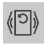

Dieser Bereich ist nur sichtbar wenn ein Analyseschritt ausgewählt wurde und ist dann benannt nach dem jeweiligen Schritt. Er enthält für jeden Schritt Konfigurationsparameter, die die automatische Analyse dieses Schrittes für alle Bilder bestimmen. Die wichtigsten Parameter sind direkt sichtbar, alle weiterem nur in der erweiterten Ansicht. Hilfestellungen zur Bedeutung jedes Parameters werden beim Klick auf `Hilfetexte einblenden` in der Goobi-Kopfleiste angezeigt.

Unterhalb der Parameter verfügt dieser Bereich außerdem über drei Buttons, die die Ausführung der Analyse regeln:

| Icon | Beschreibung |
| :--- | :--- |
|  | Dieser Button analysiert das aktuelle Bild für den ausgewählten Analyseschritt, unabhängig vom Status des Analyseschrittes. Wenn vorhergehende Analyseschritte noch nicht ausgeführt wurden, werden diese Schritte ebenfalls ausgeführt. |
|  | Dieser Button setzt den Analysestatus aller Bilder für den ausgewählten Analyseschritt zurück. Der Schritt und alle nachfolgenden gelten für alle Bilder dann als nicht ausgeführt. Bereits existierende Analyseergebnisse werden verworfen. Dies ist wichtig, wenn man eine automatische Analyse erneut durchführen möchte, da Analyseschritte die als bereits ausgeführt gelten, andernfalls nicht erneut durchgeführt werden. |
|  | Dieser Button setzt den Analysestatus für das aktuelle und alle nachfolgenden Bilder zurück. |