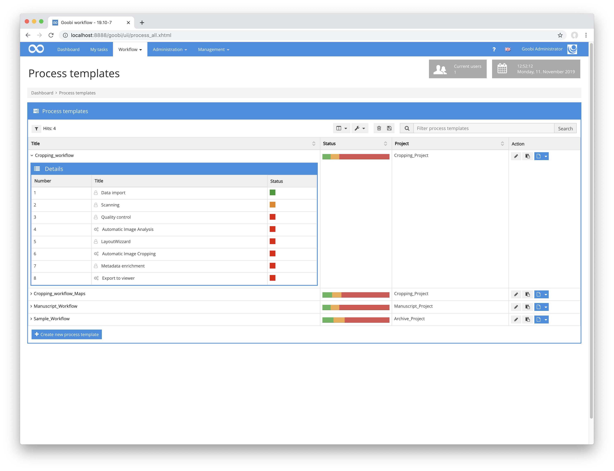

# Workflow

## Übersicht

Name                     | Wert
-------------------------|-----------
Identifier               | intranda_step_layoutwizzard
Repository               | [https://github.com/intranda/goobi-plugin-step-layoutwizzard](https://github.com/intranda/goobi-plugin-step-layoutwizzard)
Lizenz              | GPL 2.0 oder neuer 
Letzte Änderung    | 25.07.2024 14:16:57


Der LayoutWizzard-Workflow in Goobi besteht in aller Regel aus mehreren Goobi-Workflow Schritten die zusammenarbeiten. Ein typischer LayoutWizzard Workflow als Teil eines Goobi-Workflows kann dabei zum Beispiel wie folgt aussehen:



Im ersten Schritt (in diesem Beispiel `Automatic Image Analysis`) findet eine automatische Layoutanalse der Bilder zur Prüfung der Rotation, des Inhaltsbereichs sowie zur Position der Buchfalz statt. Dies geschieht üblicherweise in einem externen TaskManager, um die Systemressourcen von Goobi zu entlasten. Im zweiten Schritt (in diesem Beispiel `LayoutWizzard`) erfolgt dann eine manuelle Überprüfung und gegebenenfalls eine Korrektur der analysierten Ergebnisse. Diese Bearbeitung erfolgt innerhalb einer eigenen Nutzeroberfläche, die als Goobi-Plugin installiert wurde. Sobald diese manuelle Überprüfung dann abgeschlossen wurde, findet die automatische Speicherung (hier benannt als `Automatic Image Cropping`) der zugeschnittenen Derivate statt, auf Basis der zuvor analysierten und eventuell angepassten Daten. Auch diese Speicherung findet üblicherweise innerhalb des TaskManagers statt.

## Datenhaltung

Da die einzelnen Workflow-Schritte des LayoutWizzards auf einem gemeinsamen Datenbestand an Konfigurations- und Analysedaten arbeiten, müssen die Daten zumindest für die Dauer des LayoutWizzard Workflows persistent vorgehalten werden. Dies geschieht in der Datei `imageData.xml` im Goobi-Vorgangsordner. Beispielhaft lautet ein solcher vollständiger Pfad zu dieser Datei entsprechend:

```bash
/opt/digiverso/goobi/metadata/1234/imageData.xml
```

Diese Datei enthält sämtliche Konfigurationseinstellungen für den entsprechenden Vorgang sowie die Analysedaten zu jedem Bild, aus denen im abschließenden Speicherschritt die Derivate erstellt werden.