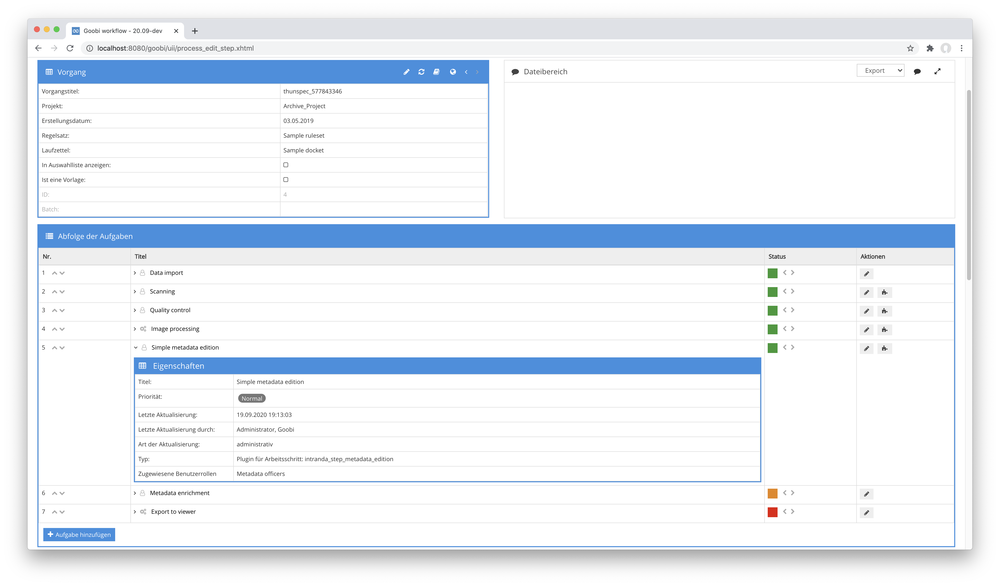
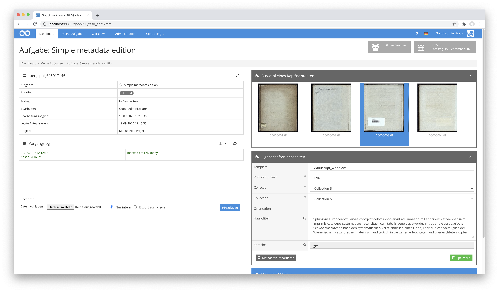
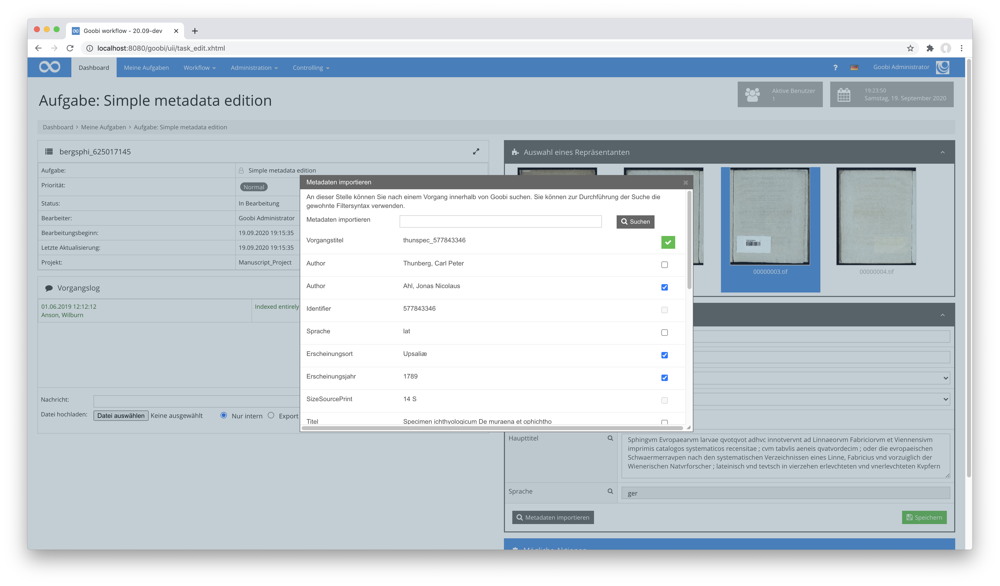

# Metadaten bearbeiten

## Übersicht

Name                     | Wert
-------------------------|-----------
Identifier               | intranda_step_metadata_edition
Repository               | [https://github.com/intranda/goobi-plugin-step-metadata-edition](https://github.com/intranda/goobi-plugin-step-metadata-edition)
Lizenz              | GPL 2.0 oder neuer 
Letzte Änderung    | 25.07.2024 11:57:05


## Einführung
Dieses Plugin erlaubt die Bearbeitung von konfigurierbaren Eigenschaften und Metadaten innerhalb der Nutzeroberfläche eine geöffneten Aufgabe, ohne dass dafür der METS-Editor betreten werden muss. Neben der Bearbeitung der Metadaten ist auch eine Suche von anderen Vorgängen und die gezielte Übernahme von Metadaten aus gefundenen Vorgängen möglich. Mit der integrierten Thumbnailanzeige kann ausserdem der Repräsentant des Werkes gesetzt werden.


## Installation
Zur Installation des Plugins müssen folgende beiden Dateien installiert werden:

```bash
/opt/digiverso/goobi/plugins/step/plugin_intranda_step_metadata_edition-base.jar
/opt/digiverso/goobi/plugins/GUI/plugin_intranda_step_metadata_edition-gui.jar
```

Um zu konfigurieren, wie sich das Plugin verhalten soll, können verschiedene Werte in der Konfigurationsdatei angepasst werden. Die Konfigurationsdatei befindet sich üblicherweise hier:

```bash
/opt/digiverso/goobi/config/plugin_intranda_step_metadata_edition.xml
```


### Überblick und Funktionsweise
Zur Inbetriebnahme des Plugins muss dieses für einen oder mehrere gewünschte Aufgaben im Workflow aktiviert werden. Dies erfolgt wie im folgenden Screenshot aufgezeigt durch Auswahl des Plugins `intranda_step_metadata_edition` aus der Liste der installierten Plugins.



Nachdem das Plugin vollständig installiert und eingerichtet wurde, steht es für die Bearbeiter der entsprechenden Aufgaben zur Verfügung. Nach dem Betreten einer Aufgabe ist im rechten Bereich der Nutzeroberfläche nun die Bearbeitung der Metadaten möglich.



Abhängig von der Konfiguration werden hier die entsprechenden Metadaten angezeigt und können bearbeitet werden. Je nach Konfiguration ist hier auch eine Suche nach anderen Vorgängen möglich, indem auf das Icon für die Suche geklickt wird.



Innerhalb des Dialogs mit den gefundenen Vorgängen kann nun ausgewählt werden, welche der angezeigten Metadaten der gefundenen Vorgänge übernommen werden sollen.

Ein Klick auf eines der angezeigten Thumbnails erlaubt das Setzen des Repräsentanten.

Bitte beachten Sie, dass die Bearbeitungen nur dann gespeichert werden, wenn auf den dafür vorgesehenen Button geklickt wird.


## Konfiguration
Die Konfiguration des Plugins ist folgendermaßen aufgebaut:

```xml
<config_plugin>
    <config>
        <!-- which projects to use for (can be more then one, otherwise use *) -->
        <project>*</project>
        <step>*</step>
        <!-- size of the thumbnail images -->
        <thumbnailsize>200</thumbnailsize>

        <!--  If true and the attribute onlyEmptyReadOnlyFields is set to false all empty fields in the plugin are hidden.
              If the attribute onlyEmptyReadOnlyFields is true also, only these ones are not rendered.
              The default value of onlyEmptyReadOnlyFields is true -->
        <hideEmptyFields onlyEmptyReadOnlyFields="true">true</hideEmptyFields>

        <!-- which image folder should be used? Possible values are master/media, default is media -->
        <imageFolder>media</imageFolder>

        <!-- configure here if the images shall be rendered inside of the user interface;
             if switched off then the representative image cannot be set -->
        <showImages>true</showImages>

        <!-- this switch allows to hide the search and import functionality for other processes;
            if switched off the button will disappear -->
        <showImportMetadata>true</showImportMetadata>

        <!-- each displayfield defines what shall be shown in the user interface
                source: where shall the field get its content from, possible values are property, metadata, person
                name: the internal name of the field to be shown
                type: define how the field shall look like (text, checkbox, multivalue, list, checkbox)
                required: define if the value must be filled out
                helpText: an explaination text for the field content
                validationRegex: a regular expression to validate the field content
                validationErrorText: the message to be shown if the validation is not successful
                label: a label to show to the users for the field
                structType: the place where the metadata comes from for source metadata (e.g. anchor)
                defaultValue: the value to fill as default
                searchable: define if the content of this field shall be used to start a search for other processes with this value
                repeatable: define if the field is allowed exist multiple times so that a button for duplication and for deletion is rendered; the default is false
                suffix: a suffix that shall be added to the search query when the field content is searched
                vocabularyName: name of the vocabulary to list records from (e.g. Subject terms)
                searchParameter: optional repeatable parameter to restrict records from the vocabulary (e.g. type=AccessLocations)
        -->
        <displayfield source="property" name="Template" type="text" required="false" repeatable="true" helpText="This is an explaining text to define what shall be entered into this field.">
            <defaultValue></defaultValue>
        </displayfield>
        <displayfield source="metadata" name="PublicationYear" type="text" required="true">
            <validationRegex>\d{4}</validationRegex>
            <validationErrorText>Value must be a 4 digits year</validationErrorText>
        </displayfield>
        <displayfield source="metadata" name="singleDigCollection" type="list" required="true" label="Collection" structType="anchor">
            <defaultValue>Collection A</defaultValue>
            <value>Collection A</value>
            <value>Collection B</value>
            <value>Collection C</value>
        </displayfield>
        <displayfield source="metadata" name="_directionRTL" type="checkbox" label="Orientation">
            <defaultValue>false</defaultValue>
        </displayfield>
        <displayfield source="metadata" name="PlaceOfPublication" type="vocabularyList" label="Place">
            <!-- name of the vocabulary, required -->
            <vocabularyName>Subject terms</vocabularyName>
            <!-- search parameter, optional, repeatable -->
            <searchParameter>type=AccessLocations</searchParameter>            
        </displayfield>
        <displayfield source="person" name="Author" type="multivalue" searchable="true" />
        <displayfield source="metadata" name="TitleDocMain" type="text" required="false" label="Haupttitel" searchable="true" suffix=" steplocked:Validierung"/>
        <displayfield source="metadata" name="DocLanguage" type="text" required="false" label="Sprache"  searchable="true"/>

        <!-- define if the fields shall be preselected after the search of processes was done -->
        <preselectFields>false</preselectFields>

        <!-- list of fields that shall be shown for each found process
                rulesetName: the name of the metadata type in the ruleset
                label: label to show for the metadata
                selectable: allow the field to be selected to use it
         -->
        <importfield rulesetName="TitleDocMain" label="Titel" selectable="true"/>
        <importfield rulesetName="PublicationYear" label="Erscheinungsjahr" selectable="true"/>
        <importfield rulesetName="DocLanguage" selectable="true" label="Sprache"/>
        <importfield rulesetName="Author" selectable="true"/>
        <importfield rulesetName="CatalogIDDigital" label="Identifier" selectable="false"/>
        <importfield rulesetName="CatalogIdentifier" label="OPAC Eintrag" selectable="false"/>
        <importfield rulesetName="Note" label="Bemerkung" selectable="false"/>
        <importfield rulesetName="PlaceOfPublication" label="Erscheinungsort" selectable="true"/>
        <importfield rulesetName="singleDigCollection"  selectable="false"/>
        <importfield rulesetName="SizeSourcePrint"  selectable="false"/>
        <importfield rulesetName="SubjectTopic" label="Schlagwort" selectable="true"/>

    </config>
</config_plugin>
```


### Hauptkonfiguration
Der Block `<config>` kann für verschiedene Projekte oder Arbeitsschritte wiederholt vorkommen, um innerhalb verschiedener Workflows unterschiedliche Aktionen durchführen zu können. Die weiteren Parameter innerhalb dieser Konfigurationsdatei haben folgende Bedeutungen:

| Wert | Beschreibung |
| :--- | :--- |
| `project` | Dieser Parameter legt fest, für welches Projekt der aktuelle Block `<config>` gelten soll. Verwendet wird hierbei der Name des Projektes. Dieser Parameter kann mehrfach pro `<config>` Block vorkommen. |
| `step` | Dieser Parameter steuert, für welche Arbeitsschritte der Block `<config>` gelten soll. Verwendet wird hier der Name des Arbeitsschritts. Dieser Parameter kann mehrfach pro `<config>` Block vorkommen. |
| `thumbnailsize` | Mit diesem Parameter wird festgelegt, in welcher Größe die Thumbnails, die zum Bestimmen des Repräsentanten angezeigt werden sollen. |
| `hideEmptyFields` | Dieses Element kann die Werte `true` und `false` annehmen. Das Element besitzt außerdem das Attribut `onlyEmptyReadOnlyFields`. Wenn das Element den Wert `true` hat, werden leere Metadatenfelder versteckt. Mit dem Attribut `onlyEmptyReadOnlyFields` kann zusätzlich gesteuert werden, ob nur leere `ReadOnly`-Felder (`true`) oder alle leeren Felder (`false`) versteckt werden sollen. Der Standardwert von `onlyEmptyReadOnlyFields` ist `true`.   |
| `imageFolder` | Dieser Parameter bestimmt, aus welchem Verzeichnis die Bilder zur Anzeige verwendet werden sollen. Übliche Werte sind hier beispielsweise `master` oder `media`. |
| `preselectFields` | Mit diesem Parameter kann festgelegt werden, ob die innerhalb der Vorgangssuche dieses Plugins gefundenen Metadaten bereits vorausgewählt sein sollen, so dass eine einfache Übernahme der Metadaten erfolgen kann. |
| `showImages` | Mit diesem Parameter wird festgelegt, ob der Bildbereich zur Auswahl des Repräsentanten angezeigt werden soll. |
| `showImportMetadata` | Dieser Parameter steuert, ob der Button für die Suche in existierenden Vorgängen und deren Datenübernahme möglich sein soll. |


### Konfiguration: displayfield
Für jedes einzublendende Metadatum kann ein Element `<displayfield>` definiert werden. Dieses steuert die Anzeige und Speicherug der jeweiligen Daten.

| Wert | Beschreibung |
| :--- | :--- |
| `source` | Hiermit wird festgelegt, woher das Feld seinen Inhalt beziehen soll. Mögliche Werte hierfür sind `property`, `metadata` und `person`. |
| `name` | Mit dem Parameter wird der interne Name des Feldes definiert. |
| `type` | Der Parameter `type` legt fest, wie das Feld aussehen soll. Mögliche Werte hierfür sind `text`, `checkbox`, `multivalue` oder `list`. |
| `required` | Der Wert `required` definiert, ob der Wert vom Nutzer ausgefüllt werden muss. |
| `helpText` | Hier läßt sich ein erklärender Hilfetext für den Feldinhalt definierten, den der Nutzer einblenden kann. |
| `validationRegex` | Mit diesem Parameter läßt sich ein regulärer Ausdruck definierten, um den Feldinhalt auf Validität zu überprüfen. |
| `validationErrorText` | Hier läßt sich die Meldung definieren, die angezeigt werden soll, wenn die Validierung nicht erfolgreich stattfinden konnte. |
| `label` | Mit dem Parameter kann eine Beschriftung definiert werden, die den Benutzern für das Feld angezeigt wird. |
| `structType` | Mit diesem Parameter wird das Strukturelement definiert, von dem die Metadaten für die Anzeige verwendet werden sollen (z. B. `anchor`). |
| `defaultValue` | Hier läßt sich ein Standardwert definieren, der gesetzt werden soll, wenn kein Wert vorhanden ist. |
| `searchable` | Mit diesem Parameter läßt sich definieren, ob der Inhalt dieses Feldes für die Ausführung einer Suche verwendet werden soll. |
| `suffix` | Hiermit läßt sich ein Suffix bestimmen, das der Suchanfrage angefügt werden soll, wenn andere Vorgänge mit gleichem Feldinhalt gesucht werden. |
| `vocabularyName` | Hier wird der Name des Vokabulars festgelegt, wenn dieses für die Anzeige von auswählbaren Datensätzen verwendet werden soll (z. B. Fachbegriffe). |
| `searchParameter` | Dieser Paremeter ist optional und wiederholbar. Er dient zur weiteren Einschränkung von Datensätzen aus dem Vokabular (z. B. `type=AccessLocations`) |


### Konfiguration: importfield
Für die Suche nach anderen Vorgängen kann festgelegt werden, welche deren Metadaten angezeigt und ggf. übernommen werden sollen.

| Wert | Beschreibung |
| :--- | :--- |
| `rulesetName` | Der Parameter legt den Name des Metadatentyps fest, wie er im Regelsatz definiert ist. |
| `label` | Mit diesem Parameter wird die Beschriftung des Feldes definiert, die für das Metadatum angezeigt werden soll. |
| `selectable` | Mit dem Parameter kann festgelegt werden, ob das Metadatum für eine Übernahme an Daten ausgewählt werden kann. |