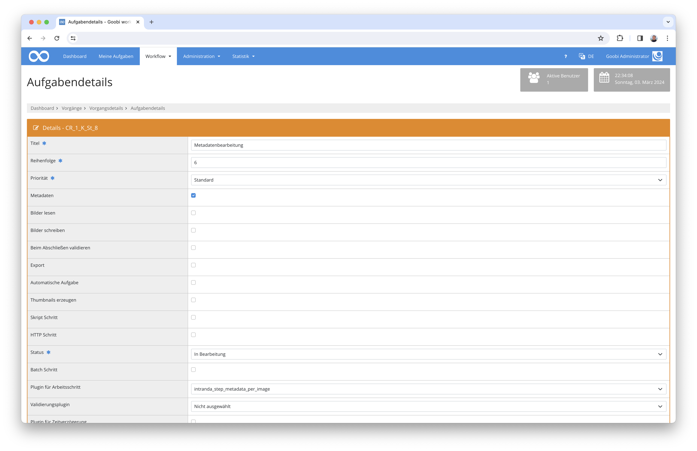
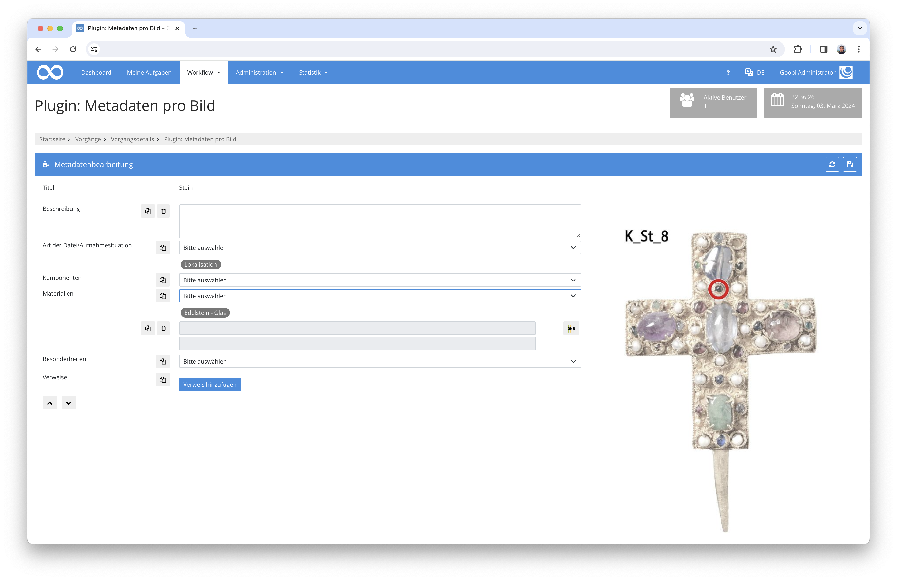
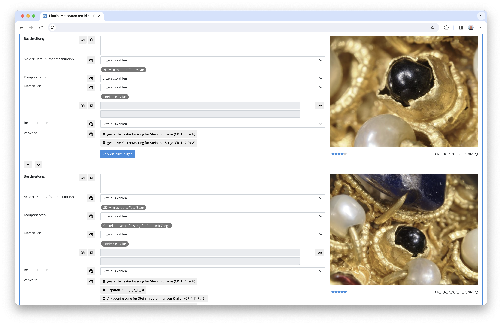

# Metadaten pro Bild erfassen

## Übersicht

Name                     | Wert
-------------------------|-----------
Identifier               | intranda_step_metadata_per_image
Repository               | [https://github.com/intranda/goobi-plugin-step-metadata-per-image](https://github.com/intranda/goobi-plugin-step-metadata-per-image)
Lizenz              | GPL 2.0 oder neuer 
Letzte Änderung    | 25.07.2024 11:56:56


## Einführung
Dieses Plugin erlaubt die Bearbeitung von konfigurierbaren Metadaten innerhalb der Nutzeroberfläche eine geöffneten Aufgabe, ohne dass dafür der Metadaten-Editor betreten werden muss. Dabei lassen sich für jede Audio-, Video- oder  Bilddatei eigene Metadaten erstellen.


## Installation
Zur Installation des Plugins müssen folgende beiden Dateien installiert werden:

```bash
/opt/digiverso/goobi/plugins/step/plugin_intranda_step_metadata_per_image-base.jar
/opt/digiverso/goobi/plugins/GUI/plugin_intranda_step_metadata_per_image-gui.jar
```

Um zu konfigurieren, wie sich das Plugin verhalten soll, können verschiedene Werte in der Konfigurationsdatei angepasst werden. Die Konfigurationsdatei befindet sich üblicherweise hier:

```bash
/opt/digiverso/goobi/config/plugin_intranda_step_metadata_per_image.xml
```


## Überblick und Funktionsweise
Zur Inbetriebnahme des Plugins muss dieses für einen oder mehrere gewünschte Aufgaben im Workflow aktiviert werden. Dies erfolgt durch Auswahl des Plugins `intranda_step_metadata_per_image` aus der Liste der installierten Plugins.



Wenn das Plugin betreten wird, werden für alle Dateien eigene Strukturelemente erstellt. Die Strukturelemente werden aufgelistet. Links sind die Metadatenfelder zu sehen, rechts das Bild bzw. die Video- oder Audiodatei. Durch einen Klick auf das Bild lässt es sich im Vollbildmodus öffnen.
Die einzelnen Strukturelemente lassen sich umsortieren, um so die Dateien in die gewünschte Reihenfolge zu bringen.



Für jedes Strukturelement werden die konfigurierten Metadaten angezeigt. Je nach Konfiguration gibt es im linken Bereich Optionen, um ein einzelnes Feld zu duplizieren, zu löschen oder einen Wert in allen Strukturelementen gleichzeitig hinzuzufügen.

Eine Besonderheit stellen die Verweise dar. Hiermit ist es möglich, eine Verknüpfung zwischen dem aktuellen Strukturelement und einem anderen Vorgang zu erstellen. Dabei wird ein Popup geöffnet, in dem nach anderen Vorgängen gesucht werden kann. Anschließend kann aus der Trefferliste der gewünschte Vorgang ausgewählt weren. Im Strukturelement wird dann eine Verknüpfung auf den ausgewählten Vorgang erstellt und im anderen Vorgang wird eine Verknüpfung auf das aktuelle Strukturelement erzeugt. 

Wenn ein Verweis wieder entfernt wird, dann wird er auch aus dem ausgewählten Vorgang entfernt.




## Konfiguration
Die Konfiguration des Plugins ist folgendermaßen aufgebaut:

```xml
<config_plugin>

    <config>
        <project>*</project>
        <step>*</step>
        <field
            label="Beschreibung"
            metadataField="ContentDescription"
            repeatable="false"
            displayType="textarea"
            defaultValue=""
            required="false"
            validation=""
            readonly="false"
            helpText="Hier kann der Inhalt des Bildes beschrieben werden."
        />

        <field
            label="Komponenten"
            metadataField="SubjectForm"
            repeatable="true"
            displayType="multiselect"
            defaultValue=""
            required="false"
            readonly="false"
            helpText="Wählen Sie hier die auf dem Bild zu sehenden Komponenten aus.">
            <vocabulary>Components</vocabulary>
        </field>
    

        <field label="Besonderheiten" metadataField="Characteristics" repeatable="false" displayType="gnd" defaultValue="" 
        required="false" readonly="false" />        

        <reference>
            <group>Reference</group>
            <process>RelationProcessID</process>
            <docstruct>RelationDocstructID</docstruct>
            <image>RelationImageNumber</image>
            <identifier>RelationExternalIdentifier</identifier>
            <label>RelationLabel</label>
        </reference>
        
        <searchfield>TitleDocMain</searchfield>
        <searchfield>ContentDescription</searchfield>
        <searchfield>CatalogIDDigital</searchfield>
        <display>
            <field>TitleDocMain</field>
            <field>ContentDescription</field>
            <field>CatalogIDDigital</field>
        </display>
        <identifierField>_urn</identifierField>
        <docstructName>CrownComponent</docstructName>
        <rating>Counter</rating>
    </config>
</config_plugin>
```

Der Block `<config>` kann für verschiedene Projekte oder Arbeitsschritte wiederholt vorkommen, um innerhalb verschiedener Workflows unterschiedliche Aktionen durchführen zu können. Durch die Angaben in den Feldern `<project>` und `<step>` wird gesteuert, für welche Aufgabe ein Bereich gültig ist. Die Felder sind wiederholbar und die Nutzung des Platzhalters `*` ist möglich.

Anschließend erfolgt die Definition der Eingabefelder. Jedes dieser `<field>` Elemente besteht aus einer Reihe von Pflichtangaben. Das Attribut `label` enthält den anzuzeigenden Namen. Mehrsprachigkeit wird unterstützt. Statt des Labels kann hier auch ein message-key eingetragen werden. `helpText` enthält einen Hilfetext, der optional eingeblendet werden kann. Auch hier kann ein message-key genutzt werden.

In `metadataField` steht das Metadatum, aus dem vorhandene Werte ausgelesen bzw in das neue Werte gespeichert werden sollen, in `defaultValue` kann ein Default definiert werden, der genutzt wird, wenn das Feld leer ist. Optional kann in `validation` ein regulärer Ausdruck eingetragen werden. Wenn das Feld nicht leer ist, wird geprüft, ob der eingetragene Wert dem Ausdruck entspricht. In dem Fall kann in `validationErrorMessage` eine Fehlermeldung definiert werden.

Mittels `repeatable="true/false"` wird gesteuert, ob ein Feld wiederholbar ist, oder nicht, `required="true/false"` steuert, ob eine Validierung stattfindet, dass mindestens ein Feld dieses Typs ausgefüllt wurde und `readonly="true/false"`, definiert, ob lesender oder auch schreibender Zugriff möglich ist.

Der Feldtyp wird im Attribut `displayType` definiert. Es stehen folgende Typen zur Verfügung:


### Einzeliges Eingabefeld
```xml
        <field
            label="language"
            metadataField="DocLanguage"
            repeatable="true"
            displayType="input"
            defaultValue=" - bitte eintragen - "
            required="false"
            validation="[a-z]{3}"
            validationErrorMessage="Der Wert muss ein dreistelliger ISO 639 Wert sein." />
```


### Mehrzeiliges Eingabefeld
```xml
        <field 
            label="Beschreibung"
            metadataField="ContentDescription"
            repeatable="false"
            displayType="textarea"
            defaultValue=""
            required="false"
            validation=""
            readonly="false"
            helpText="Hier kann der Inhalt des Bildes beschrieben werden." />
```


### Auswahlliste
Hier gibt es zwei Optionen zur Konfiguration der möglichen Werte. Zum einen lässt sich ein Vokabular angeben, dass bereits in Goobi erstellt wurde:

```xml
        <field
            label="Art der Datei/Aufnahmesituation"
            metadataField="ImageType"
            repeatable="true"
            displayType="select"
            defaultValue=""
            required="false"
            readonly="false"
            helpText="Bildtyp.">
            <vocabulary>ImageType</vocabulary>  
        </field>
```

Oder die Liste der Werte wird in der Konfigurationsdatei angegeben:
```xml
        <field
            label="Art der Datei/Aufnahmesituation"
            metadataField="ImageType"
            repeatable="true"
            displayType="select"
            defaultValue=""
            required="false"
            readonly="false"
            helpText="Bildtyp.">
            <field>value A</field>
            <field>value B</field>
            <field>value C</field>
        </field>
```


### Mehrfachauswahl 
Auch hier stehen zwei Optionen zur Konfiguration der möglichen Werte zur Verfügung, die Nutzung eines Vokabulares oder Angabe der Werte in der Konfigurationsdatei:

```xml
        <field
            label="Komponenten"
            metadataField="SubjectForm"
            repeatable="true"
            displayType="multiselect"
            defaultValue=""
            required="false"
            readonly="false"
            helpText="Wählen Sie hier die auf dem Bild zu sehenden Komponenten aus.">
            <vocabulary>Components</vocabulary>
        </field>

        <field
            label="Komponenten"
            metadataField="SubjectForm"
            repeatable="true"
            displayType="multiselect"
            defaultValue=""
            required="false"
            readonly="false"
            helpText="Wählen Sie hier die auf dem Bild zu sehenden Komponenten aus.">
            <field>value A</field>
            <field>value B</field>
            <field>value C</field>
        </field>
```

Dieses Feld definiert eine Auswahlliste mit den gewünschten Werten. Wenn ein Wert ausgewählt wurde, wird er aus der Auswahlliste entfernt und als Badge unterhalb des Feldes angezeigt. Klickt man auf den Badge, wird er entfernt und der Wert steht in der Auswahlliste wieder zur Verfügung. 


### GND Suche 

```xml
        <field
            label="Schlagwort"
            metadataField="SubjectTopic"
            repeatable="false"
            displayType="gnd"
            defaultValue=""
            required="false"
            readonly="false" />
```

Dieses Feld definiert ein GND-Suchfeld. Damit ist es nicht möglich, den Wert von Hand zu editieren. Stattdessen gibt es die Option in der GND zu suchen und dort einen Wert auszuwählen, der dann importiert wird. 


### Geonames Suche 
```xml
        <field
            label="Place"
            metadataField="PlaceOfPublication"
            repeatable="false"
            displayType="geonames"
            defaultValue=""
            required="false"
            readonly="false" />
```

Dieses Feld definiert ein Geonames-Suchfeld. Damit ist es nicht möglich, den Wert von Hand zu editieren. Stattdessen gibt es die Option in Geonames zu suchen und dort einen Wert auszuwählen, der dann importiert wird.


### VIAF Suche 
```xml
        <field
            label="Schlagwort"
            metadataField="SubjectTopic"
            repeatable="false"
            displayType="viaf"
            defaultValue=""
            required="false"
            readonly="false" />
```
Dieses Feld definiert ein VIAF-Suchfeld. Damit ist es nicht möglich, den Wert von Hand zu editieren. Stattdessen gibt es die Option in VIAF zu suchen und dort einen Wert auszuwählen, der dann importiert wird.

Im Anschluß an die Felddefinition wird konfiguriert, wie Verweise auf andere Vorgänge gespeichert werden:

```xml
        <reference>
            <group>Reference</group>
            <process>RelationProcessID</process>
            <docstruct>RelationDocstructID</docstruct>
            <image>RelationImageNumber</image>
            <identifier>RelationExternalIdentifier</identifier>
            <label>RelationLabel</label>
        </reference>
```

Hierzu wird die Metadatengruppe und die darin enthaltenen Metadaten definiert, in denen die Verweise gespeichert werden.

Als letztes wird noch konfiguriert, wie die Suche nach Verweisen funktioniert:

```xml
        <searchfield>TitleDocMain</searchfield>
        <searchfield>ContentDescription</searchfield>
        <searchfield>CatalogIDDigital</searchfield>

        <display>
            <field>TitleDocMain</field>
            <field>ContentDescription</field>
            <field>CatalogIDDigital</field>
        </display>
```

Dazu wird in <searchfield> festgelegt, in welchen Metadatenfeldern nach den gewünschten Werten gesucht werden soll und in <display> wird definiert, welche Metadatenfelder in der Trefferliste angezeigt werden sollen.