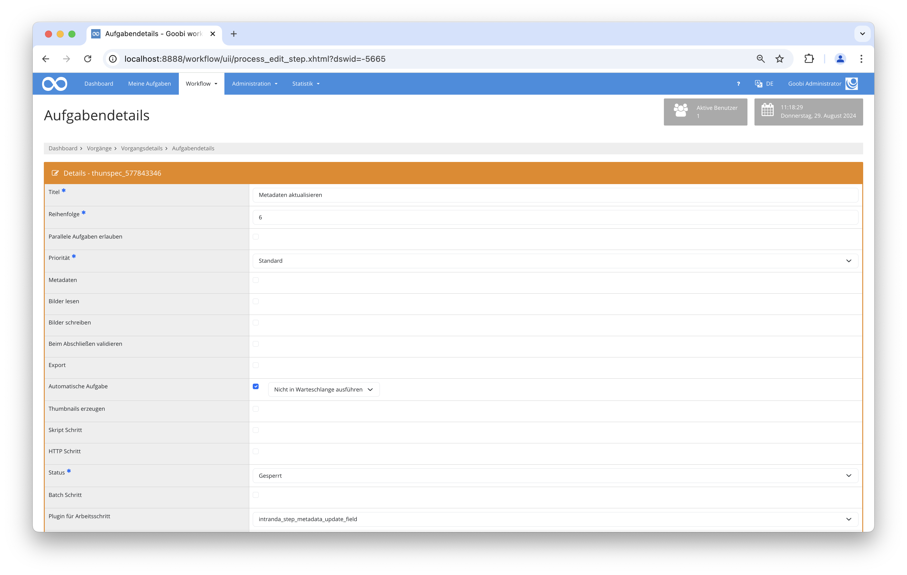

# Metadatenfelder aktualisieren

## Übersicht

Name                     | Wert
-------------------------|-----------
Identifier               | intranda_step_metadata_update_field
Repository               | [https://github.com/intranda/goobi-plugin-step-metadata-update-field](https://github.com/intranda/goobi-plugin-step-metadata-update-field)
Lizenz              | GPL 2.0 oder neuer 
Letzte Änderung    | 04.02.2025 11:00:59


## Einführung
Dieses Plugin für den Goobi workflow ermöglicht es, spezifische Metadatenfelder innerhalb von METS-Dateien automatisch zu erstellen oder zu aktualisieren. Dazu kann es den Variablen Replacer oder auch den Inhalt benachbarter Metadatenfelder verwenden, um Metadaten in logische Elemente auf allen hierarchischen Ebenen zu schreiben.

## Installation
Um das Plugin nutzen zu können, müssen folgende Dateien installiert werden:

```bash
/opt/digiverso/goobi/plugins/step/plugin-step-metadata-update-field-base.jar
/opt/digiverso/goobi/config/plugin_intranda_step_metadata_update_field.xml
```

Nach der Installation des Plugins kann dieses innerhalb des Workflows für die jeweiligen Arbeitsschritte ausgewählt und somit automatisch ausgeführt werden. 

Für die Verwendung des Plugins muss dieses in einem Arbeitsschritt ausgewählt sein:




## Überblick und Funktionsweise
Zuerst müssen die Werte, die das Plugin aktualisieren soll, in der Konfigurationsdatei festgelegt werden. Wenn das Plugin ausgeführt wird, sammelt es alle relevanten Strukturelemente der METS-Datei. Anschließend überprüft es, ob und wie die angegebenen Werte aktualisiert werden sollen. Wenn die Bedingungen erfüllt sind, werden entweder neue Werte in leere Felder eingefügt oder vorhandene Werte überschrieben, falls dies erzwungen wird.

## Konfiguration
Die Konfiguration des Plugins erfolgt in der Datei `plugin_intranda_step_metadata_update_field.xml` wie hier aufgezeigt:

```xml
<config_plugin>
    <!--
        order of configuration is:
          1.) project name and step name matches
          2.) step name matches and project is *
          3.) project name matches and step name is *
          4.) project name and step name are *
	-->

	<config>
		<!-- which projects to use for (can be more then one, otherwise use *) -->
		<project>*</project>
		<step>*</step>
        
		<!-- multiple updates can happen within one call. 
        	Repeat the update blocks for each additional change -->
		<update>
			<!-- define for which field inside of the METS file the content shall be generated -->
			<field>TitleDocMain</field>
			
			<!-- for which structure elements shall the content be updated? 
				Multiple 'element' can be listed here. 
				Use '*' to match all structure element types. -->
			<element>Monograph</element>
			
			<!-- define if the content shall be overwritten if the field is not empty -->
			<forceUpdate>true</forceUpdate>
	
            <!-- optional: configure a condition. If enabled, the condition must match, otherwise the update will be skipped -->
            <!--
            <condition field="PublicationYear" value="\d[4}]" />
            -->
    
			<!-- define a list of content here to be used for the field as metadata value
				variable: this content gets analyzed and replaced by the variable replacer 
				metadata: value of the metadata field with the given name inside of the same docstruct element
				static: a static string
				random: a random number with a defined length 
				uuid: a UUID with 36 characters
				timestamp: a numeric timestamp 
                groupcounter: a separate counter for each value of 'groupField' -->
			<content type="variable">{meta.CatalogIDDigital}</content>
			<content type="metadata">DocLanguage</content>
			<content type="static">_</content>
			<content type="random">9</content>
			<content type="uuid" />
			<content type="timestamp" />
			<content type="counter">%03d</content>
            <content groupField="{meta.PublicationYear}" type="groupcounter">%03d</content>
            
            <!-- replace some texts with other texts. For leading, trailing or single whitespaces, use '\u0020' -->
            <!-- field is repeatable to allow multiple changes. The individual replacements are processed from top to bottom -->
           <replace value="/" replacement="-" />
		</update>

		<update>
			<field>DocLanguage</field>
			<element>Chapter</element>
			<forceUpdate>false</forceUpdate>
			<content type="variable">{meta.DocLanguage}</content>
            
		</update>

	</config>

</config_plugin>

```

### Allgemeine Parameter 
Der Block `<config>` kann für verschiedene Projekte oder Arbeitsschritte wiederholt vorkommen, um innerhalb verschiedener Workflows unterschiedliche Aktionen durchführen zu können. Die weiteren Parameter innerhalb dieser Konfigurationsdatei haben folgende Bedeutungen: 

| Parameter | Erläuterung | 
| :-------- | :---------- | 
| `project` | Dieser Parameter legt fest, für welches Projekt der aktuelle Block `<config>` gelten soll. Verwendet wird hierbei der Name des Projektes. Dieser Parameter kann mehrfach pro `<config>` Block vorkommen. | 
| `step` | Dieser Parameter steuert, für welche Arbeitsschritte der Block `<config>` gelten soll. Verwendet wird hier der Name des Arbeitsschritts. Dieser Parameter kann mehrfach pro `<config>` Block vorkommen. | 


### Weitere Parameter 
Neben diesen allgemeinen Parametern stehen die folgenden Parameter für die weitergehende Konfiguration zur Verfügung: 


Parameter               | Erläuterung
------------------------|------------------------------------
`<field>`      | Gibt das Feld innerhalb der METS-Datei an, für das der Inhalt generiert werden soll. |
`<element>`    | Bestimmt die Strukturelemente, für die der Inhalt aktualisiert werden soll. Mehrere Elemente können hier aufgelistet werden. Um alle Strukturelementtypen zu berücksichtigen kann `*` verwendet werden. |
`<forceUpdate>`| Gibt an, ob der Inhalt überschrieben werden soll, wenn das Feld nicht leer ist. |
`variable`     | Der Inhalt wird analysiert und durch den Variablenersetzungsprozess ersetzt. |
`metadata`     | Der Wert des Metadatenfeldes mit dem angegebenen Namen innerhalb desselben Strukturelements wird als Inhalt verwendet. |
`static`       | Ein statischer String wird als Inhalt verwendet. |
`random`       | Eine zufällige Zahl mit einer definierten Länge wird als Inhalt verwendet. |
`uuid`         | Eine UUID (Universally Unique Identifier) mit 36 Zeichen wird als Inhalt verwendet. |
`timestamp`    | Ein numerischer Zeitstempel wird als Inhalt verwendet. |
`counter`      | Generiert eine fortlaufende Zahl, die automatisch erhöht wird. Beispielsweise wird mit `%03d` so gezählt: `001`, `002`, `003` etc. |
`groupcounter` | Ein separater Zähler für jeden Wert des Feldes `groupField` wird als Inhalt verwendet. |
`<replace>`    | Erlaubt die Ersetzung von Texten durch andere Texte. |
`<condition>`  | Existiert dieses Feld, wird die Ersetzung nur ausgeführt, wenn das dort konfigurierte Metadatum vorhanden ist und dem in `value` angegebenem Ausdruck entspricht. |