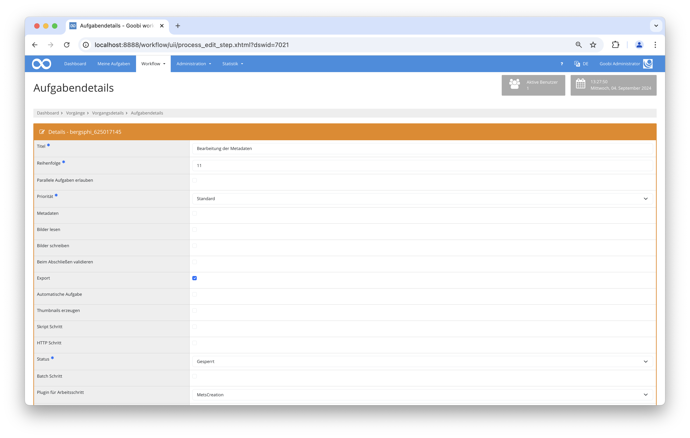

# Automatische METS-Anreicherung mit Bilddateien und Paginierung

## Übersicht

Name                     | Wert
-------------------------|-----------
Identifier               | plugin_intranda_step_mets_creation
Repository               | [https://github.com/intranda/goobi-plugin-step-mets-creation](https://github.com/intranda/goobi-plugin-step-mets-creation)
Lizenz              | GPL 2.0 oder neuer 
Letzte Änderung    | 04.09.2024 20:55:00


## Einführung
Diese Dokumentation erläutert wie mithilfe von mehreren Plugins METS-Dateien geladen, angereichert und anschließend gespeichert werden. 

## Installation
Um das Plugin nutzen zu können, müssen folgende Dateien installiert werden:

```bash
/opt/digiverso/goobi/plugins/step/plugin-step-mets-creation-base.jar
```

Nach der Installation des Plugins kann dieses innerhalb des Workflows für die jeweiligen Arbeitsschritte ausgewählt und somit automatisch ausgeführt werden.

Für die Verwendung des Plugins muss dieses in einem Arbeitsschritt ausgewählt sein:




## Überblick und Funktionsweise
Bei der Auswahl des Plugins innerhalb des Arbeitsschrittes lässt sich eines von diesen Plugins auswählen: `METSCreation`, `METSCreatePagination` oder `MapMETSCreation`.

Wenn das Plugin `METSCreation` ausgeführt wird, öffnet dieses die METS-Datei des Vorganges, reichert diese mit den verfügbaren Bildern des Master- bzw. Derivate-Verzeichnisses an und speichert diese anschließend erneut. 

Das Plugin `METSCreatePagination` öffnet bei dessen Ausführung ebenfalls die METS-Datei des Vorgangs und überprüft anschließend, ob dort ein gültiger Pfad zu den Bilddateien eingetragen ist. Sollte das nicht der Fall sein, wird dieser ergänzt. Anschließend werden die Bilddateien aus dem Dateisystem gelesen um diese mit einer Paginierung zu ergänzen. Abschließend wird die METS-Datei gespeichert.

Im Fall, dass das Plugin `MapMETSCreation` ausgeführt wird, öffnet dieses die METS-Datei und prüft, ob das Metadatum `singleDigCollection` existiert. Sollte das nicht der Fall sein, wird diesem der Wert `Karten` zugewiesen. Danach wird überprüft ob es einen validen Dateipfad und dieser im Fall, dass er nicht vorhanden ist, ergänzt. Anschließend werden die Bilddateien aus dem Dateisystem gelesen um diese mit einer Paginierung zu ergänzen. Abschließend wird die METS-Datei gespeichert.

## Konfiguration
Dieses Plugin verfügt über keine Konfigurationsdatei und erfordert dementsprechend keine besonderen Einstellungen.