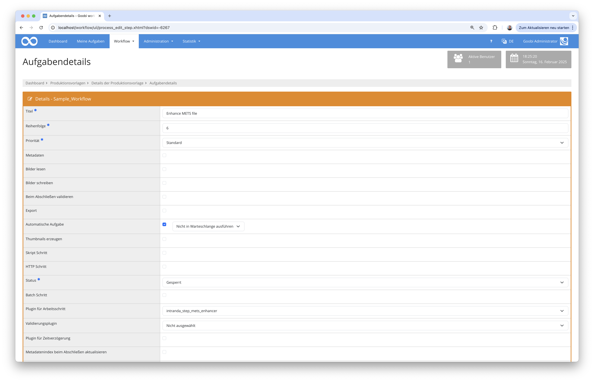
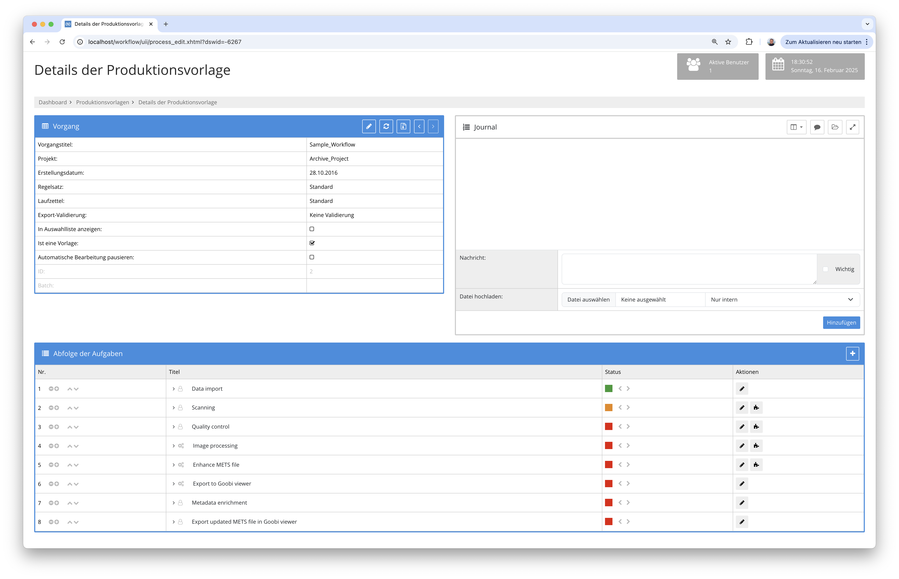

# METS-Datei anreichern

## Übersicht

Name                     | Wert
-------------------------|-----------
Identifier               | intranda_step_mets_enhancer
Repository               | [https://github.com/intranda/goobi-plugin-step-mets-enhancer](https://github.com/intranda/goobi-plugin-step-mets-enhancer)
Lizenz              | GPL 2.0 oder neuer 
Letzte Änderung    | 16.02.2025 19:52:46


## Einführung
Diese Dokumentation erläutert das Step Plugin für Goobi workflow zur automatischen Anreicherung von METS-Dateien mit den zugehörigen Mediendateien. Je nach Konfiguration können hierbei ebenfalls automatisch eine Paginierung erzeugt sowie weitere Metadaten hinzugefügt werden.

## Installation
Um das Plugin nutzen zu können, müssen folgende Dateien installiert werden:

```bash
/opt/digiverso/goobi/plugins/plugin-step-mets-enhancer-base.jar
/opt/digiverso/goobi/config/plugin-step-mets-enhancer-base.xml
```

Nach der Installation des Plugins kann dieses innerhalb des Workflows für die jeweiligen Arbeitsschritte ausgewählt und somit automatisch ausgeführt werden.

Für die Verwendung des Plugins muss dieses in einem Arbeitsschritt wie folgt ausgewählt sein:




## Überblick und Funktionsweise
Das Plugin wird üblicherweise eingesetzt, wenn innerhalb des Workflows nicht beabsichtigt ist, manuell mit an der METS-Datei zu arbeiten und diese automatisch zu veröffentlichen. In diesem Fall könnte ein Workflow beispielsweise wie folgt aussehen:



Hier wird also die METS-Datei von dem Plugin automatisch geöffnet und wie konfiguriert angereichert. Dabei werden zunächst einmal sämtliche Mediendateien aus dem Dateisystem des Vorgangs neu zu dem obersten Strukturelement zugewiesen. Auf Wunsch kann dabei je nach Konfiguration ebenso auch eine Paginierung verschiedenen Typs erzeugt werden. Zudem lassen sich über die Konfiguration ebenso automatisch weitere Metadaten für das oberste Strukturelement ergänzen.

## Konfiguration
Die Konfiguration des Plugins erfolgt in der Datei `plugin_intranda_step_mets_enhancer.xml` wie hier aufgezeigt:

```xml
<config_plugin>
	<!--
        order of configuration is:
          1.) project name and step name matches
          2.) step name matches and project is *
          3.) project name matches and step name is *
          4.) project name and step name are *
	-->

	<config>
		<!-- which projects to use for (can be more then one, otherwise use *) -->
		<project>*</project>
		<step>*</step>

		<!-- if a pagination shall be automatically created activate this and use one of these types:
        	- uncounted
        	- ROMAN
        	- roman
        	- arabic
        -->
		<createPagination type="arabic">true</createPagination>

		<!-- list of metadata to be added to the topstruct element -->
		<addMetadata type="singleDigCollection" value="Maps" />

	</config>

</config_plugin>

```

### Allgemeine Parameter 
Der Block `<config>` kann für verschiedene Projekte oder Arbeitsschritte wiederholt vorkommen, um innerhalb verschiedener Workflows unterschiedliche Aktionen durchführen zu können. Die weiteren Parameter innerhalb dieser Konfigurationsdatei haben folgende Bedeutungen: 

| Parameter | Erläuterung | 
| :-------- | :---------- | 
| `project` | Dieser Parameter legt fest, für welches Projekt der aktuelle Block `<config>` gelten soll. Verwendet wird hierbei der Name des Projektes. Dieser Parameter kann mehrfach pro `<config>` Block vorkommen. | 
| `step` | Dieser Parameter steuert, für welche Arbeitsschritte der Block `<config>` gelten soll. Verwendet wird hier der Name des Arbeitsschritts. Dieser Parameter kann mehrfach pro `<config>` Block vorkommen. | 


### Weitere Parameter 
Neben diesen allgemeinen Parametern stehen die folgenden Parameter für die weitergehende Konfiguration zur Verfügung: 


Parameter               | Erläuterung
------------------------|------------------------------------
| `<createPagination>`   | Hier kann mit dem Wert `true` festgelegt werden, ob autoamtisch eine Paginierung erstellt werden soll. Diese kann zusätzlich durch das Attribut `type` festgelegt werden. Für die Paginierung stehen die folgenden Typen zur Verfügung: `uncounted`, `roman`, `ROMAN` oder `arabic` |
| `<addMetadata>`        | Hier können weitere Metadaten in die Konfiguration festgelegt werden, die dem obersten Strukturelement zugefügt werden sollen. Das Attribut `type` definiert hierbei den gewünschten Metadatentyp, wie er im Regelsatz zur Verfügung steht, und mittels des Attributs `value` wird der zu verwendende Wert festgelegt. Dieses Element ist wiederholbar.|