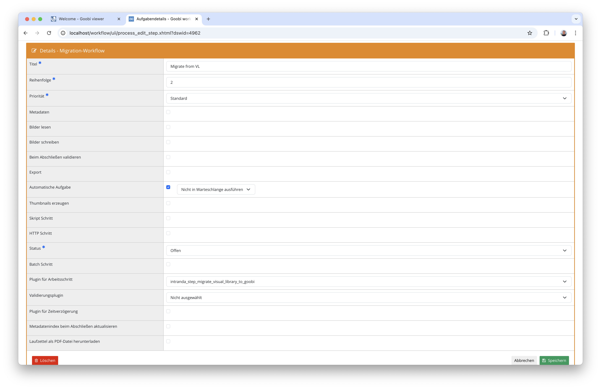
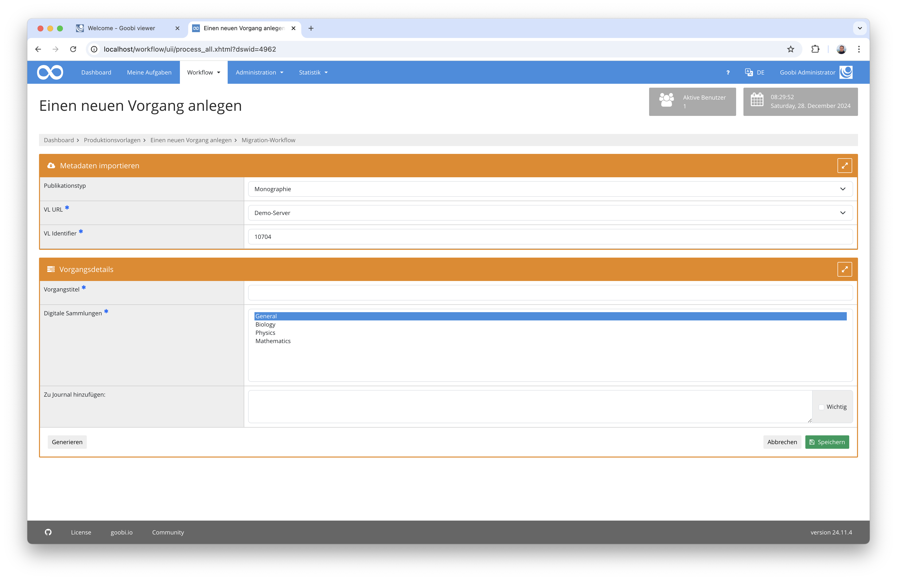
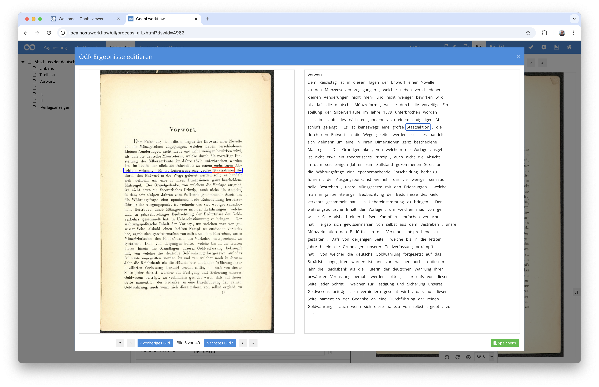
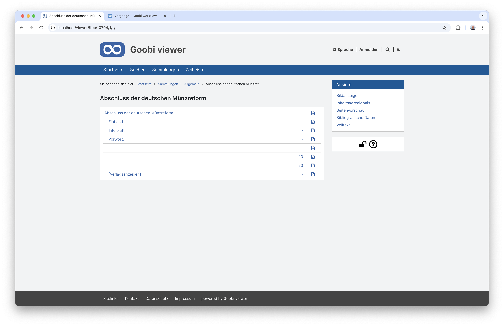

# Datenmigration aus Visual Library

## Übersicht

Name                     | Wert
-------------------------|-----------
Identifier               | intranda_step_migrate_visual_library_to_goobi
Repository               | [https://github.com/intranda/goobi-plugin-step-migrate-visual-library-to-goobi](https://github.com/intranda/goobi-plugin-step-migrate-visual-library-to-goobi)
Lizenz              | GPL 2.0 oder neuer 
Letzte Änderung    | 28.12.2024 20:27:17


## Einführung
Diese Dokumentation erläutert das Plugin für eine automatische Datenübernahme von Digitalisaten aus einer Visual Library Instanz nach Goobi workflow. Hierbei wird die öffentlich erreichbare METS-Datei aus dem Visual Library System abgefragt. Aus dieser werden anschließend die Metadaten, die Strukturdaten, die Paginierung sowie auch die Bilder und die Volltexte übernommen. Unmittelbar nach der Datenübernahme können die Werke im Goobi viewer veröffentlicht werden.

## Installation
Um das Plugin nutzen zu können, müssen folgende Dateien installiert werden:

```bash
/opt/digiverso/goobi/plugins/step/plugin-step-migrate-visual-library-to-goobi-base.jar
/opt/digiverso/goobi/config/plugin_intranda_step_migrate_visual_library_to_goobi.xml
```

Nach der Installation des Plugins kann dieses innerhalb des Workflows für die jeweiligen Arbeitsschritte ausgewählt und somit automatisch ausgeführt werden. Ein Workflow könnte dabei beispielhaft wie folgt aussehen:


Für die Verwendung des Plugins muss dieses in einem Arbeitsschritt ausgewählt sein:




## Überblick und Funktionsweise
Nach dem Start des Plugins initialisiert sich dieses zunächst mit Informationen aus der Konfigurationsdatei. Anschließend ermittelt das Plugin aus einer konfigurierten Eigenschaft, welche OAI-Schnittstelle für die Abfrage einer METS-Datei verwendet werden soll. 



Die METS-Datei wird daraufhin heruntergeladen und alle relevanten Metadaten daraus extrahiert und in die entsprechende METS-Datei in Goobi überführt. Das gleiche passiert hierbei ebenso für die Strukturdaten und die Paginierungssequenzen. 


Abschließend startet das Plugin mit dem Download der Bilder aus der Dateigruppe `MAX`, um die beste verfügbare Qualität der Derivate herunterzuladen. Sollten für das abgefragte Werke Volltexte im Format `ALTO` vorliegen, werden diese ebenfalls heruntergeladen und im Goobi Vorgang gespeichert.



Nach dem erfolgreichen Import können die Werke anschließend weiterverarbeitet und auch z.B. im Goobi viewer veröffentlicht werden.




## Konfiguration
Die Konfiguration des Plugins erfolgt in der Datei `plugin_intranda_step_migrate_visual_library_to_goobi.xml` wie hier aufgezeigt:

```xml
<config_plugin>
    <!--
        order of configuration is:
          1.) project name and step name matches
          2.) step name matches and project is *
          3.) project name matches and step name is *
          4.) project name and step name are *
	-->
    
    <config>
        <!-- which projects to use for (can be more then one, otherwise use *) -->
        <project>*</project>
        <step>*</step>

		<!-- define the property where the VL server url shall be taken from -->
        <vl-url>VL URL</vl-url>        
    </config>

</config_plugin>

```

### Allgemeine Parameter 
Der Block `<config>` kann für verschiedene Projekte oder Arbeitsschritte wiederholt vorkommen, um innerhalb verschiedener Workflows unterschiedliche Aktionen durchführen zu können. Die weiteren Parameter innerhalb dieser Konfigurationsdatei haben folgende Bedeutungen: 

| Parameter | Erläuterung | 
| :-------- | :---------- | 
| `project` | Dieser Parameter legt fest, für welches Projekt der aktuelle Block `<config>` gelten soll. Verwendet wird hierbei der Name des Projektes. Dieser Parameter kann mehrfach pro `<config>` Block vorkommen. | 
| `step` | Dieser Parameter steuert, für welche Arbeitsschritte der Block `<config>` gelten soll. Verwendet wird hier der Name des Arbeitsschritts. Dieser Parameter kann mehrfach pro `<config>` Block vorkommen. | 


### Weitere Parameter 
Neben diesen allgemeinen Parametern stehen die folgenden Parameter für die weitergehende Konfiguration zur Verfügung: 


Parameter               | Erläuterung
------------------------|------------------------------------
`vl-url`                | Angabe derjenigen Vorgangseigenschaft, in der die URL der OAI-Schnittstelle steht. Erwartet wird in dieser Eigenschaft eine URL wie beispielsweise `https://visuallibrary.net/ihd4/oai/?verb=GetRecord&metadataPrefix=mets&identifier=`