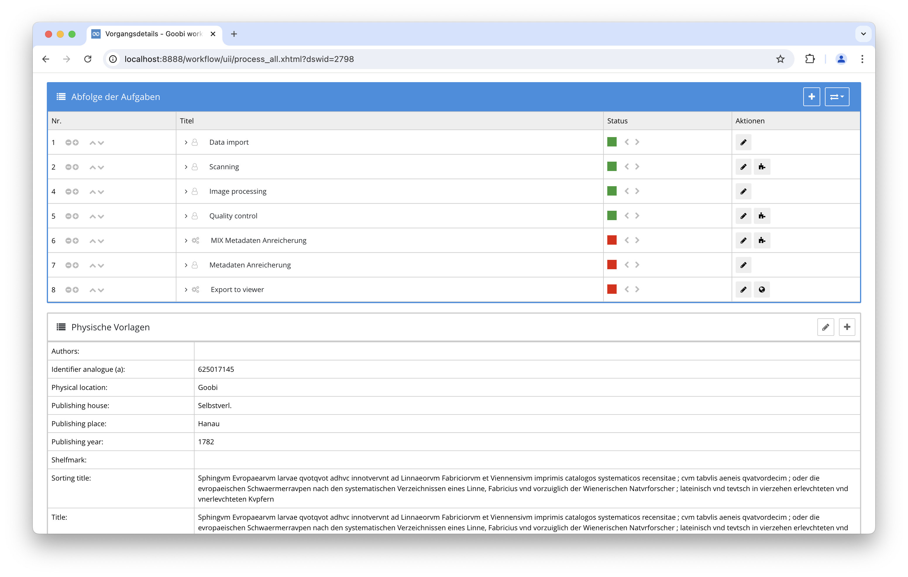
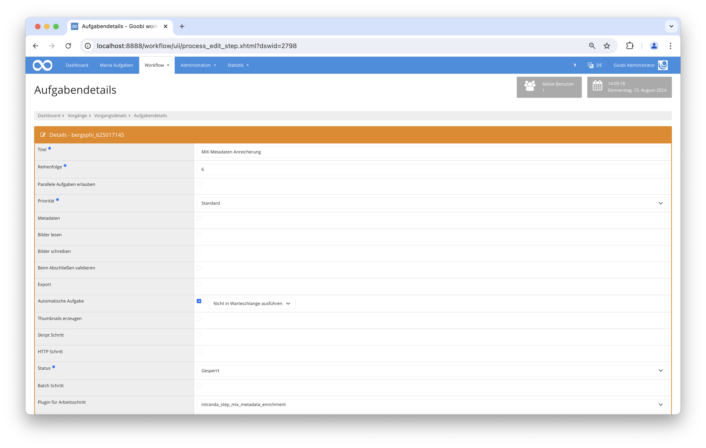

# MIX Metadata Enrichment Plugin

## Übersicht

Name                     | Wert
-------------------------|-----------
Identifier               | intranda_step_mix_metadata_enrichment
Repository               | [https://github.com/intranda/goobi-plugin-step-mix-metadata-enrichment](https://github.com/intranda/goobi-plugin-step-mix-metadata-enrichment)
Lizenz              | GPL 2.0 oder neuer 
Letzte Änderung    | 15.08.2024 17:57:08


## Einführung
Diese Dokumentation erläutert das Plugin zum MIX Metadata anreichern.

## Installation
Um das Plugin nutzen zu können, müssen folgende Dateien installiert werden:

```bash
/opt/digiverso/goobi/plugins/step/plugin-step-mix-metadata-enrichment-base.jar
/opt/digiverso/goobi/config/plugin_intranda_step_mix_metadata_enrichment.xml
/opt/digiverso/goobi/config/jhove/jhove.conf
```

Nach der Installation des Plugins kann dieses innerhalb des Workflows für die jeweiligen Arbeitsschritte ausgewählt und somit automatisch ausgeführt werden. Ein Workflow könnte dabei beispielhaft wie folgt aussehen:



Für die Verwendung des Plugins muss dieses in einem Arbeitsschritt ausgewählt sein:




## Überblick und Funktionsweise
Wenn das Plugin ausgeführt wird, werden alle Bilddateien in den konfigurierten Ordnern mit JHove analysiert und die technischen Metadaten im MIX Format extrahiert.
Diese technischen Metadaten werden dann in der Mets Datei des Vorgangs hinzugefügt und dort mit den jeweiligen Bilddateien verlinkt.


## Konfiguration
Die Konfiguration des Plugins erfolgt in der Datei `plugin_intranda_step_mix_metadata_enrichment.xml` wie hier aufgezeigt:

```xml
<config_plugin>
    <!--
        order of configuration is:
          1.) project name and step name matches
          2.) step name matches and project is *
          3.) project name matches and step name is *
          4.) project name and step name are *
	-->

    <config>
        <!-- which projects to use for (can be more then one, otherwise use *) -->
        <project>*</project>
        <step>*</step>
        <folder>*</folder>

        <!-- jhove configuration file path -->
        <jhoveConfig>/opt/digiverso/goobi/config/jhove/jhove.conf</jhoveConfig>
    </config>

    <config>
        <project>*</project>
        <step>Custom Step</step>
        <folder>custom_folder</folder>

        <jhoveConfig>/opt/digiverso/goobi/config/jhove/jhove.conf</jhoveConfig>
    </config>

</config_plugin>

```

### Allgemeine Parameter 
Der Block `<config>` kann für verschiedene Projekte oder Arbeitsschritte wiederholt vorkommen, um innerhalb verschiedener Workflows unterschiedliche Aktionen durchführen zu können. Die weiteren Parameter innerhalb dieser Konfigurationsdatei haben folgende Bedeutungen: 

| Parameter | Erläuterung | 
| :-------- | :---------- | 
| `project` | Dieser Parameter legt fest, für welches Projekt der aktuelle Block `<config>` gelten soll. Verwendet wird hierbei der Name des Projektes. Dieser Parameter kann mehrfach pro `<config>` Block vorkommen. | 
| `step` | Dieser Parameter steuert, für welche Arbeitsschritte der Block `<config>` gelten soll. Verwendet wird hier der Name des Arbeitsschritts. Dieser Parameter kann mehrfach pro `<config>` Block vorkommen. | 


### Weitere Parameter 
Neben diesen allgemeinen Parametern stehen die folgenden Parameter für die weitergehende Konfiguration zur Verfügung: 


Parameter               | Erläuterung
------------------------|------------------------------------
`folder`                | Angabe des Ordners, der von JHove analysiert werden soll um technische Metadaten zu extrahieren. <br /><br />Es können mehrere Ordner angegeben werden, indem das `<folder>` Element wiederholt wird. Der Wert `*` kann verwendet werden, um alle Standardordner auszuwählen.
`jhoveConfig`           | Der Pfad zur JHove Konfigurationsdatei. Eine Beispielkonfiguration liegt dem Plugin bei.