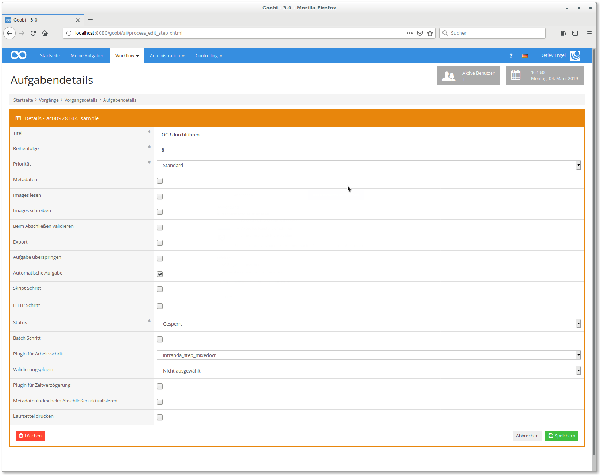

# OCR-Durchführung mit gemischten Schrifttypen

## Übersicht

Name                     | Wert
-------------------------|-----------
Identifier               | intranda_step_mixedocr
Repository               | [https://github.com/intranda/goobi-plugin-step-mixed-ocr](https://github.com/intranda/goobi-plugin-step-mixed-ocr)
Lizenz              | GPL 2.0 oder neuer 
Letzte Änderung    | 25.07.2024 11:56:35


## Einführung
Die vorliegende Dokumentation beschreibt die Installation, Konfiguration und den Einsatz eines Plugins zur OCR-Durchführung mit gemischten Schrifttypen. Dieses Plugin ist nur in Zusammenarbeit mit dem Plugin ["OCR Seitenauswahl"](intranda_step_ocrselector.md) nützlich.


## Installation und Konfiguration
Zur Nutzung des Plugins müssen folgende Dateien installiert sein:

```bash
/opt/digiverso/goobi/plugins/step/plugin_intranda_step_mixedocr-base.jar
/opt/digiverso/goobi/config/plugin_intranda_step_mixedocr.xml
```

Die erste Datei enthält das eigentliche Plugin. Die zweite Datei ist die Konfigurationsdatei des Plugins.

Voraussetzung für die Verwendung des Plugins ist die korrekte Installation und Konfiguration des Plugins sowie die korrekte Einbindung des Plugins in die gewünschten Arbeitsschritte des Workflows. Zusätzlich wird noch das Plugin für die manuelle Auswahl der Seiten benötigt (`intranda_step_ocrselector`).


## Überblick und Funktionsweise
Nachdem das Plugin installiert und Konfiguriert wurde, muss es noch in Goobi workflow zu einem Arbeitsschritt hinzugefügt werden.



Das Plugin wird üblicherweise automatisch ausgeführt, deshalb sollte der Haken bei `Automatische Aufgabe` gesetzt sein. Außerdem muss das Plugin `intranda_step_mixedocr` unter `Plugin für Arbeitsschritt` ausgewählt werden.


# Konfiguration
Der Inhalt de Konfigurationsdatei `plugin_intranda_step_mixedocr.xml` muss folgendermaßen aufgebaut sein:

```xml
<config_plugin>
<!--
        order of configuration is:
          1.) project name and step name matches
          2.) step name matches and project is *
          3.) project name matches and step name is *
          4.) project name and step name are *
-->
    <config>
        <!-- which projects to use for (can be more then one, otherwise use *) -->
        <project>*</project>
        <step>*</step>

        <template>template.xml</template>
        <itmUrl>http://localhost:8080/itm/service</itmUrl>
        <!--  this must be without a trailing slash -->
        <callbackBaseUrl>http://localhost:8080/goobi</callbackBaseUrl>
        <useOrigDir>false</useOrigDir>
        <serverType>intranda-tesseract</serverType>
    </config>

    <config>
        <!-- which projects to use for (can be more then one, otherwise use *) -->
        <project>My special project</project>
        <project>Archive_Project</project>
        <step>OCR</step>

        <template>template_pdfonly.xml</template>
        <itmUrl>https://itm.mydomain.tld/itm/service</itmUrl>
        <callbackBaseUrl>https://goobi.mydomain.tld/goobi</callbackBaseUrl>
        <useOrigDir>true</useOrigDir>
        <serverType>intranda-tesseract</serverType>
    </config>
```

Es sind mehrere Konfigurationen für verschiedene Projekte und Schitte möglich. Diese werden per `<project>` und `<step>` festgelegt. Es ist auch die Wildcard `*` möglich, die für alle Schritte bzw. Projekte greift. Die eigentliche Konfiguration findet dann innerhalb der `<config>` Elemente statt.

Das `<template>` ist das Template, das der TaskManager benutzen soll, die `<itmUrl>` ist die URL zum Endpoint des TaskManagers, der neue Jobs annimmt. Die `<callbackBaseUrl>` muss eine URL sein, die vom TaskManager aus erreicht werden kann und zur Goobi-Installation zeigt, in der das Plugin installiert ist. Sie wird benötigt, um den Schritt nach der erfolgreichen OCR wieder zu schließen. Das Element `<useOrigDir>` bestimmt, ob für die OCR die Masterbilder oder die Derivate genutzt werden sollen. Der Eintrag `<serverType>` ist der im intranda LizenzServer eingetragene Wert für den Server, über den die OCR durchgeführt werden soll. Dieser Wert kann bei intranda angefragt werden oder bei der Nutzung eines anderen OCR Providers ausgelassen werden.

Zusätzlich zu dieser Plugin-spezifischen Konfiguration muss noch eine Freigabe in der Datei `/opt/digiverso/goobi/config/goobi_rest.xml` erfolgen, damit der TaskManager dem Plugin die erfolgreiche Abarbeitung der Jobs melden kann:

```xml
<endpoint path="/plugins/ocr.*">
    <method name="post">
        <allow netmask="127.0.0.0/8" token="mytoken"/>
    </method>
</endpoint>
```