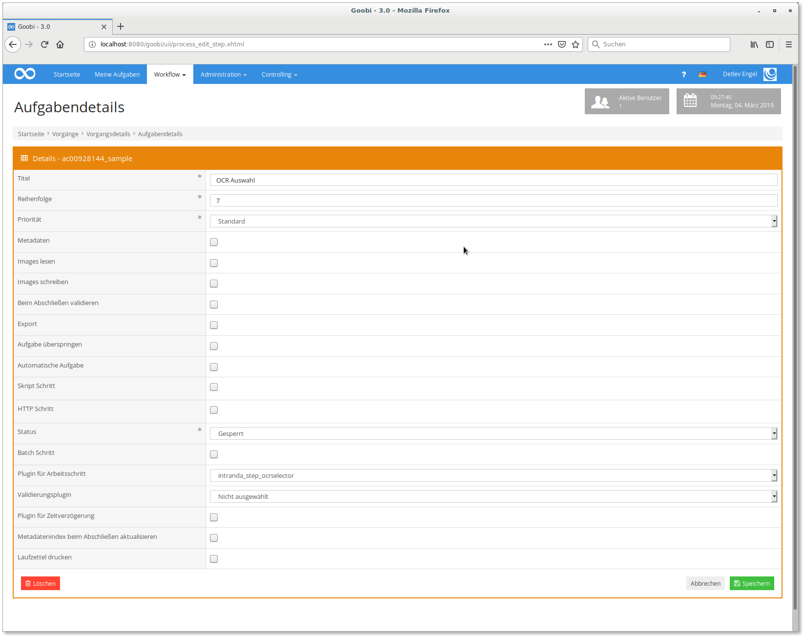
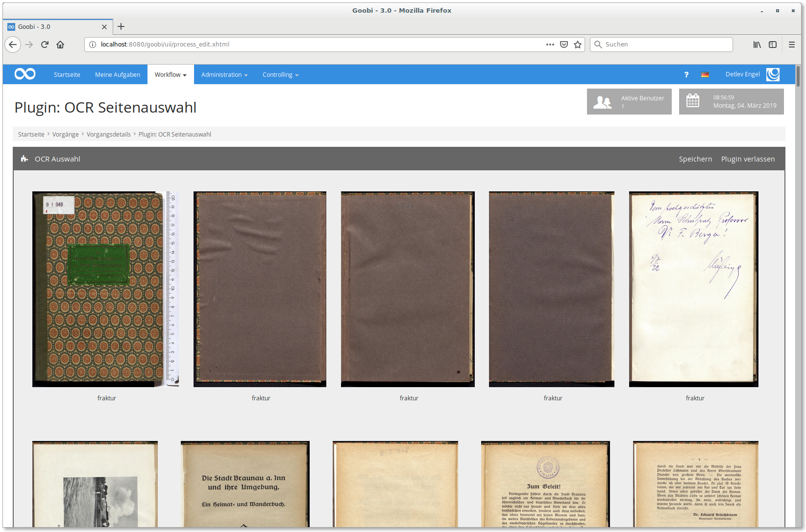
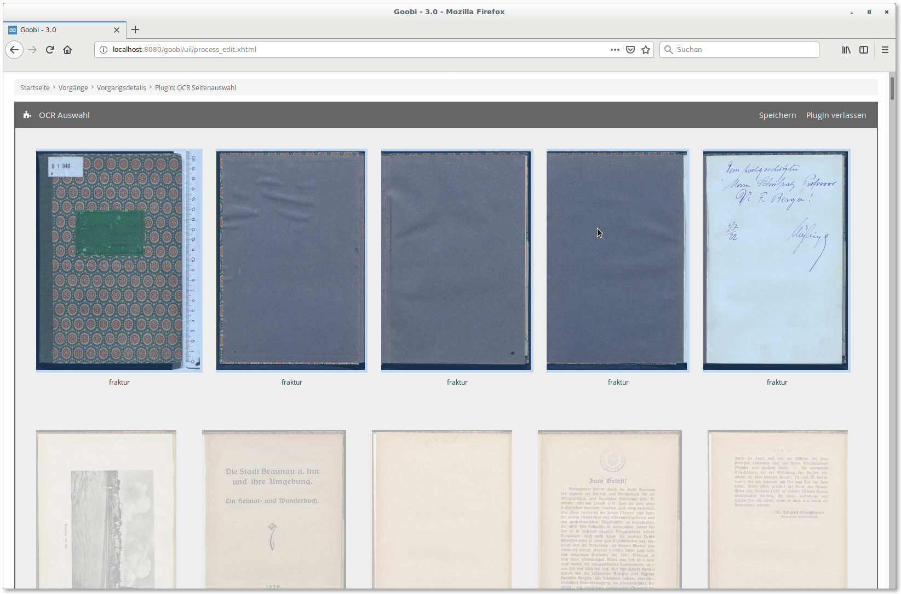
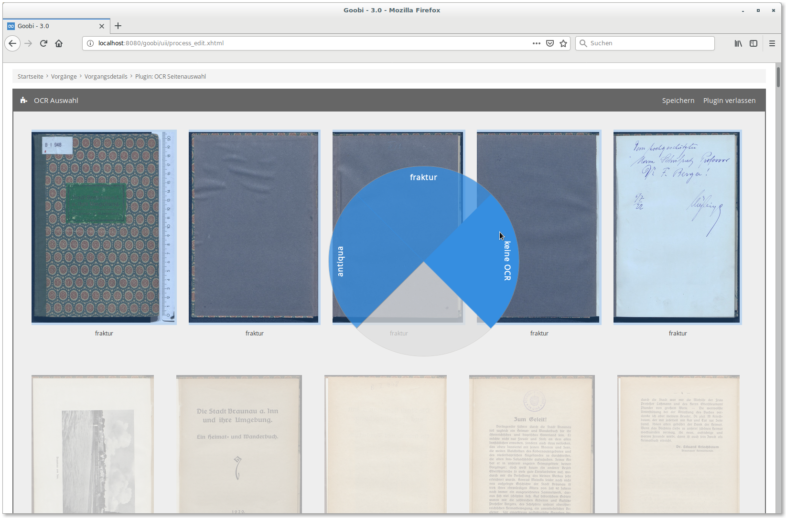
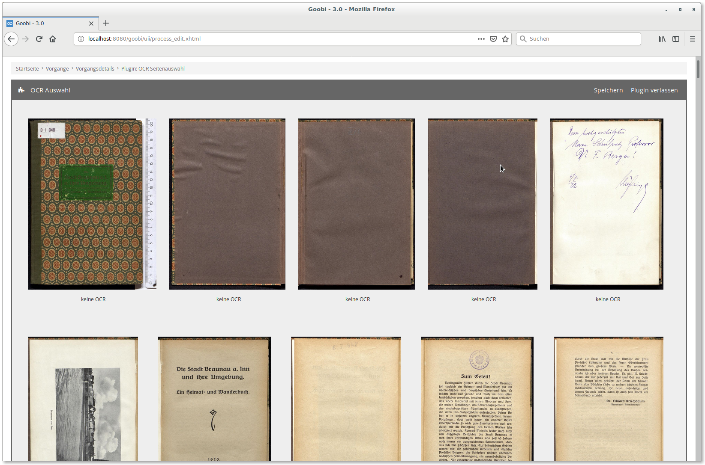

# OCR Seitenauswahl

## Übersicht

Name                     | Wert
-------------------------|-----------
Identifier               | intranda_step_ocrselector
Repository               | [https://github.com/intranda/goobi-plugin-step-ocr-selector](https://github.com/intranda/goobi-plugin-step-ocr-selector)
Lizenz              | GPL 2.0 oder neuer 
Letzte Änderung    | 25.07.2024 11:56:26


## Einführung
Die vorliegende Dokumentation beschreibt die Installation, Konfiguration und den Einsatz eines Plugins zur Seitenauswahl für eine nachgelagerte OCR Durchführung. Mit diesem Plugin kann auf Einzelseiten-Basis festgelegt werden, welche Bilder aus einem Vorgang mit welchem Schrifttyp zur OCR gesendet werden. ​

## Installation
Zur Nutzung des Plugins müssen folgende Dateien installiert werden: ​

```bash
/opt/digiverso/goobi/plugins/step/plugin_intranda_step_ocrselector-base.jar
/opt/digiverso/goobi/static_assets/plugins/intranda_step_ocrselector/css/style.css
/opt/digiverso/goobi/static_assets/plugins/intranda_step_ocrselector/js/app.js
/opt/digiverso/goobi/static_assets/plugins/intranda_step_ocrselector/js/riot.min.js
/opt/digiverso/goobi/static_assets/plugins/intranda_step_ocrselector/js/tags.js
/opt/digiverso/goobi/static_assets/plugins/intranda_step_ocrselector/js/ugh.js
```

​Die erste Datei ist der Java-Teil des Plugins, alle folgenden Dateien werden für die grafische Anzeige benötigt. Das Plugin hat keine eigene Konfiguration, sondern liest den Standard-Wert für alle Seiten aus den Metadaten des Vorgangs aus. ​

Darüber hinaus ist ein Plugin für die eigentliche Ausführung der OCR und das Zusammenführen der Ergebnisse erforderlich (`intranda_step_mixedocr`).​


## Überblick und Funktionsweise
Nachdem das Plugin installiert wurde, kann es in der Nutzeroberfläche in einem Workflowschritt konfiguriert werden. ​

 ​

Wurde der entsprechende Arbeitsschritt durch den jeweiligen Nutzer geöffnet, innerhalb dem das Plugin konfiguriert wurde, wird dem Nutzer das Plugin in dem Arbeitsschritt angezeigt. Nachdem das Plugin betreten wurde, öffnet sich eine neue Ansicht, in der alle zum Prozess gehörenden Bilder angezeigt werden.



Die aktuelle Auswahl (Antiqua, Fraktur, keine OCR) wird unterhalb des jeweiligen Bildes angezeigt. Die Vorauswahl wird aus der Vorgangseigenschaft `Schrifttyp` ausgelesen. 

Hier können nun einzelne Bilder per Linksklick ausgewählt werden. Eine Mehrfachauswahl ist per `Strg + Klick` für einzelne Seiten und `Shift + Klick` für einen Bereich von Seiten möglich. Mit `Strg + a` können alle Bilder ausgewählt und entsprechend mit `Strg + Shift + a` abgewählt werden. Hierfür kann alternativ auch die Checkbox links über der Bildübersicht verwendet werden.



Wenn eine oder mehrere Seiten ausgewählt sind, kann per Rechtsklick auf eine der ausgewählten Seiten ein Kontextmenü geöffnet werden.



Hier stehen die drei Auswahlmöglichkeiten `antiqua`, `fraktur` und `keine OCR` zur Auswahl. Per Klick auf eine der drei Möglichkeiten wird diese auf alle ausgewählten Seiten angewandt.



Das Plugin kann nach erfolgter Markierung per Klick auf `Plugin verlassen` verlassen werden. Dabei wird auch automatisch noch einmal gespeichert. Die Schaltfläche `Speichern` kann für zwischenzeitliches Speichern benutzt werden.