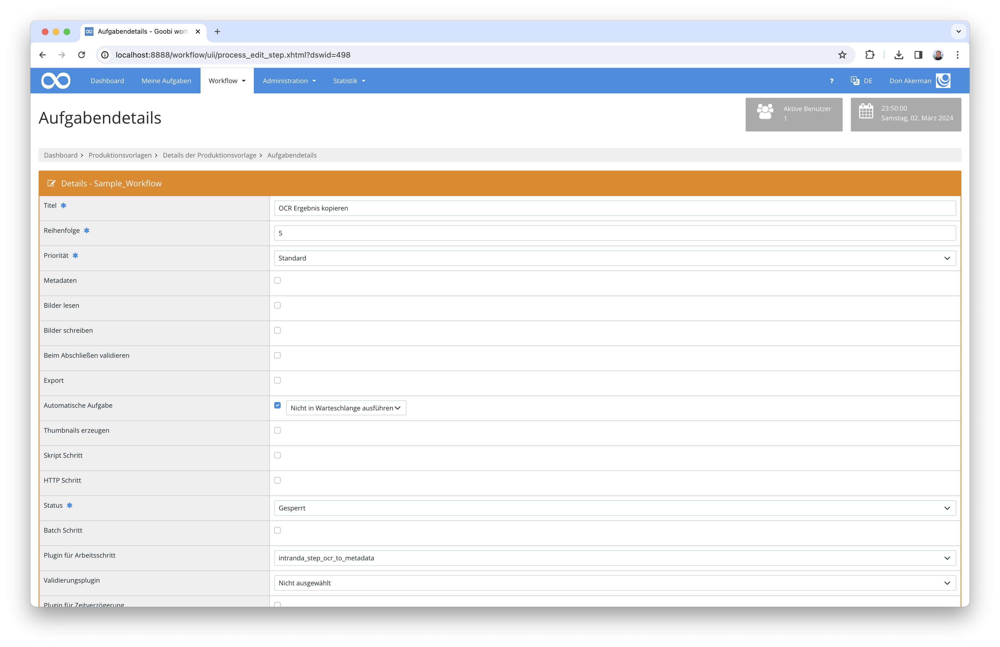

# OCR-Ergebnis in Metadatenfeld übernehmen

## Übersicht

Name                     | Wert
-------------------------|-----------
Identifier               | intranda_step_ocr_to_metadata
Repository               | [https://github.com/intranda/goobi-plugin-step-ocr-to-metadata](https://github.com/intranda/goobi-plugin-step-ocr-to-metadata)
Lizenz              | GPL 2.0 oder neuer 
Letzte Änderung    | 25.07.2024 11:56:17


## Einführung
Dieses Step-Plugin für Goobi Workflow liest die OCR-Ergebnisse aller zugehörigen Dateien automatisch ein, kombiniert diese miteinander und speichert sie anschließend in einem konfigurierbaren Metadatenfeld innerhalb der METS-Datei.


## Installation
Das Plugin besteht aus folgenden Dateien:

```bash
plugin_intranda_step_ocr_to_metadata-base.jar
plugin_intranda_step_ocr_to_metadata.xml
```

Die Datei `plugin_intranda_step_ocr_to_metadata-base.jar` muss in dem richtigen Verzeichnis installiert werden, so dass diese nach der Installation an folgendem Pfad vorliegt:

```bash
/opt/digiverso/goobi/plugins/step/plugin_intranda_step_ocr_to_metadata-base.jar
```

Daneben gibt es eine Konfigurationsdatei, die an folgender Stelle liegen muss:

```bash
/opt/digiverso/goobi/config/plugin_intranda_step_ocr_to_metadata.xml
```


## Überblick und Funktionsweise
Dieses Plugin wird in den Workflow so integriert, dass es automatisch ausgeführt wird. Eine manuelle Interaktion mit dem Plugin ist nicht notwendig. Zur Verwendung innerhalb eines Arbeitsschrittes des Workflows sollte es wie im nachfolgenden Screenshot in dem Workflow konfiguriert werden.



Das Plugin prüft zunächst, ob das Verzeichnis mit OCR-Ergebnissen im Format TXT oder ALTO bereits existiert. Sofern diese vorhanden sind, wird der Inhalt der dort verfügbaren Dateien eingelesen und zu einem gesamten Volltext kombiniert. Abschließend wird dieser kombinierte Volltext in dem Metadatenfeld der METS-Datei gespeichert, das in der Konfigurationsdatei festgelegt wurde. Dabei wird ggf. bereits vorhandener Inhalt des Metadatenfeldes mit dem Volltext überschrieben. 


## Konfiguration
Die Konfiguration des Plugins erfolgt über die Konfigurationsdatei `plugin_intranda_step_ocr_to_metadata.xml` und kann im laufenden Betrieb angepasst werden. Im folgenden ist eine beispielhafte Konfigurationsdatei aufgeführt:

```xml
<?xml version="1.0" encoding="UTF-8"?>
<config_plugin>
    <!--
        order of configuration is:
          1.) project name and step name matches
          2.) step name matches and project is *
          3.) project name matches and step name is *
          4.) project name and step name are *
    -->
    
    <config>
        <!-- which projects to use for (can be more then one, otherwise use *) -->
        <project>*</project>
        <step>*</step>
        
        <!-- Name of the field where to store the OCR result -->
        <metadataField>AdditionalInformation</metadataField>
    </config>

</config_plugin>
```

| Parameter | Erläuterung |
| :--- | :--- |
| `project` | Dieser Parameter legt fest, für welches Projekt der aktuelle Block `<config>` gelten soll. Verwendet wird hierbei der Name des Projektes. Dieser Parameter kann mehrfach pro `<config>` Block vorkommen. |
| `step` | Dieser Parameter steuert, für welche Arbeitsschritte der Block `<config>` gelten soll. Verwendet wird hier der Name des Arbeitsschritts. Dieser Parameter kann mehrfach pro `<config>` Block vorkommen. |
| `metadataField` | Dieser Parameter legt den Typ des Metadatenfeldes fest, das zur Speicherung des OCR-Ergebnisses verwendet werden soll.  |