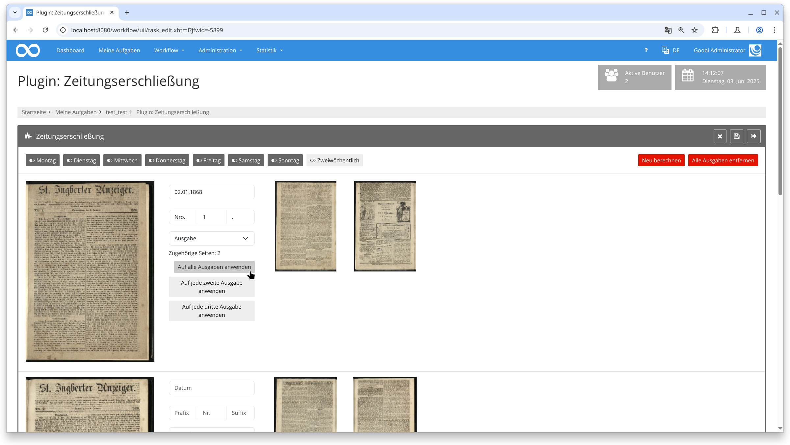

# Kontrolle der Ausgabenerkennung innerhalb von Zeitungen

## Übersicht

Name                     | Wert
-------------------------|-----------
Identifier               | intranda_step_newspaperRecognizer
Repository               | [https://github.com/intranda/goobi-plugin-step-olr-newspaper-recognizer](https://github.com/intranda/goobi-plugin-step-olr-newspaper-recognizer)
Lizenz              | GPL 2.0 oder neuer 
Letzte Änderung    | 10.06.2025 13:34:54


## Einführung
Diese Dokumentation erläutert das Plugin zur manuellen Ausgabenkontrolle. Dieses Step-Plugin für Goobi workflow ermöglicht es Nutzern, METS-Dateien für Zeitungsbände anzureichern, so dass bequem Datums- und Ausgaben-Informationen für zahlreiche Ausgaben innerhalb eines Bandes definiert werden können. Das Plugin erstellt automatisch Strukturelemente für jede Zeitungsausgabe zusammen mit Metadaten in standardisierten und benutzerfreundlichen Formaten sowie mit Paginierungsinformationen.

## Installation
Um das Plugin nutzen zu können, müssen folgende Dateien installiert werden:

```bash
/opt/digiverso/goobi/plugins/step/plugin-step-olr-newspaper-recognizer-base.jar
/opt/digiverso/goobi/plugins/GUI/plugin-step-olr-newspaper-recognizer-gui.jar
/opt/digiverso/goobi/config/plugin_intranda_step_newspaperRecognizer.xml
```

Nach der Installation des Plugins kann dieses innerhalb des Workflows für die jeweiligen Arbeitsschritte ausgewählt und somit automatisch ausgeführt werden. Ein Workflow könnte dabei beispielhaft wie folgt aussehen:


Für die Verwendung des Plugins muss dieses in einem Arbeitsschritt ausgewählt sein:


## Überblick und Funktionsweise
Beim Betreten des Plugins werden alle Bilder einer Ausgabe zugeordnet. Das erste Bild ist hierbei die erste Seite der Ausgabe und wird etwas größer dargestellt. Alle Seiten rechts davon sind Folgeseiten der Ausgabe und werden kleiner dargestellt:


Mit einem Klick auf eine Folgeseite wird diese Seite zu einer neuen Ausgabeseite. Alle Folgeseiten danach werden zu Folgeseiten der neuen Ausgabe. Ein Klick auf die erste Seite einer Ausgabe auf der linken Seite macht diese Seite zu einer Folgeseite der vorherigen Ausgabe. Auf diese Weise werden zunächst alle Ausgabenseiten zu Ausgaben gemacht, indem die jeweiligen Seiten angeklickt werden.

Wenn der Mauszeiger über eine Seite bewegt wird während zugleich die `SHIFT` Taste auf der Tastatur gehalten wird, wird die Seite vergrößert dargestellt. So lassen sich Details wie das Datum der Ausgabe oder die Ausgabennummer besser ablesen. Diese Informationen werden in die Felder `Präfix`, `Nr. ` und `Suffix` eingetragen. Darüber hinaus kann der Ausgabentyp ausgewählt werden:


Je nachdem welche Wochentage im oberen Bereich des Plugins aktiviert sind, werden bei einem Klick auf `Auf alle Ausgaben anwenden` die Datums- und Nummerierungsinformationen für alle Folgeausgaben berechnet:



Wenn eine Folgeseite einer Ausgabe angeklickt wird während dabei die `STRG` oder `ALT` Taste auf der Tastatur gehalten wird, werden diese Seite und alle folgenden Seiten zu einer Beilage. Beilage werden mit einem farbigen Kreis und einer Ziffer dargestellt. Unterhalb der Ausgabeninformationen taucht ein zusätzliches Auswahlmenü für den Beilagentypen auf. Jede Beilage kann individuell typisiert werden:


Nach dem Speichern und Verlassen des Plugins werden die Metadaten so aktualisiert, dass sie pro Ausgabe und Beilage passende Strukturelemente mit den jeweiligen Seitenzuweisungen und Metadaten enthalten.


## Konfiguration
Die Konfiguration des Plugins erfolgt in der Datei `plugin_intranda_step_newspaperRecognizer.xml` wie hier aufgezeigt:

```xml
<config_plugin>
	<loadAllImages>true</loadAllImages>
    <showDeletePageButton>false</showDeletePageButton>
	<dateFormat>dd.MM.yyyy</dateFormat>
	<!-- The previous "writePageTitle" configuration option is not present anymore. It is replaced with "metadata" child elements in the "issue" and "supplement" elements. If no title metadata is written, there is no title generation. -->
    
    <!-- configurations related to pagination settings -->
	<pagination>
		<!-- whether or not to create a new pagination, if false then the old pagination will be used. DEFAULT true. -->
		<createNewPagination>true</createNewPagination>
		<!-- type of the fake paginations, acceptable values are -, 1, i, I. DEFAULT 1. -->
		<!--
		 (1) - means no paginations are wanted
		 (2) 1 means all paginations should be formated as Arabic numbers 1, 2, 3, ... 
		 (3) i means all paginations should be formated as Roman numerals i, ii, iii, ...
		 (4) I means all paginations should be formated as capitalized Roman numerals I, II, III, ... 
		 (5) Any other settings will just result in Arabic numbers
		--> 
		<type>1</type>
		<!-- whether or not to use the fake pagination, if true then use [N] where N is a properly formatted number, otherwise use the bare N itself. DEFAULT false. -->
		<useFakePagination>false</useFakePagination>
	</pagination>

	<!-- The "label" can be any constant text as well as a message identifier. If the "label" is present in the translations, it will be translated to the current language. -->
	<issue type="NewspaperIssue" label="plugin_intranda_step_newspaperRecognizer_issueType_issue">
		<metadata key="TitleDocMain" value="Ausgabe {partNo} vom {date:dd.MM.yyyy}" />
		<metadata key="MainTitle" value="Ausgabe {partNo} vom {date:dd.MM.yyyy}" />
	</issue>
	<issue type="NewspaperIssue" label="plugin_intranda_step_newspaperRecognizer_issueType_morningIssue">
		<metadata key="TitleDocMain" value="Morgenausgabe {partNo} vom {date:dd.MM.yyyy}" />
		<metadata key="MainTitle" value="Morgenausgabe {partNo} vom {date:dd.MM.yyyy}" />
	</issue>
	<issue type="NewspaperIssue" label="plugin_intranda_step_newspaperRecognizer_issueType_eveningIssue">
		<metadata key="TitleDocMain" value="Abendausgabe {partNo} vom {date:dd.MM.yyyy}" />
		<metadata key="MainTitle" value="Abendausgabe {partNo} vom {date:dd.MM.yyyy}" />
	</issue>

	<supplement type="NewspaperSupplement" label="Allgemeine Beilage">
		<metadata key="TitleDocMain" value="Beilage zur {no}. Ausgabe vom {date:dd.MM.yyyy}" />
		<metadata key="MainTitle" value="Beilage zur {no}. Ausgabe vom {date:dd.MM.yyyy}" />
	</supplement>
	<supplement type="NewspaperSupplement" label="Kultur">
		<metadata key="TitleDocMain" value="Kulturteil zur {no}. Ausgabe vom {date:dd.MM.yyyy}" />
		<metadata key="MainTitle" value="Kulturteil zur {no}. Ausgabe vom {date:dd.MM.yyyy}" />
	</supplement>
	<supplement type="NewspaperSupplement" label="Sport">
		<metadata key="TitleDocMain" value="Sportteil zur {no}. Ausgabe vom {date:dd.MM.yyyy}" />
		<metadata key="MainTitle" value="Sportteil zur {no}. Ausgabe vom {date:dd.MM.yyyy}" />
	</supplement>
</config_plugin>
```

### Allgemeine Parameter 
Der Block `<config>` kann für verschiedene Projekte oder Arbeitsschritte wiederholt vorkommen, um innerhalb verschiedener Workflows unterschiedliche Aktionen durchführen zu können. Die weiteren Parameter innerhalb dieser Konfigurationsdatei haben folgende Bedeutungen: 

| Parameter | Erläuterung | 
| :-------- | :---------- | 
| `project` | Dieser Parameter legt fest, für welches Projekt der aktuelle Block `<config>` gelten soll. Verwendet wird hierbei der Name des Projektes. Dieser Parameter kann mehrfach pro `<config>` Block vorkommen. | 
| `step` | Dieser Parameter steuert, für welche Arbeitsschritte der Block `<config>` gelten soll. Verwendet wird hier der Name des Arbeitsschritts. Dieser Parameter kann mehrfach pro `<config>` Block vorkommen. | 


### Weitere Parameter 
Neben diesen allgemeinen Parametern stehen die folgenden Parameter für die weitergehende Konfiguration zur Verfügung: 


Parameter               | Erläuterung
------------------------|------------------------------------
`loadAllImages`         | Hiermit kann eingestellt werden, dass beim Laden des Plugins alle Bilder direkt geladen werden sollen.
`showDeletePageButton`  | Hiermit kann eingestellt werden, ob es möglich sein soll, Seiten innerhalb dieses Plugins permanent zu löschen. Der Wert `true` aktiviert diese Funktion, `false` schaltet sie aus.
`dateFormat`            | Hier kann eingestellt werden, in welchem Format das Datum einzugeben ist (siehe https://docs.oracle.com/javase/8/docs/api/java/text/SimpleDateFormat.html).
`pagination`            | Das `pagination` Element definiert Paginierungseinstellungen. Mit `createNewPagination` kann gesteuert werden, ob eine neue Paginierung erzeugt werden soll. Der `type` gibt an, welches Format die Paginierung haben soll: `1` für arabische Zahlen, `i` für römische Zahlen, `I` für großgeschriebene römische Zahlen. Mit `useFakePagination` kann gesteuert werden, ob eine fingierte Paginierung erzeugt werden soll.
`issue`                 | Jeder Ausgabentyp, der mit dem Plugin erfassbar sein soll, muss hier konfiguriert werden. Pro Ausgabentyp muss es ein `issue` Element geben. Das `type` Attribut referenziert einen Strukturelementtypen aus dem Regelsatz, der für eine Ausgabe dieses Typs verwendet werden soll. Das Attribut `label` definiert die Beschriftung dieses Ausgabetypen im Auswahlmenü des Plugins. Hier kann auch eine Bezeichnung verwendet werden, die in den Übersetzungsdateien außerdem übersetzt werden kann. Das `issue` Element kann beliebig viele oder auch keine `metadata` Elemente enthalten. Ein `metadata` Element hat einen `key` und einen `value`. Der `key` referenziert ein Metadatum aus dem Regelsatz, welches im jeweilig konfigurierten Strukturelement verfügbar sein muss. `value` definiert den Wert des Metadatums, welcher geschrieben werden soll. Es können die Platzhalter `{no}`, `{partNo}` und `{date:FORMAT}` verwendet werden, um im Wert des Metadatums die Ausgabennummer, Ausgabennummer mit Präfix und Suffix sowie das Datum in beliebigem `FORMAT` zu verwenden. Auf diese Weise können einfach Überschriften für die Ausgaben erzeugt werden.
`supplement`            | Jeder Beilagentyp, der mit dem Plugin erfassbar sein soll, muss hier konfiguriert werden. Pro Beilagentyp muss es ein `supplement` Element geben. Die Beilagentypen sind analog zu den Ausgabentypen zu konfigurieren.