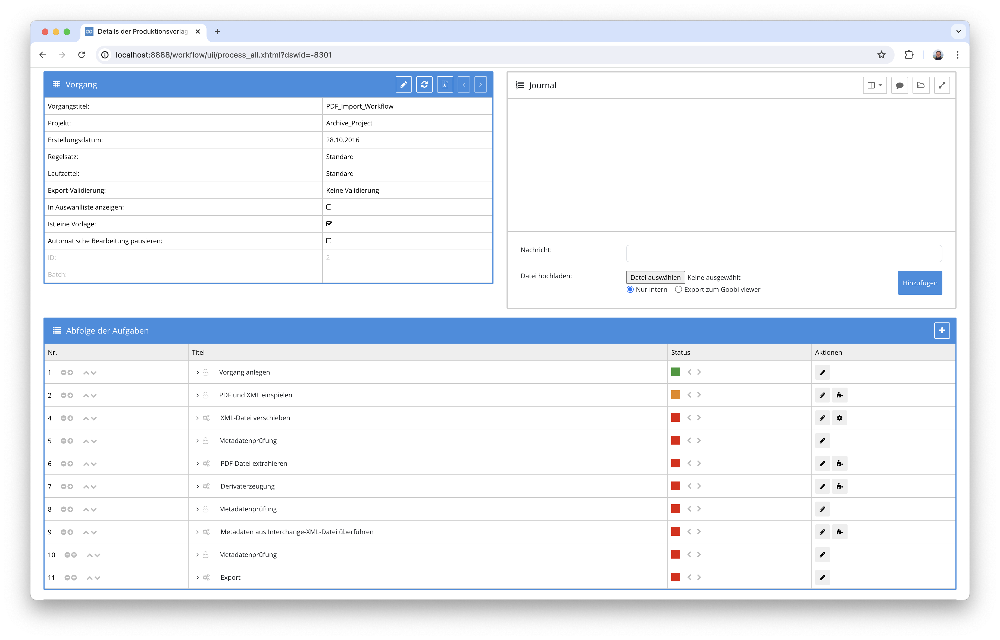
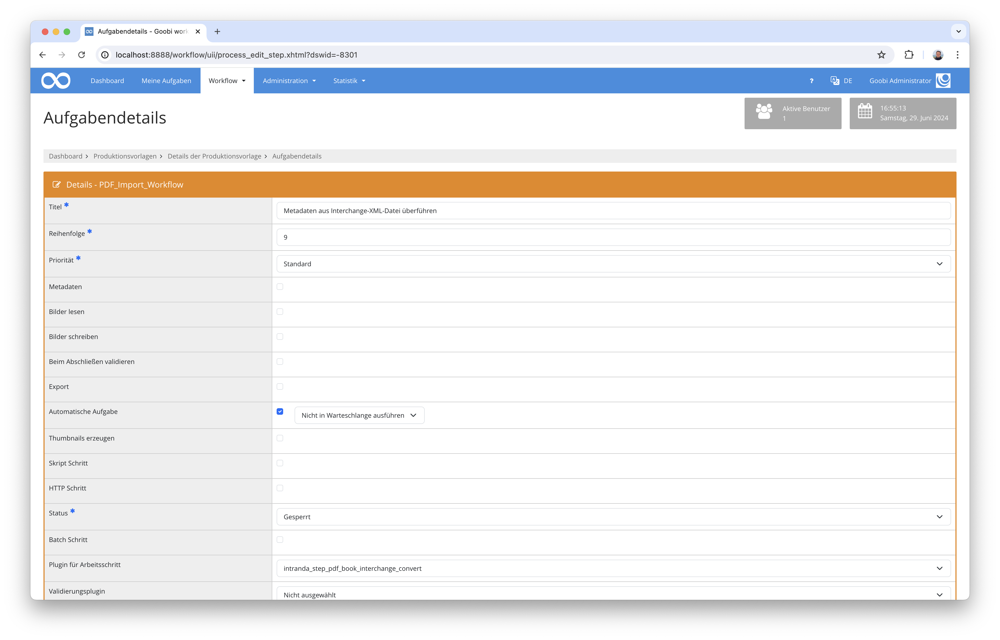

# Datenimport für Book Interchange Dateien

## Übersicht

Name                     | Wert
-------------------------|-----------
Identifier               | intranda_step_pdf_book_interchange_convert
GitHub Repository        | https://github.com/intranda/goobi-plugin-step-pdf-book-interchange-convert
Lizenz              | GPL 2.0 oder neuer 
Letzte Änderung    | 13.07.2024 09:56:52


## Einführung
Diese Dokumentation erläutert das Plugin für den Import von Book Interchange Daten im XML-Format zur Anreicherung von Struktur- und Metadaten bestehender Goobi Vorgänge.

## Installation
Um das Plugin nutzen zu können, müssen folgende Dateien installiert werden:

```bash
/opt/digiverso/goobi/plugins/step/plugin-step-pdf-book-interchange-convert-base.jar
/opt/digiverso/goobi/config/plugin_intranda_step_pdf_book_interchange_convert.xml
```

Nach der Installation des Plugins kann dieses innerhalb des Workflows für die jeweiligen Arbeitsschritte ausgewählt und somit automatisch ausgeführt werden. Ein Workflow könnte dabei beispielhaft wie folgt aussehen:



Für die Verwendung des Plugins muss dieses in einem Arbeitsschritt ausgewählt sein:




## Überblick und Funktionsweise
In dem hier gezeigten Workflow wurde zunächst eine PDF-Datei zusammen mit einer Book-Interchange-Datei eingespielt. Die PDF-Datei wurden im Verlauf des Workflows zu Bildern konvertiert, die im `master`-Ordner gespeichert wurden. Die PDF-Datei wurde im Workflow automatisch in den `import`-Ordner verschoben. Die Book-Interchange-Datei wurde in den `source`-Ordner verschoben. Anschließend hat das Book-Interchange-Plugin die bereits vom PDF-Extraction-Plugin erzeugten Strukturdaten, die aus der PDF-Datei gelesen werden konnten, mit den Informationen aus der Book-Interchange-Datei angereichert. 


## Konfiguration
Die Konfiguration des Plugins erfolgt in der Datei `plugin_intranda_step_pdf_book_interchange_convert.xml` wie hier aufgezeigt:

```xml
<config_plugin>
	<!-- order of configuration is: 1.) project name and step name matches 2.) 
		step name matches and project is * 3.) project name matches and step name 
		is * 4.) project name and step name are * -->
	<config>
		<!-- which projects to use for (can be more then one, otherwise use *) -->
		<project>*</project>
		<step>*</step>

		<!-- type of the structure elements that were created from the pdf table 
			of contents by the pdf-extraction plugin -->
		<structureTypePdf>Chapter</structureTypePdf>

		<!-- type of the structure elements to be created from the Book Interchange 
			Format or Type of the elements that had their metadata updated -->
		<structureTypeBits>Part</structureTypeBits>

		<!-- mapping for the metadata that belongs to the publication aka topstruct 
			(e.g. Monograph or Volume) -->

		<publicationMapping>

			<!-- 'value' defines an xpath expression of the current element; 'field' 
				defines a ruleset element to be created that shall receive the value that 
				was read using xpath -->
			<metadata
				value="./book/book-meta/book-title-group/book-title"
				field="TitleDocMain" />
			<metadata value="./book/book-meta/book-title-group/subtitle"
				field="TitleDocSub1" />
			<metadata value="./book/book-meta/isbn" field="ISBN" />

			<!-- person information is read from xpath expressions in 'firstname' 
				and 'lastname' fields separately; the ruleset type to be used for the person 
				is defined as 'role' -->
			<person
				xpathNode="//book-meta/contrib-group/contrib/name[@content-type='author']"
				firstname="./given-names" lastname="./surname" role="Author" />
			<person
				xpathNode="//book-meta/contrib-group/contrib/name[@content-type='editor']"
				firstname="./given-names" lastname="./surname" role="Editor" />
		</publicationMapping>

		<!-- mapping for the metadata that belongs to the created structure elements 
			the attribute xpathNode should be used to specify the xml-elements that have 
			the wanted metadata in the case of bitsxml-files this could be "book-part-meta". 
			the xpath-expression of the metadata and person elements must 
			be relative to this selected node. This means they have to start with 
			a "." -->

		<elementMapping
			xpathNode="./book/book-body/book-part/book-part-meta">
			<!-- 'value' defines an xpath expression of the current element; 'field' 
				defines a ruleset element to be created that shall receive the value that 
				was read using xpath -->
			<metadata value="./title-group/title" field="TitleDocMain" />
			<metadata value="./title-group/subtitle"
				field="TitleDocSub1" />
			<!-- <metadata value="./abc/def/ghi/jkl" field="DocLanguage" /> -->
			<!-- person information is read from xpath expressions in 'firstname' 
				and 'lastname'. note that the xpath expressions in firstname and lastname 
				are relative to the element selected by the path specified by the attribute 
				xpathNode. the ruleset type to be used for the person is defined by the attribute 'role' -->
			<person xpathNode=".//name[@content-type='author']"
				firstname="./given-names" lastname="./surname" role="Author" />
			<person xpathNode=".//name[@content-type='editor']"
				firstname="./given-names" lastname="./surname" role="Editor" />
			<lpage xpath="./lpage" />
			<fpage xpath="./fpage" />
		</elementMapping>
	</config>
</config_plugin>
```

### Allgemeine Parameter 
Der Block `<config>` kann für verschiedene Projekte oder Arbeitsschritte wiederholt vorkommen, um innerhalb verschiedener Workflows unterschiedliche Aktionen durchführen zu können. Die weiteren Parameter innerhalb dieser Konfigurationsdatei haben folgende Bedeutungen: 

| Parameter | Erläuterung | 
| :-------- | :---------- | 
| `project` | Dieser Parameter legt fest, für welches Projekt der aktuelle Block `<config>` gelten soll. Verwendet wird hierbei der Name des Projektes. Dieser Parameter kann mehrfach pro `<config>` Block vorkommen. | 
| `step` | Dieser Parameter steuert, für welche Arbeitsschritte der Block `<config>` gelten soll. Verwendet wird hier der Name des Arbeitsschritts. Dieser Parameter kann mehrfach pro `<config>` Block vorkommen. | 


### Weitere Parameter 
Neben diesen allgemeinen Parametern stehen die folgenden Parameter für die weitergehende Konfiguration zur Verfügung: 


Parameter               | Erläuterung
------------------------|-----------
`structureTypePdf`      | Benennung des Strukturtyps der Elemente, die durch das im Workflow zuvor verwendete Plugin zur PDF-Extraktion erzeugt wurden.
`structureTypeBits`      | Benennung des Strukturtyps für die Elemente, die das Book-Interchange-Plugin erzeugen soll.
`publicationMapping`      | Bereich für die Definition der Publikationsmetadaten, die innerhalb der METS-Datei angereichert werden sollen. Hierbei sind jeweils über eine Kombination die Daten aus der XML-Datei mittels xPath-Ausdrücken und der Metadatentyp aus dem Regelsatz angegeben.
`elementMapping`      | Bereich für die Definition der Strukturdaten, die innerhalb der METS-Datei angereichert oder erzeugt werden sollen. Hierbei sind jeweils über eine Kombination die Daten aus der XML-Datei mittels xPath-Ausdrücken und der Metadatentyp aus dem Regelsatz angegeben.

Für eine einfachere Inbetriebnahme befindet sich in `install`-Ordner des Plugins eine Datei mit dem Namen `ruleset.xml` die als Referenz-Regelsatz zu der hier aufgeführte Konfigurationsdatei passt.