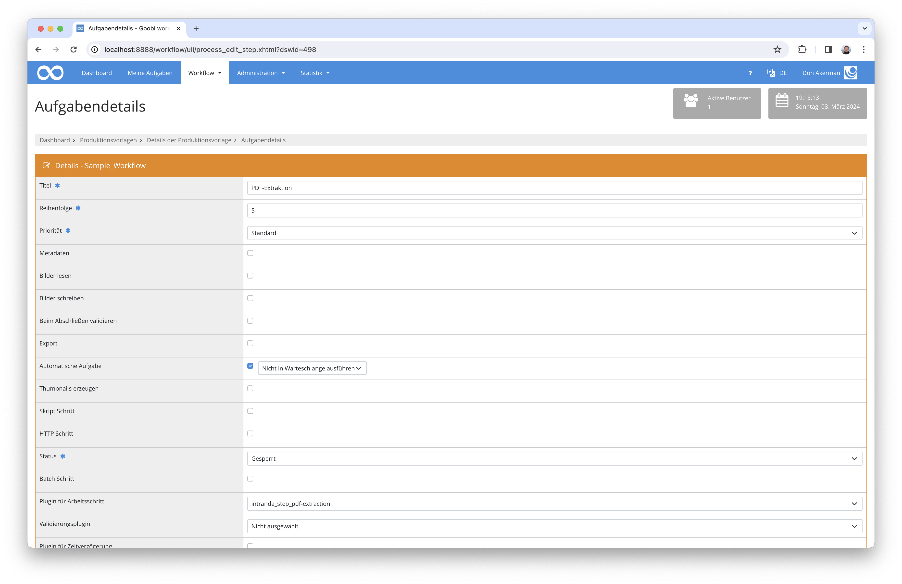

# PDFs aufsplitten, Volltext extrahieren und Inhaltsverzeichnis auslesen

## Übersicht

Name                     | Wert
-------------------------|-----------
Identifier               | intranda_step_pdf-extraction
Repository               | [https://github.com/intranda/goobi-plugin-step-pdf-extraction](https://github.com/intranda/goobi-plugin-step-pdf-extraction)
Lizenz              | GPL 2.0 oder neuer 
Letzte Änderung    | 25.07.2024 11:55:57


## Einführung
Die vorliegende Dokumentation beschreibt die Installation, Konfiguration und den Einsatz eines Plugins zum Extrahieren von Bildern, Volltexten und dem Inhaltsverzeichnis aus PDF-Dateien. Das Plugin extrahiert immer nur, was in der PDF vorhanden ist und schreibt keine Fehlermeldung wenn kein Volltext oder Inhaltsverzeichnis gefunden werden kann.


## Installation
Zur Nutzung des Plugins muss es an folgenden Ort kopiert werden:

```bash
/opt/digiverso/goobi/plugins/step/plugin_intranda_step_pdf-extraction-base.jar
```

Die Konfiguration des Plugins wird unter folgendem Pfad erwartet:

```bash
/opt/digiverso/goobi/config/plugin_intranda_step_pdf-extraction.xml
```

Außerdem wird das Kommandozeilenprogramm `Ghostscript` und/oder das Tool `pdftoppm` aus dem Paket `poppler-utils` benötigt, abhängig davon wie man den `<generator>` konfiguriert. Es kann über die Paketquellen des Systems installiert werden.


## Überblick und Funktionsweise
Nachdem das Plugin installiert wurde, kann es in der Nutzeroberfläche in einem Workflowschritt beispielhaft wie auf diesem Screenshot konfiguriert werden.



Für die Nutzung des Plugins muss zum Ausführungszeitpunkt im Master-Ordner des Vorgangs eine PDF-Datei liegen. Diese wird dann automatisch in Einzelseiten aufgeteilt. Außerdem wird (falls vorhanden) der Volltext extrahiert und das Inhaltsverzeichnis der PDF-Datei ausgelesen, um dann als Strukturelemente in die METS-Datei eingetragen zu werden.

Es ist also zu empfehlen, dem Workflowschritt mit diesem Plugin einen anderen Workflowschritt vorzulagern, in dem Dateien in den Master-Ordner geladen werden. Dies kann per Verlinken des Vorgangsordners in den Home-Ordner des Nutzers oder zum Beispiel im File-Upload-Plugin geschehen.


## Konfiguration
Eine Beispielkonfiguration könnte folgendermaßen aussehen:

```xml
<config>

	<project>*</project>
	<step>OCR-Extraktion</step>

	<validation>
		<!-- set to false to skip this step if no PDF files exist in the source folder -->
		<!-- DEFAULT true -->
		<failOnMissingPDF>true</failOnMissingPDF>
	</validation>
	
	<!-- if true then all old data from tifFolder, pdfFolder, textFolder and altoFolder will be deleted, and all file references will be removed if current book is not empty -->
	<!-- DEFAULT true -->
	<overwriteExistingData>true</overwriteExistingData>

	<mets>
		<!-- DEFAULT true -->
		<write>false</write>
		<!-- DEFAULT true -->
		<failOnError>false</failOnError>
		<!-- Settings for writing Mets-Structure -->
		<docType>
			<!-- If this element exists and is not empty then for each imported pdf 
			a new StructElement of the given type is created within the top StructElement. -->
			<parent>Chapter</parent>
			<!-- If this element exists and is not empty then the table-of-content structure of the pdf is
			written into the Mets file. Each structure element of the PDF is written as a StructElement of the given type. -->
			<children>Chapter</children>
		</docType>
	</mets>

	<images>
		<!-- DEFAULT true -->
		<write>false</write>
		<!-- DEFAULT true -->
		<failOnError>true</failOnError>
		<!-- The resolution with which to scan the PDF file. This has a large impact on both image file size and quality. DEFAULT 300. -->
		<resolution>300</resolution>
		<!-- The image format for the image files written. DEFAULT tif. -->
		<!-- Allowed formats for the generator pdftoppm are png, jpg, jpeg, jpegcmyk, tif, tiff.  -->
		<format>tif</format>
		<!-- Select the command line tool which should be used to create the images. Either 'ghostscript' or 'pdftoppm'. -->
		<generator>pdftoppm</generator>						
		<!-- A parameter to add to the generator call. Repeatable -->
		<generatorParameter>-cropbox</generatorParameter>
		<!-- Hardcoded parameters for ghostscript are: -dUseCropBox, -SDEVICE, -r<res>, -sOutputFile, -dNOPAUSE, -dBATCH.
				Useful parameters for configuration are:
				===================================================
				-q                         `quiet`, fewer messages
				...................................................
				-g<width>x<height>          page size in pixels 
				===================================================
		-->
		<!-- Hardcoded parameters for pdftoppm are: -{format}, -r.
				Useful parameters for configuration are:
				======================================================================================================
				-f <int>                           first page to print
				......................................................................................................
				-l <int>                           last page to print
				......................................................................................................
				-o                                 print only odd pages
				......................................................................................................
				-e                                 print only even pages
				......................................................................................................
				-singlefile                        write only the first page and do not add digits
				......................................................................................................
				-scale-dimension-before-rotation   for rotated pdf, resize dimensions before the rotation
				......................................................................................................
				-rx <fp>                           X resolution, in DPI
				......................................................................................................
				-ry <fp>                           Y resolution, in DPI
				......................................................................................................
				-scale-to <int>                    scales each page to fit within scale-to*scale-to pixel box
				......................................................................................................
				-scale-to-x <int>                  scales each page horizontally to fit in scale-to-x pixels
				......................................................................................................
				-scale-to-y <int>                  scales each page vertically to fit in scale-to-y pixels
				......................................................................................................
				-x <int>                           x-coordinate of the crop area top left corner
				......................................................................................................
				-y <int>                           y-coordinate of the crop area top left corner
				......................................................................................................
				-W <int>                           width of crop area in pixels (DEFAULT 0)
				......................................................................................................
				-H <int>                           height of crop area in pixels (DEFAULT 0)
				......................................................................................................
				-sz <int>                          size of crop square in pixels (sets W and H)
				......................................................................................................
				-cropbox                           use the crop box rather than media box
				......................................................................................................
				-hide-annotations                  do not show annotations
				......................................................................................................
				-mono                              generate a monochrome PBM file
				......................................................................................................
				-gray                              generate a grayscale PGM file
				......................................................................................................
				-sep <string>                      single character separator between name and page number (DEFAULT -)
				......................................................................................................
				-forcenum                          force page number even if there is only one page
				......................................................................................................
				-overprint                         enable overprint
				......................................................................................................
				-freetype <string>                 enable FreeType font rasterizer: yes, no
				......................................................................................................
				-thinlinemode <string>             set thin line mode: none, solid, shape. DEFAULT none.
				......................................................................................................
				-aa <string>                       enable font anti-aliasing: yes, no
				......................................................................................................
				-aaVector <string>                 enable vector anti-aliasing: yes, no
				......................................................................................................
				-opw <string>                      owner password (for encrypted files)
				......................................................................................................
				-upw <string>                      user password (for encrypted files)
				......................................................................................................
				-q                                 don't print any messages or errors
				......................................................................................................
				-progress                          print progress info
				......................................................................................................
				-tiffcompression <string>          set TIFF compression: none, packbits, jpeg, lzw, deflate
				======================================================================================================
		-->
	</images>

	<plaintext>
		<!-- DEFAULT true -->
		<write>true</write>
		<!-- DEFAULT true -->
		<failOnError>false</failOnError>
	</plaintext>

	<alto>
		<!-- DEFAULT true -->
		<write>true</write>
		<!-- DEFAULT true -->
		<failOnError>false</failOnError>
	</alto>

	<pagePdfs>
		<!-- DEFAULT true -->
		<write>true</write>
		<!-- DEFAULT true -->
		<failOnError>true</failOnError>
	</pagePdfs>

	<properties>
		<!-- Write this process property after extraction is done. The value depends on whether any ocr files with content have been written. -->
		<!-- If there exist some properties named so, then the first one will be picked up to accept the value.
		Otherwise a new process property will be created for this purpose. ONLY 1 fulltext tag is allowed.  -->
		<fulltext>
			<!-- process property name. If blank, no property will be written -->
			<name>OCRDone</name>
			<!-- property value when there are alto contents or text contents created. DEFAULT TRUE. -->
			<value exists="true">YES</value>
			<!-- property value when there are neither contents nor text contents created. DEFAULT FALSE. -->
			<value exists="false">NO</value>
		</fulltext>
	</properties>

</config>
```

In der Konfigurationsdatei können beliebig viele Konfigurationen für Projekte oder Arbeitsschritte mit bestimmten Namen definiert werden. Dazu können verschiedene `<config>`-Blöcke untereinander verwendet werden, wobei in jedem die Eigenschaften `<project>` und `<step>` anzugeben sind. Die `<config>`-Blöcke werden in der folgenden Reihenfolge auf einen bestimmten Arbeitsschritt angewandt:

1) `<project>` und `<step>` entsprechen dem aktuellen Projekt und Arbeitsschritt
2) `<step>` entspricht dem aktuellen Arbeitsschritt und `<project>` ist auf `*` gesetzt
3) `<project>` entspricht dem aktuellen Projekt und `<step>` ist auf  `*` gesetzt
4) `<project>` und `<step>` sind auf `*` gesetzt

Das `<failOnMissingPDF>`-Element innerhalb des `<validation>`-Elements kann auf `true` gesetzt werden, um eine Warnung auszugeben, wenn keine PDF-Dateien gefunden werden konnten. Warnungen werden dann in das Journal und die server-internen Log-Dateien geschrieben. Wird diese Option mit `false` deaktiviert, so wird der Fall ignoriert, dass eventuell keine PDF-Dateien existieren.

Mit dem `<overwriteExistingData>`-Element kann global für dieses Plugin eingestellt werden, ob existierende PDF-Dateien überschrieben werden dürfen.

Mittels `<docType>` wird geregelt, welche Strukturtypen die aus dem PDF-Inhaltsverzeichnis extrahierten Einträge in der METS-Datei erhalten. Das `<parent>`-Element ist dabei das Hauptelement in dem alle anderen Inhaltsverzeichnis-Einträge landen. Wird es weggelassen, werden alle Einträge direkt in das Hauptelement der METS-Datei eingetragen. Mit dem `<children>` Element wird angegeben, welchen Strukturtyp die Unterelemente des aus dem PDF-Inhaltsverzeichnis extrahierten Eintrags bekommen sollen.

Die Elemente `<pagePdfs>`, `<alto>`, `<plaintext>`, `<images>` und `<mets>` haben jeweils eine Eigenschaft `<write>` und `<failOnError>`. Damit kann entsprechend des XML-Elements für PDF-Dateien, ALTO-Dateien, TXT-Dateien, allgemeine Bilddateien und die METS-Datei eingestellt werden, ob Dateien dieser Typen jeweils geschrieben oder überschrieben werden sollen und ob eine Fehlermeldung ausgegeben und die weitere Ausführung abgebrochen werden soll, wenn diese nicht geschrieben werden konnten.

Im `<images>`-Element sind einige weitere Einstellungen für Bilddateien möglich. Mit den Werten in `<resolution>` und `<format>` können die Bildauflösung (in DPI) und das Ausgabe-Dateiformat für die extrahierten Bilder festgelegt werden.

Das Unterelement `<generator>` innerhalb von `<images>` gibt an, welches ausführbare Programm auf dem Server verwendet werden soll, um die Bilder zu extrahieren. Gültige Werte sind in der Regel `pdftoppm` und `ghostscript`. Das Element `<generatorParameter>` kann mehrfach verwendet werden und beinhaltet jeweils einen Kommandozeilenparameter für das in `<generator>` angegebene Programm.

Das Element `<mets>` regelt die Generierung der METS-Dateien und erlaubt verschiedene Konfigurationen. So läßt sich z.B. über `<docType>` steuern, welche Strukturtypen für die aus dem PDF-Inhaltsverzeichnis extrahierten Einträge erzeugt werden sollen. Das `<parent>`-Element ist dabei das Hauptelement in dem alle anderen Inhaltsverzeichniseinträge landen. Wird es weggelassen, werden alle Einträge direkt in das Hauptelement der METS-Datei eingetragen.

Die Elemente `<plaintext>`, `<alto>` und `<pagePdfs>` regeln die Generierungen der Text-Dateien, der Alto-Dateien und der Pdf-Dateien aller Einzelseiten.

Mit `<properties>` werden Vorgangseigenschaften je nach Ergebnis der Extraktion geschrieben. Die hier als Beispiel verwendete Konfiguration schreibt die Vorgangseigenschaft `OCRDone` mit Wert `YES`, wenn Volltext innerhalb der PDF-Datei gefunden wurde und den Wert `NO`, wenn es keinen Volltext in der PDF-Datei gab. Dies ist besonders hilfreich, wenn der Workflow im Nachhinein geändert werden soll, um zum Beispiel einen OCR-Schritt auszulassen, wenn schon Volltext existiert.