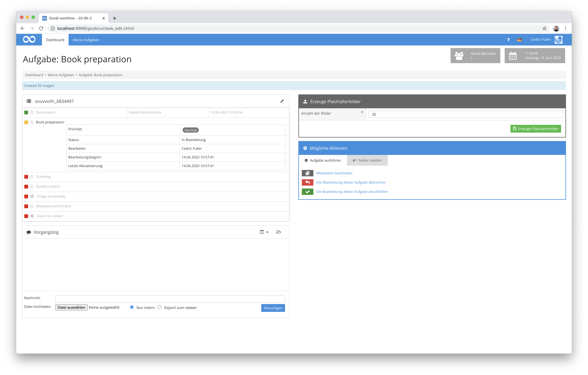
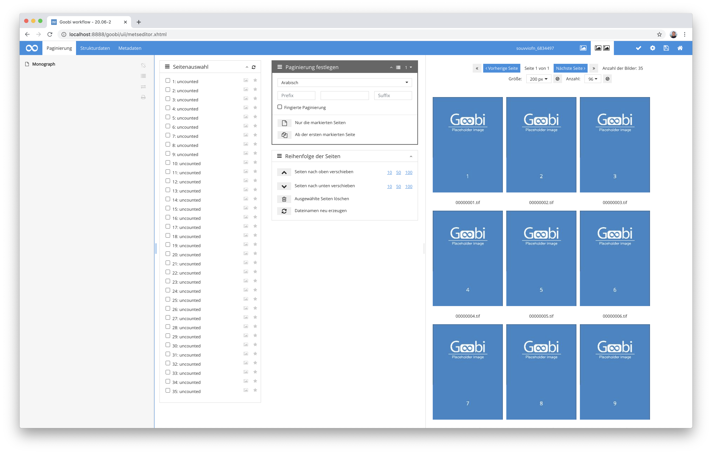

# Generierung von Platzhalterbildern

## Übersicht

Name                     | Wert
-------------------------|-----------
Identifier               | intranda_step_placeholder-creation
Repository               | [https://github.com/intranda/goobi-plugin-step-placeholder-creation](https://github.com/intranda/goobi-plugin-step-placeholder-creation)
Lizenz              | GPL 2.0 oder neuer 
Letzte Änderung    | 25.07.2024 11:55:42


## Einführung
Dieses Plugin dient zur Generierung von Platzhalterbildern innerhalb des Master-Ordners eines Vorgangs von Goobi workflow. Die Anzahl der zu generierenden Bilder ist hierbei innerhalb der Nutzeroberfläche definierbar.


## Installation
Zur Nutzung des Plugins müssen diese beiden Dateien an folgende Orte kopiert werden:

```bash
/opt/digiverso/goobi/plugins/step/plugin_intranda_step_placeholder-base.jar
/opt/digiverso/goobi/plugins/GUI/plugin_intranda_step_placeholder-gui.jar
```

Dieses Plugin verfügt über keine Konfigurationsdatei und ist entsprechend nicht weitergehend konfigurierbar.


## Überblick und Funktionsweise
Dieses Plugin wird in den Workflow so integriert, dass es für eine ausgewählte Aufgabe zur Verfügung steht. Nach dem Annehmen der Aufgabe, kann der Nutzer festlegen, welche Anzahl an Bildern durch das Plugin generiert werden soll und bestätigt dies. Unmittelbar darauf erzeugt das Plugin die definierte Anzahl an Bildern und speichert diese innerhalb des Master-Ordners zu dem Vorgang ab.



Ab diesem Moment existieren zu dem Vorgang die generierten auffälligen Platzhalterbilder und können im Laufe des weiteren Workflows angezeigt und auch ersetzt werden.

