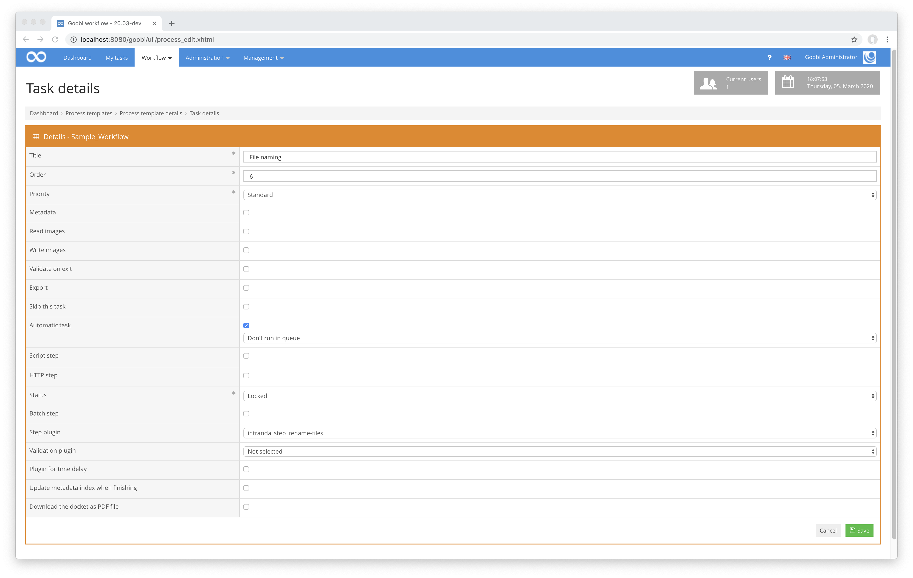

# Umbenennung von Dateien

## Übersicht

Name                     | Wert
-------------------------|-----------
Identifier               | intranda_step_rename-files
Repository               | [https://github.com/intranda/goobi-plugin-step-rename-files](https://github.com/intranda/goobi-plugin-step-rename-files)
Lizenz              | GPL 2.0 oder neuer 
Letzte Änderung    | 25.07.2024 11:55:31


## Einführung
Dieses Plugin dient zu bedingen Umbenennung von Dateien innerhalb der verschiedenen Ordner eines Vorgangs von Goobi workflow. Die Benennung erfolgt dabei abhängig von einer Konfigurationsdatei, die für unterschiedliche Workflows jeweils anders aufgebaut sein kann.


## Installation
Zur Installation des Plugins muss die folgende Datei installiert werden:

```bash
/opt/digiverso/goobi/plugins/step/plugin_intranda_step_rename-files-base.jar
```

Um zu konfigurieren, wie sich das Plugin verhalten soll, können verschiedene Werte in der Konfigurationsdatei angepasst werden. Die Konfigurationsdatei befindet sich üblicherweise hier:

```bash
/opt/digiverso/goobi/config/plugin_intranda_step_rename-files.xml
```

Dabei sieht der Inhalt dieser Konfigurationsdatei beispielhaft wie folgt aus:

```xml
<config_plugin>
    <config>
        <project>Manuscript_Project</project>
        <step>*</step>
        <folder>*</folder>
        <startValue>2</startValue>
        <!-- Replacement removed anything in the process title before and including the '_' -->
        <namepart type="variable">
            {processtitle}
            <replace regex="^.*?_" replacement=""/>
            <condition value="{meta._imageFilePrefix}" matches="^$"/>
        </namepart>
        <namepart type="static">_</namepart>
        <namepart type="counter">00000</namepart>
    </config>

    <config>
        <project>Archive_Project</project>
        <step>*</step>
        <folder>*</folder>
        <namepart type="originalfilename" />
        <namepart type="static">_ARCHIVE</namepart>
    </config>

    <config>
        <project>*</project>
        <step>*</step>
        <folder>*</folder>
        <startValue>0</startValue>
        <namepart type="variable">{processtitle}</namepart>
        <namepart type="static">_</namepart>
        <!-- Conditional name parts (mimic old barcode feature) -->
        <namepart type="counter">
            0000
            <condition value="{originalfilename}" matches="^(?!.*barcode).*$" />
        </namepart>
        <namepart type="static">
            0000
            <condition value="{originalfilename}" matches="^.*barcode.*$" />
        </namepart>
    </config>
</config_plugin>
```

Dieses Plugin wird in den Workflow so integriert, dass es automatisch ausgeführt wird. Eine manuelle Interaktion mit dem Plugin ist nicht notwendig. Zur Verwendung innerhalb eines Arbeitsschrittes des Workflows sollte es wie im nachfolgenden Screenshot konfiguriert werden.




## Überblick und Funktionsweise
Das Plugin wird üblicherweise vollautomatisch innerhalb des Workflows ausgeführt. Es ermittelt zunächst, ob sich innerhalb der Konfigurationsdatei ein Block befindet, der für den aktuellen Workflow bzgl. des Projektnamens und Arbeitsschrittes konfiguriert wurde. Wenn dies der Fall ist, werden die einzelnen Elemente `<namepart>` ausgewertet, mit den entsprechenden Werten für den Zähler und die Variablen aus Goobi workflow ausgestattet und anschließend miteinander verkettet. Die somit erzeugten Dateinamen werden nun für sämtliche relevanten Verzeichnisse des Goobi Vorgangs angewendet und mit den jeweils korrekten Dateinamenerweiterungen ergänzt (z.B. `.tif`).

Um eine korrekte Umbennenung gewährleisten zu können, die auf dem originalen Dateinamen basiert, merkt sich das Plugin die originalen Dateinamen jeder Datei in einer Vorgangseigenschaft namens `plugin_intranda_step_rename_files`. Mit dieser Vorgangseigenschaft wird sichergestellt, dass mehrfache Ausführungen des Plugins, mit möglichen Änderungen der Konfiguration, den ursprünglichen Dateinamen korrekt auflösen.

Details über die in diesem Plugin verwendbaren Variablen aus Goobi workflow finden sich[ innerhalb dieser Dokumentation](https://docs.intranda.com/goobi-workflow-de/manager/8).

Standardmäßig berücksichtigt das Plugin für die Benennung die Dateien innerhalb der folgenden Unterverzeichnisse:

* master
* media
* jpeg
* alto
* pdf
* txt
* xml


## Migration
Dieser Abschnitt beschreibt notwendige Schritte zum Migrieren auf eine neue Plugin Version.

In älteren Versionen gab es die folgende Funktionalität:
> Sollte innerhalb des Ordners eine Datei vorgefunden werden, die `barcode` innerhalb des Dateinamens enthält, so wird diese ebenfalls entsprechend des Namensschemas benannt. Als Zähler wird hier jedoch der Wert `0` gesetzt.

Diese Funktionalität wurde in der aktuellen Version des Plugins entfernt. Durch die Einführung von Bedingungen (`<condition>` Blöcke) in den `<namepart>` Elementen, kann diese Funktionalität jetzt selbst flexibel konfiguriert werden.

Die Funktionalität wurde zuvor immer bedingungslos angewandt und hat den Zähler des `<namepart>` mit dem Typ `counter` auf `0` gesetzt, wenn der Dateiname das Wort `barcode` beinhaltete. Dieses Verhalten kann jetzt explizit erzwungen werden. Wir zeigen im Folgenden ein Beispiel anhand eines `counter` Elements mit vier Ziffern:

```xml
        <namepart type="counter">
            0000
            <condition value="{originalfilename}" matches="^(?!.*barcode).*$" />
        </namepart>
        <namepart type="static">
            0000
            <condition value="{originalfilename}" matches="^.*barcode.*$" />
        </namepart>
```

Dieser Auszug enthält zwei `<namepart>` Elemente die nicht gleichzeitig aktiv sein können. Das erste `<namepart>` Element ist ein Zähler und dann aktiv, wenn der `{originalfilename}` (der originale Dateiname) nicht das Wort `barcode` enthält. Das zweite `<namepart>` Element ist das statische Wort `0000` und wird dann aktiviert, wenn der Dateiname das Wort `barcode` enthält.

Das führt zu exakt dem selben Verhalten wie zuvor. Jetzt hingegen kann der Nutzer selbst entscheiden ob und wie er diese Funktionalität verwenden möchte und ggf. die Konfiguration anpassen.


## Konfiguration
Die Konfiguration des Plugins erfolgt innerhalb der bereits erwähnten Konfigurationsdatei. Dort können verschiedene Parameter konfiguriert werden. Der Block `<config>` kann für verschiedene Projekte oder Arbeitsschritte wiederholt vorkommen, um innerhalb verschiedener Workflows unterschiedliche Aktionen durchführen zu können. Die Elemente `<namepart>` sind hierbei maßgeblich für die Generierung der Dateinamen.

<table>
  <thead>
    <tr>
      <th style="text-align:left">Wert</th>
      <th style="text-align:left">Beschreibung</th>
    </tr>
  </thead>
  <tbody>
    <tr>
      <td style="text-align:left"><code>project</code>
      </td>
      <td style="text-align:left">Dieser Parameter legt fest, für welches Projekt der aktuelle Block <code>&lt;config&gt;</code> gelten
        soll. Verwendet wird hierbei der Name des Projektes. Dieser Parameter kann
        mehrfach pro <code>&lt;config&gt;</code> Block vorkommen.</td>
    </tr>
    <tr>
      <td style="text-align:left"><code>step</code>
      </td>
      <td style="text-align:left">Dieser Parameter steuert, für welche Arbeitsschritte der Block <code>&lt;config&gt;</code> gelten
        soll. Verwendet wird hier der Name des Arbeitsschritts. Dieser Parameter
        kann mehrfach pro <code>&lt;config&gt;</code> Block vorkommen.</td>
    </tr>
    <tr>
      <td style="text-align:left"><code>folder</code>
      </td>
      <td style="text-align:left">Dieser Parameter lässt die Nutzer steuern, welche Verzeichniss für die Umbenennung berücksichtigt werden sollen. Wenn hier als Wert <code>*</code> angegeben wird, der Parameter fehlt oder der Wert nicht konfiguriert ist, werden die default-Settings verwendet.</td>
    </tr>
    <tr>
      <td style="text-align:left"><code>startValue</code>
      </td>
      <td style="text-align:left">Dieser Wert steuert, mit welchem Startwert der hochzählende <code>counter</code> beginnen
        soll.</td>
    </tr>
    <tr>
      <td style="text-align:left"><code>namepart</code>
      </td>
      <td style="text-align:left">
        <p>Dieser ebenfalls mehrfach verwendbare Parameter steuert die Generierung
          der Dateinamen. Er kann statische Elemente beinhalten (<code>static</code>),
          den originale Dateinamen verwenden (<code>originalfilename</code>),
          Variablen aus Goobi nutzen (<code>variable</code>) sowie einen Zähler
          erzeugen (<code>counter</code>). Der Parameter <code>originalfilename</code> 
          entspricht dem originalen Dateinamen der Datei bevor das Plugin erstmalig 
          ausgeführt wird. Für die Generierung des Zählers ist entscheidend, 
          welche Anzahl an Stellen definiert wurden. Der Wert <code>00000</code> würde
          beispielsweise fünfstellige Zahlen mit ggf. vorangestellten Nullen 
          erzeugen.</p>
        <p>Die so definierten Bestandteile des Dateinamens werden für die Benennung
          miteinander verkettet und anschlie?end um die eigentliche Dateiendung
          ergänzt, um so die Datei zu benennen.</p>
      </td>
    </tr>
  </tbody>
</table>

Darüber hinaus können `<namepart>` Elemente mehrere `<condition>` und `<replace>` Elemente beinhalten um Bedingungen oder Ersetzungsanweisungen zu spezifizieren.

Bedingungselemente haben die Form
```xml
<condition value="{VARIABLE}" matches="REGEX" />
```
und können den Wert jeder `VARIABLE` gegen einen regulären Ausdruck `REGEX` prüfen. Wenn mehrere Bedingungen spezifiziert sind müssen alle erfüllt sein, damit das jeweilige `<namepart>` Element aktiviert wird.

Ersetzungselemente haben die Form
```xml
<replace regex="REGEX" replacement="REPLACEMENT"/>
```
und können beliebige reguläre Ausdrücke `REGEX` in dem Wert des `<namepart>` Elements durch `REPLACEMENT` ersetzen (dies kann auch leer sein). Wenn mehrere Ersetzungen spezifiziert sind werden sie in der Reihenfolge ausgeführt, wie sie konfiguriert wurden, sodass am Ende ein finaler Wert des `<namepart>` Elements entsteht.