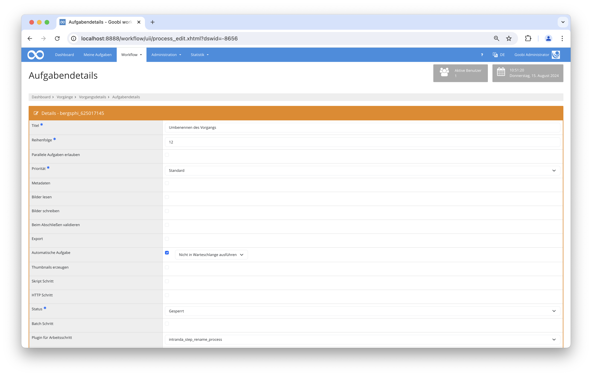

# Umbenennen von Vorgängen

## Übersicht

Name                     | Wert
-------------------------|-----------
Identifier               | intranda_step_rename_process
Repository               | [https://github.com/intranda/goobi-plugin-step-rename-process](https://github.com/intranda/goobi-plugin-step-rename-process)
Lizenz              | GPL 2.0 oder neuer 
Letzte Änderung    | 14.08.2024 19:02:14


## Einführung
Dieses Step Plugin für Goobi workflow benennt den Vorgang mit dem in der Konfiguration angegebenen Namen um. Hierbei können für die Festlegung der Umbenennung von Vorgängen auch Variablen des Variablen-Replacers verwendet werden.


## Installation
Das Plugin besteht aus der folgenden Datei:

```bash
plugin_intranda_step_rename_process-base.jar
```

Diese Datei muss in dem richtigen Verzeichnis installiert werden, so dass diese nach der Installation üblicherweise an folgendem Pfad vorliegt:

```bash
/opt/digiverso/goobi/plugins/step/plugin_intranda_step_rename_process-base.jar
```

Daneben gibt es eine Konfigurationsdatei, die an folgender Stelle liegen muss:

```bash
/opt/digiverso/goobi/config/plugin_intranda_step_rename_process.xml
```

## Überblick und Funktionsweise
Zur Inbetriebnahme des Plugins muss dieses für einen oder mehrere gewünschte automatische Aufgaben im Workflow aktiviert werden. Dies erfolgt durch Auswahl des Plugins `intranda_step_rename_process` aus der Liste der installierten Plugins innerhalb der Schrittekonfiguration des Workflows.



## Konfiguration
Die Konfiguration des Plugins erfolgt über die Konfigurationsdatei `plugin_intranda_step_rename_process.xml` und kann im laufenden Betrieb angepasst werden. Im folgenden ist eine beispielhafte Konfigurationsdatei aufgeführt:

```xml
<?xml version="1.0" encoding="UTF-8"?>
<config_plugin>
    <!--
        order of configuration is:
          1.) project name and step name matches
          2.) step name matches and project is *
          3.) project name matches and step name is *
          4.) project name and step name are *
	-->

    <config>
        <project>*</project>
        <step>*</step>

        <!-- The process title is generated based on the following configuration. You can use
             Goobi variables here as well as the characters underscore _ and minus -
             Empty properties are skipped. Spaces are trimmed.

             Example:
               {processproperty.Institution} = Public Library of Example City
               {processproperty.Font} =
               {meta.CatalogIDDigitalLocalCatalogue} = ID123456789

               config = {processproperty.Institution}_{processproperty.Font}_{meta.CatalogIDDigitalLocalCatalogue}

               result: PublicLibraryofExampleCity__ID123456789
         -->

        <newProcessTitle>{process.Institution}_{meta.CatalogIDDigitalLocalCatalogue}</newProcessTitle>
    </config>

    <config>
    	<project>Archive_Project</project>
    	<step>*</step>
    	<newProcessTitle>{process.CreatorsAllOrigin}_{meta.PublicationYear}</newProcessTitle>
    </config>

    <config>
    	<project>*</project>
    	<step>STEP_NAME</step>
    	<newProcessTitle>{product.DocType}-{process.Creator of digital edition}-{process.Template}</newProcessTitle>
    </config>

    <config>
    	<project>PROJECT_NAME</project>
    	<step>STEP_NAME</step>
    	<newProcessTitle>Some Title</newProcessTitle>
    </config>

</config_plugin>
```