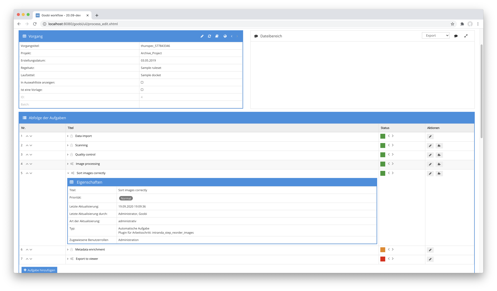

# Bilder sortieren

## Übersicht

Name                     | Wert
-------------------------|-----------
Identifier               | intranda_step_reorder_images
Repository               | [https://github.com/intranda/goobi-plugin-step-reorder-images](https://github.com/intranda/goobi-plugin-step-reorder-images)
Lizenz              | GPL 2.0 oder neuer 
Letzte Änderung    | 25.07.2024 11:55:06


## Einführung
Das Plugin erlaubt eine automatische Sortierung von Bilddateien, die bei der Erzeugung nicht fortlaufend erzeugt und stattdessen für linke und rechte Seiten getrennt voneinander gespeichert wurden. Dies ist beispielsweise dann sinnvoll, wenn z.B. ein zu geringer Öffnungswinkel eines Buchs das Scannen linker und rechter Seiten gleichzeitig verbietet.


## Installation
Zur Installation des Plugins muss die folgende Datei installiert werden:

```bash
/opt/digiverso/goobi/plugins/step/plugin_intranda_step_reorder_images-base.jar
```

Um zu konfigurieren, wie sich das Plugin verhalten soll, können verschiedene Werte in der Konfigurationsdatei angepasst werden. Die Konfigurationsdatei befindet sich üblicherweise hier:

```bash
/opt/digiverso/goobi/config/plugin_intranda_step_reorder_images.xml
```


## Überblick und Funktionsweise
Zur Inbetriebnahme des Plugins muss dieses für einen oder mehrere gewünschte Aufgaben im Workflow aktiviert werden. Dies erfolgt wie im folgenden Screenshot aufgezeigt durch Auswahl des Plugins `intranda_step_reorder_images` aus der Liste der installierten Plugins.



Da dieses Plugin üblicherweise automatisch ausgeführt werden soll, sollte der Arbeitsschritt im Workflow als automatisch konfiguriert werden.

Nachdem das Plugin vollständig installiert und eingerichtet wurde, wird es üblicherweise automatisch innerhalb des Workflows ausgeführt, so dass keine manuelle Interaktion mit dem Nutzer erfolgt. Stattdessen erfolgt der Aufruf des Plugins durch den Workflow im Hintergrund und startet die Umsortierung bzw. Umbenennung der Dateien abhängig von der gewählten Konfiguration.


## Konfiguration
Die Konfiguration des Plugins ist folgendermaßen aufgebaut:

```xml
<config_plugin>

    <config>
        <!-- which projects to use for (can be more then one, otherwise use *) -->
        <project>*</project>
        <step>*</step>

        <!-- which folder to use as source (master|media|jpeg|source|...) -->
        <sourceFolder>master</sourceFolder>

    <!-- which folder to use as target (master|media|jpeg|source|...) -->
        <targetFolder>media</targetFolder>

    <!-- use prefix from previous file name separated by following underscore -->
        <usePrefix>true</usePrefix>

    <!-- define if the first page is right or left -->
        <firstFileIsRight>true</firstFileIsRight>

    <!-- define which naming format shall be used; default is %04d -->
        <namingFormat>%04d</namingFormat>

    <!-- files to be ignored and moved to the end, can be multiple ones, used
            in the order as defined here, the string mentioned here has to be contained
            in file name -->
        <blacklist>_Spine_2</blacklist>
        <blacklist>_Spine_1</blacklist>
        <blacklist>_Colourchart</blacklist>
    </config>

</config_plugin>
```

Der Block `<config>` kann für verschiedene Projekte oder Arbeitsschritte wiederholt vorkommen, um innerhalb verschiedener Workflows unterschiedliche Aktionen durchführen zu können. Die weiteren Parameter innerhalb dieser Konfigurationsdatei haben folgende Bedeutungen:

| Wert | Beschreibung |
| :--- | :--- |
| `project` | Dieser Parameter legt fest, für welches Projekt der aktuelle Block `<config>` gelten soll. Verwendet wird hierbei der Name des Projektes. Dieser Parameter kann mehrfach pro `<config>` Block vorkommen. |
| `step` | Dieser Parameter steuert, für welche Arbeitsschritte der Block `<config>` gelten soll. Verwendet wird hier der Name des Arbeitsschritts. Dieser Parameter kann mehrfach pro `<config>` Block vorkommen. |
| `sourceFolder` | Mit diesem Parameter wird das Verzeichnis angegeben, aus dem die Dateien gelesen werden sollen. Dies ist üblicherweise das Master-Verzeichnis (`master`). |
| `targetFolder` | Hier kann festgelegt werden, in welchem Ordner die umsortierten Dateien abgelegt werden sollen. Dies ist meist das Verzeichnis `media` |
| `usePrefix` | Soll für die Umsortierung eine Präfix berücksichtigt werden, der den Dateinahmen vorangestellt ist und mit einem Unterstrich endet, kann dies hier definiert werden. |
| `firstFileIsRight` | Da das Plugin unterschiedlich vorgeht, ob es sich bei der ersten Datei um eine rechte oder linke Seite handelt, kann dies hier festgelegt werden. |
| `namingFormat` | Die Dateien erhalten nach der Umsortierung neue Dateinamen. Wie diese aussehen sollen, kann mit einem regulären Ausdruck definiert werden. Der Standardwert hierfür lautet `%04d` und erzeugt so 4-stellige Zahlen für die Dateinamen. |
| `blacklist` | Sollen ausgewählte Dateien innerhalb der Sortierung ignoriert und an das Ende der zuvor sortierten Dateien gesetzt werden, können diese hier benannt werden. Die Dateien werden dabei in der Reihenfolge hinten angestellt, wie sie hier aufgelistet werden. Sie erhalten im Anschluß ebenfalls einen hochzählenden neuen Dateinamen. |