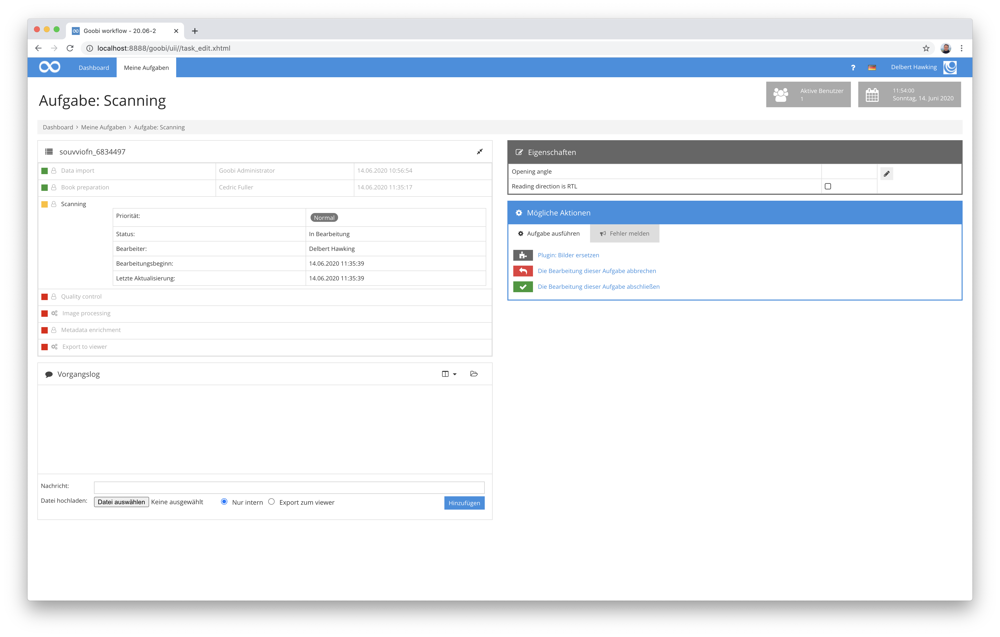
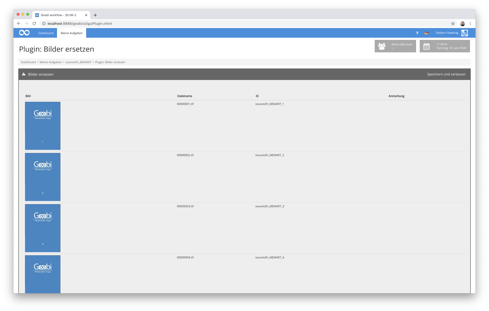

# Ersetzen von Bildern

## Übersicht

Name                     | Wert
-------------------------|-----------
Identifier               | intranda_step_replace-images
Repository               | [https://github.com/intranda/goobi-plugin-step-replace-images](https://github.com/intranda/goobi-plugin-step-replace-images)
Lizenz              | GPL 2.0 oder neuer 
Letzte Änderung    | 25.07.2024 11:54:54


## Einführung
Dieses Plugin dient zum Ersetzen von zuvor eingespielten Platzhalterbildern innerhalb des Master-Ordners eines Vorgangs von Goobi workflow durch die tatsächlichen Master-Bilder. Die Bedienung des Plugins erfolgt über einfaches Drag & Drop der gewünschten Dateien in die Nutzeroberfläche des Plugins.


## Installation
Dieses Plugin wird als `tar`-Archiv ausgeliefert. Um es zu installieren, muss das Archiv `plugin-intranda-step-replace-images.tar` in den Goobi-Ordner entpackt werden:

```bash
tar -C /opt/digiverso/goobi/ -xf plugin-intranda-step-replace-images.tar --exclude="pom.xml"
```

Dieses Plugin verfügt ausserdem über eine Konfigurationsdatei mit dem Namen `plugin_intranda_step_replace-images.xml`. Sie muss unter folgendem Pfad abgelegt werden:

```bash
/opt/digiverso/goobi/config/plugin_intranda_step_replace-images.xml
```

Die Konfigurationsdatei hat dabei den folgenden Aufbau:

```xml
<config_plugin>
    <config>
        <project>*</project>
        <step>*</step>

        <imageFolder>master</imageFolder>
        <imageFolder>media</imageFolder>
    </config>
</config_plugin>
```

Der Block `<config>` kann für verschiedene Projekte oder Arbeitsschritte wiederholt vorkommen, um innerhalb verschiedener Workflows unterschiedliche Aktionen durchführen zu können. Die weiteren Parameter innerhalb dieser Konfigurationsdatei haben folgende Bedeutungen:

| Wert | Beschreibung |
| :--- | :--- |
| `project` | Dieser Parameter legt fest, für welches Projekt der aktuelle Block `<config>` gelten soll. Verwendet wird hierbei der Name des Projektes. Dieser Parameter kann mehrfach pro `<config>` Block vorkommen. |
| `step` | Dieser Parameter steuert, für welche Arbeitsschritte der Block `<config>` gelten soll. Verwendet wird hier der Name des Arbeitsschritts. Dieser Parameter kann mehrfach pro `<config>` Block vorkommen. |
| `imagefolder` | Mit diesem Parameter wird das Verzeichnis angegeben, für das ein Ersetzen von Bildern möglich sein soll. Dieser Parameter ist wiederholbar. Mögliche Werte hierfür sind z.B. `master`, `media` oder auch individuelle Ordner wie `photos` und `scans`. |


## Überblick und Funktionsweise
Dieses Plugin wird in den Workflow so integriert, dass es für eine ausgewählte Aufgabe zur Verfügung steht. Nach dem Annehmen der Aufgabe, kann der Nutzer das Plugin betreten.



Somit erhält der Nutzer Zugriff auf die Nutzeroberfläche des Plugins, wo ihm der derzeitige Inhalt des Master-Ordners aufgelistet wird. Hier können nun gezielt einzelne oder auch viele Bilder per Drag & Drop an diejenige Stelle kopiert werden, ab der die einzufügenden Bilder die vorhandenen Platzhalterbilder ersetzen sollen. Das Plugin stellt während des Uploads zugleich sicher, dass die neu hochgeladenen Dateien korrekt umbenannt werden.

