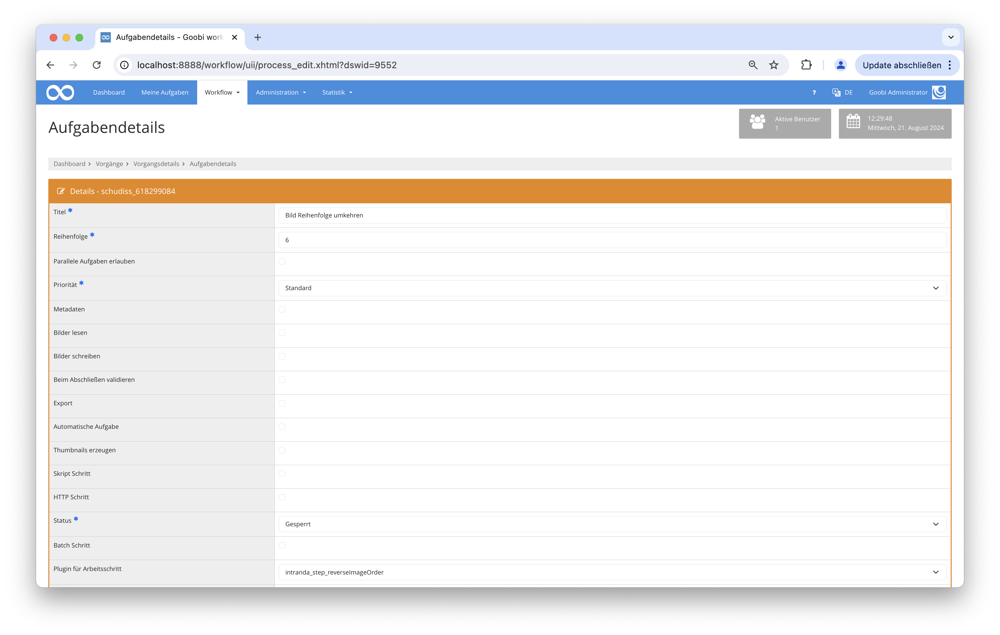

# Bildreihenfolge umkehren

## Übersicht

Name                     | Wert
-------------------------|-----------
Identifier               | intranda_step_reverse_image-order
Repository               | [https://github.com/intranda/goobi-plugin-step-reverse-image-order](https://github.com/intranda/goobi-plugin-step-reverse-image-order)
Lizenz              | GPL 2.0 oder neuer 
Letzte Änderung    | 22.08.2024 12:00:30


## Einführung
Dieses Schritt-Plugin für den Goobi-Workflow kehrt die Dateireihenfolge von Bildern im Goobi-Workflow basierend auf dem Metadatenfeld `DocLanguage` um.

## Installation
Um das Plugin nutzen zu können, müssen folgende Dateien installiert werden:

```bash
/opt/digiverso/goobi/plugins/step/plugin-step-reverse-image-order-base.jar
/opt/digiverso/goobi/config/plugin_intranda_step_reverseImageOrder.xml
```

Für die Verwendung des Plugins muss dieses in einem Arbeitsschritt ausgewählt sein:




## Überblick und Funktionsweise
Das Plugin vergleicht alle Sprachen die in dem Dokument vorkommen mit den in der Konfigurationsdatei festgelegten Sprachen. Sollte eine Übereinstimmung gefunden werden, dann werden die Bilder in der Reihenfolge umgekehrt. 


## Konfiguration
Die Konfiguration des Plugins erfolgt in der Datei `plugin_intranda_step_reverseImageOrderPlugin.xml` wie hier aufgezeigt:

```xml
<!-- * This file is part of a plugin for Goobi - a Workflow tool for the 
	support of mass digitization. * * Visit the websites for more information. 
	* - https://goobi.io * - https://www.intranda.com * - https://github.com/intranda/goobi 
	* * This program is free software; you can redistribute it and/or modify 
	it under the terms of the GNU General Public License as published by the 
	Free * Software Foundation; either version 2 of the License, or (at your 
	option) any later version. * * This program is distributed in the hope that 
	it will be useful, but WITHOUT ANY WARRANTY; without even the implied warranty 
	of MERCHANTABILITY or * FITNESS FOR A PARTICULAR PURPOSE. See the GNU General 
	Public License for more details. * * You should have received a copy of the 
	GNU General Public License along with this program; if not, write to the 
	Free Software Foundation, Inc., 59 * Temple Place, Suite 330, Boston, MA 
	02111-1307 USA * -->
<config_plugin>
	<!-- order of configuration is: 1.) project name and step name matches 2.) 
		step name matches and project is * 3.) project name matches and step name 
		is * 4.) project name and step name are * -->
	<config>
		<!-- which projects to use for (can be more then one, otherwise use *) -->
		<project>*</project>
		<step>*</step>

		<language>heb</language>
		<language>yid</language>
		<language>lad</language>
		<language>jpr</language>
		<language>jbe</language>
		<language>jrb</language>
		<language>jge</language>
		<language>itk</language>
		<language>yhd</language>
		<language>aju</language>
		<language>yud</language>
		<language>ajt</language>
		<language>jye</language>
		<language>jdt</language>
		<language>jtgk</language>
		<language>jger</language>
		<language>jgrc</language>
		<language>narc</language>
	</config>

	<config>
		<!-- which projects to use for (can be more then one, otherwise use *) -->
		<project>My special project</project>
		<project>Archive_Project</project>
		<step>OCR</step>

		<language>heb</language>
		<language>yid</language>
		<language>lad</language>
		<language>jpr</language>
		<language>jbe</language>
		<language>jrb</language>
		<language>jge</language>
		<language>itk</language>
		<language>yhd</language>
		<language>aju</language>
		<language>yud</language>
		<language>ajt</language>

	</config>


</config_plugin>

```

### Allgemeine Parameter 
Der Block `<config>` kann für verschiedene Projekte oder Arbeitsschritte wiederholt vorkommen, um innerhalb verschiedener Workflows unterschiedliche Aktionen durchführen zu können. Die weiteren Parameter innerhalb dieser Konfigurationsdatei haben folgende Bedeutungen: 

| Parameter | Erläuterung | 
| :-------- | :---------- | 
| `project` | Dieser Parameter legt fest, für welches Projekt der aktuelle Block `<config>` gelten soll. Verwendet wird hierbei der Name des Projektes. Dieser Parameter kann mehrfach pro `<config>` Block vorkommen. | 
| `step` | Dieser Parameter steuert, für welche Arbeitsschritte der Block `<config>` gelten soll. Verwendet wird hier der Name des Arbeitsschritts. Dieser Parameter kann mehrfach pro `<config>` Block vorkommen. | 


### Weitere Parameter 
Neben diesen allgemeinen Parametern stehen die folgenden Parameter für die weitergehende Konfiguration zur Verfügung: 


Parameter               | Erläuterung
------------------------|------------------------------------
`language`              | Dieser Parameter gibt eine Liste von Sprachen an, für die die Reihenfolge der Bilder im Dokument umgekehrt werden soll. Die Sprachen werden als ISO-Sprachcodes (z.B. "he" für Hebräisch, "ar" für Arabisch) angegeben. |